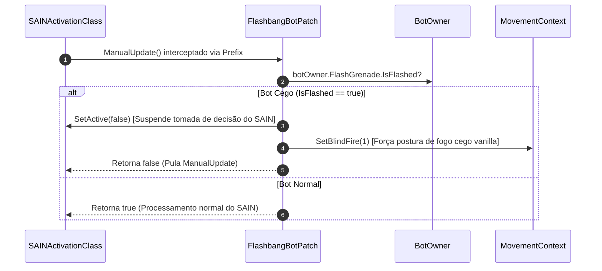
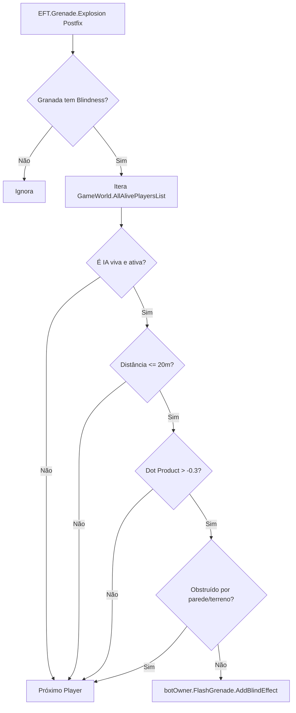

# TRL-Fixes — Patches de IA e Mecânicas de Combate

Este documento detalha as correções aplicadas sobre os sistemas de inteligência artificial do Escape from Tarkov, solucionando o comportamento de montagem e operação de armas estacionárias pesadas (NSV Utes, AGS-30) e restaurando a dinâmica de reação de bots a granadas de atordoamento (Flashbangs) sob o **SAIN**.

---

## 1. Operação de Armas Estacionárias por Bots (`BotMountWeaponFixPatch.cs`)

No jogo base e no ambiente SPT/FIKA, os bots de IA (notadamente os Rogues/ExUsec em Lighthouse e Scav Bosses) sofrem de três problemas combinados que os impediam de operar metralhadoras e lança-granadas montados:
1. **Inativação da Camada da IA**: A camada de decisão `StationaryWithSuppressLayer` (Camada 10) frequentemente permanecia dormente ou com lógica `NoSupress` (`Usable = false`).
2. **Descarte Acidental de Arma (*Weapon Drop Bug*)**: O método de montagem comparava instâncias de C# por referência direta (`Item == Item`). Pequenas variações de instancialização faziam a IA acreditar que a arma montada não era a esperada, executando `DropCurWeapon()`.
3. **Bloqueio de Pacotes de Rede no FIKA**: O FIKA interceptava a montagem aguardando callbacks assíncronos (`WaitingForCallback`) projetados para jogadores humanos, travando a IA em animações incompletas.

O arquivo [BotMountWeaponFixPatch.cs](../modded-V2-audit/Patches/BotMountWeaponFixPatch.cs) resolve esses três nós através de cinco classes de patch coordenadas:

```mermaid
flowchart TD
    subgraph BrainActivation ["1. Ativação do Cérebro (ExUsecBrainClass)"]
        A[ExUsecBrainClass .ctor] -->|Postfix| B[Ativa Camada 10 StationaryWS]
        B --> C{Tem Arma Vinculada?}
        C -->|Não| D[CheckWantTakeStationary 100m]
        C -->|Sim| E[Mantém Vínculo]
    end

    subgraph DecisionValidation ["2. Validação da Camada (GClass81)"]
        F[GClass81.ShallUseNow] -->|Prefix| G{CurUsingLogic Nulo ou Usable=false?}
        G -->|Sim & É Granada| H[Transiciona para ArtillerySuppress]
        G -->|Sim & É Metralhadora| I[Transiciona para MgSuppress]
        G -->|Não| J[Mantém Lógica Atual]
    end

    subgraph ItemResolution ["3. Resolução de Item (BotStationaryWeaponData)"]
        K[method_4: Verificação de Mão] -->|Prefix| L{Item.Id == StationId OU TemplateId Igual?}
        L -->|Sim| M[StationaryTaken + CanLeave = true]
        M -->|Retorna false| N[Bypassa DropCurWeapon]
        L -->|Não| O[Executa Fallback Original]
    end

    subgraph NetworkFikaBypass ["4. Destravamento no FIKA (FikaPlayer)"]
        P[FikaPlayer.OperateStationaryWeapon] -->|Prefix se IsAI| Q[Destrava Arma se Locked]
        Q --> R[SetOperator + SetStationaryAnimation]
        R -->|Retorna false| S[Bypassa checagem WaitingForCallback]
    end
```

---

### 1.1. Detalhamento dos Patches de Montagem

| Classe Patch | Alvo | Tipo | Responsabilidade |
| :--- | :--- | :--- | :--- |
| `BotMountWeaponFixPatch` | `ExUsecBrainClass..ctor` | `Postfix` | Força a ativação da Camada 10 (`StationaryWithSuppressLayer`) e dispara busca de metralhadoras em raio de 100 metros. |
| `GClass81ShallUseNowPatch` | `GClass81.ShallUseNow` | `Prefix` | Converte dinamicamente lógicas inoperantes para `MgSuppress` ou `ArtillerySuppress` dependendo de `CurLink.IsGrenade()`. |
| `BotStationaryWeaponDataMethod4Patch` | `BotStationaryWeaponData.method_4` | `Prefix` | Compara `Item.Id` e `Item.TemplateId` em vez de igualdade de ponteiro C#, evitando que a IA descarte a arma ao montar. |
| `FikaPlayerOperateStationaryWeaponPatch` | `Fika.Core.Main.Players.FikaPlayer.OperateStationaryWeapon` | `Prefix` | Bypassa o fluxo assíncrono de rede do FIKA quando a entidade for bot (`IsAI == true`). |
| `PlayerOperateStationaryWeaponPatch` | `EFT.Player.OperateStationaryWeapon` | `Prefix` | Garante a limpeza de itens na mão esquerda e parâmetros corretos no `MovementContext` vanilla. |

---

## 2. Supressão e Desativação de Bots sob Flashbang (`FlashbangBotPatch.cs`)

Quando o mod **SAIN** está ativo, o ciclo de decisão avançado da IA em `SAINActivationClass.ManualUpdate()` continuava processando alvos e recalculando disparos precisos mesmo enquanto o bot estava sob efeito de cegueira profunda.

O [FlashbangBotPatch.cs](../modded-V2-audit/Patches/FlashbangBotPatch.cs) atua diretamente sobre o ponto de atualização do SAIN:

### Regras de Execução:
1. Se `botOwner.FlashGrenade.IsFlashed` for verdadeiro:
   - Invoca `SetActive(false)` no componente SAIN do bot.
   - Força o estado de disparo cego no `MovementContext.SetBlindFire(1)`.
   - Retorna `false` para pular o `ManualUpdate`, permitindo que as rotinas de pânico do EFT vanilla assumam o controle.

---

## 3. Ampliação do Raio e Percepção de Flashbangs (`FlashbangRadiusPatch.cs`)

O EFT vanilla possui um cálculo extremamente restritivo para cegar IAs com granadas flashbang, exigindo que a IA esteja olhando quase diretamente para o vetor da explosão. Em raids reais, explosões logo acima ou na visão periférica do bot eram ignoradas.

O [FlashbangRadiusPatch.cs](../modded-V2-audit/Patches/FlashbangRadiusPatch.cs) faz um hook no método `EFT.Grenade.Explosion`:

### 3.1. Parâmetros e Critérios de Aplicação

| Parâmetro | Valor / Expressão | Significado Técnico |
| :--- | :--- | :--- |
| **Componente de Cegueira** | `grenadeItem.Blindness != Vector3.zero` | Ignora granadas puramente fragmentárias/HE. |
| **Raio Máximo de Ação** | `distance <= 20.0f` | Alcance efetivo estendido para 20 metros da cabeça da IA. |
| **Tolerância Angular (Dot Product)** | `Dot(dirToExplosion, LookDirection) > -0.3f` | Cobre visão frontal, periférica e ligeiramente atrás do ombro (~107°). |
| **Máscara de Oclusão (Raycast)** | `LayerMaskClass.HighPolyWithTerrainMaskAI` | Ignora folhagens leves, checando apenas paredes, sólidos e terreno. |
| **Tempo de Cegueira** | `Blindness.z * FLASH_GRENADE_TIME_COEF` | Respeita o coeficiente de resistência a flash configurado no bot. |

### 3.2. Fórmula Matemática do Efeito:
$$\text{Duração} = \text{Blindness}_z \times \text{Settings.FileSettings.Grenade.FLASH\_GRENADE\_TIME\_COEF}$$

O método força o registro em `botOwner.FlashGrenade.AddBlindEffect(time, grenadePosition)`, garantindo que o estado `IsFlashed` seja disparado imediatamente, integrando-se em seguida com o `FlashbangBotPatch`.
