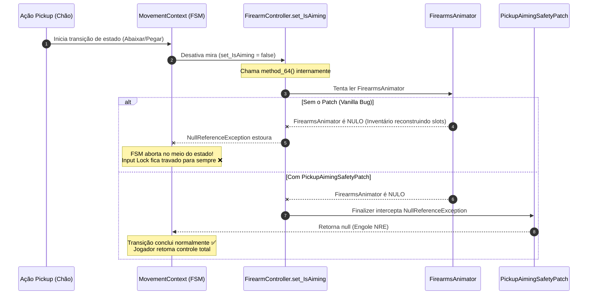
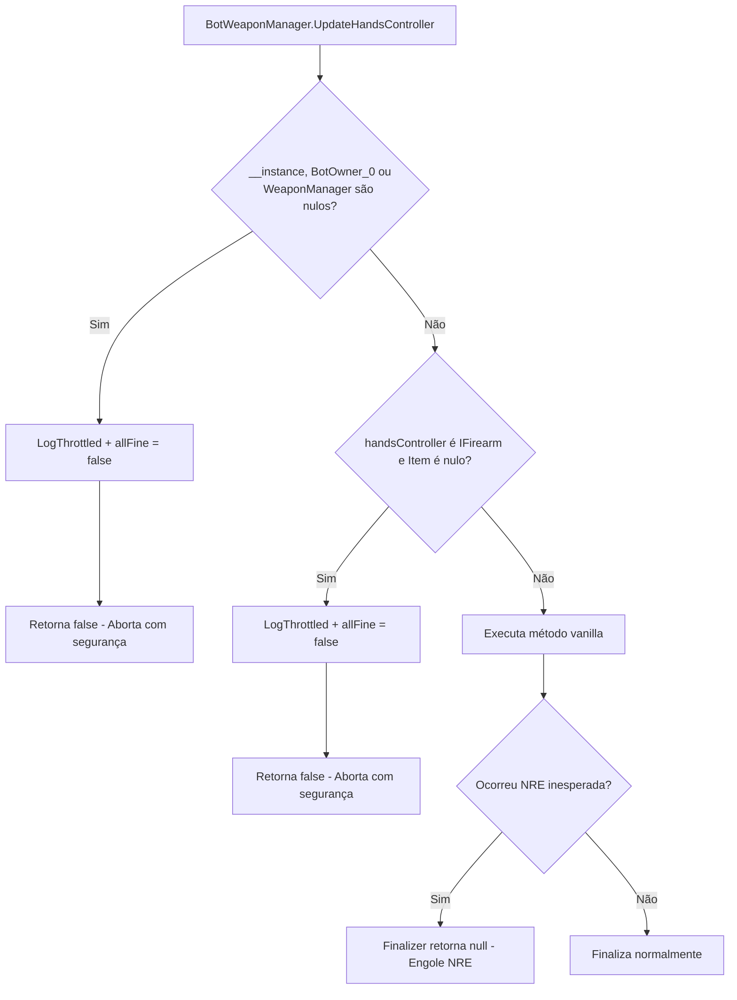
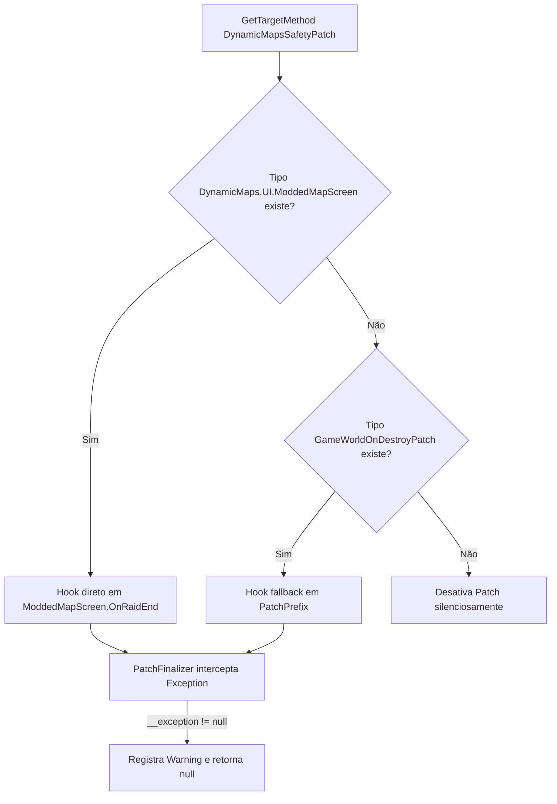

# TRL-Fixes — Estabilidade do Jogo Base e Tolerância a Falhas

Este documento descreve as defesas implementadas contra falhas de concorrência, corridas de estado de animação (*race conditions*) e vazamentos de exceções no motor principal do Escape from Tarkov e em utilitários de interface.

---

## 1. Prevenção de Trava de Controles no Pickup (`PickupAimingSafetyPatch.cs`)

### 1.1. Diagnóstico e Causa Raiz
Ao equipar ou pegar do chão itens volumosos (coletes balísticos, rigs táticos ou armas secundárias) usando a interação nativa "Pickup/Equipar", jogadores frequentemente sofriam com o congelamento completo dos comandos de locomoção e rotação da câmera, enquanto a interface (inventário TAB) permanecia ativa.

### 1.2. Estratégia de Mitigação e Telemetria Forense
A resolução em [PickupAimingSafetyPatch.cs](../modded-V2-audit/Patches/PickupAimingSafetyPatch.cs) atua como um `[PatchFinalizer]` sobre o setter `Player.FirearmController.IsAiming`:

| Comportamento | Detalhe da Implementação |
| :--- | :--- |
| **Captura Seletiva** | Intercepta exclusivamente instâncias de `NullReferenceException`. |
| **Diagnóstico Forense** | A **primeira ocorrência** no processo registra no log a **pilha de chamadas completa** (`Stack Trace`), permitindo validar se a origem partiu de `method_63/64`. |
| **Throttling de Logs** | Ocorrências subsequentes são agrupadas e logadas no máximo a cada **5 segundos** com contador acumulado. |
| **Recuperação da FSM** | O retorno `null` no Finalizer permite que o `MovementContext` complete a transição de estado sem travar o jogador. |

> Para o histórico completo da investigação e movimentação deste patch entre módulos, consulte o [Handoff Técnico de Pickup Aiming Safety](./handoff-pickup-aiming-safety.md).

---

## 2. Proteção de Ciclo de Vida do Gerenciador de Armas de IA (`BotWeaponManagerSafetyPatch.cs`)

### 2.1. O Problema das Transições em `LateUpdate`
Quando um bot de IA é abatido, desmaiado ou tem seu componente de IA desativado exatamente no mesmo frame em que uma troca de arma estava sendo concluída em `LateUpdate`, métodos como `BotWeaponManager.UpdateHandsController` e `BotWeaponSelector.OnWeaponTaken` tentavam ler propriedades em referências já desalocadas.

O arquivo [BotWeaponManagerSafetyPatch.cs](../modded-V2-audit/Patches/BotWeaponManagerSafetyPatch.cs) aplica dupla proteção (Prefix Defensivo + Finalizer):

### 2.2. Métodos Interceptados e Parâmetros

| Método Alvo | Tipo de Hook | Verificação Defensiva Realizada |
| :--- | :--- | :--- |
| `BotWeaponManager.UpdateHandsController` | `Prefix` | Aborta se `BotOwner_0 == null`, `WeaponManager == null` ou `firearm.Item == null`, atribuindo `allFine = false`. |
| `BotWeaponManager.UpdateHandsController` | `Finalizer` | Engole qualquer `NullReferenceException` residual escapada do código interno vanilla. |
| `BotWeaponSelector.OnWeaponTaken` | `Prefix` | Aborta se `BotOwner_0 == null` antes que o método tente ler `BotOwner_0.BotState`. |
| `BotWeaponSelector.OnWeaponTaken` | `Finalizer` | Engole `NullReferenceException` durante o descarte de armas em transição. |

---

## 3. Encerramento Seguro de Raid no DynamicMaps (`DynamicMapsSafetyPatch.cs`)

### 3.1. Falha de Descarte de Telas Modded
No encerramento de raid (`GameWorld.OnDestroy`), o mod de terceiros **DynamicMaps** dispara rotinas de limpeza de UI através de `DynamicMaps.UI.ModdedMapScreen.OnRaidEnd()`. Se o jogador extrair ou desconectar enquanto componentes gráficos ainda não foram totalmente instanciados, o método disparava NREs bloqueantes.

O [DynamicMapsSafetyPatch.cs](../modded-V2-audit/Patches/DynamicMapsSafetyPatch.cs) resolve o problema utilizando resolução hierárquica:

### 3.2. Vantagens do Patch Direto sobre o `OnRaidEnd`:
- **Isolamento de Escopo**: Interceptar o método interno `OnRaidEnd` impede que exceções geradas na limpeza de camadas do mapa afetem o pipeline de destruição do `GameWorld`.
- **Compatibilidade Resiliente**: Caso o DynamicMaps altere sua hierarquia interna de classes, o mecanismo de fallback garante compatibilidade retroativa sem interromper o carregamento do jogo.
