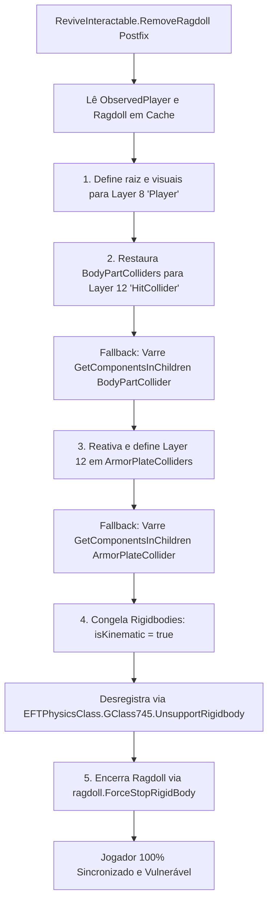
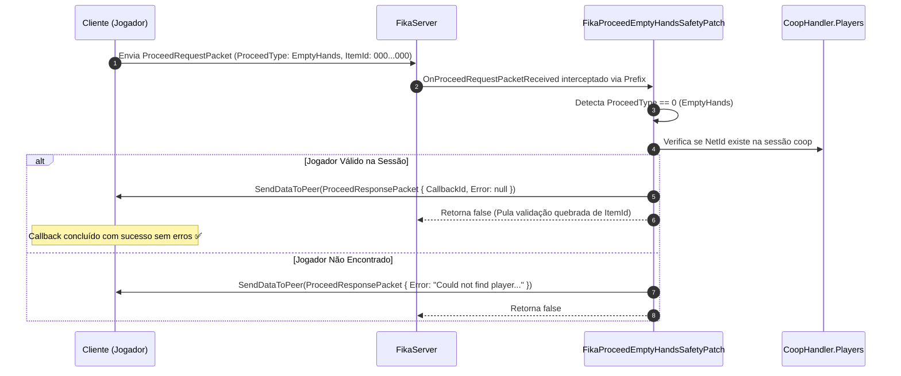
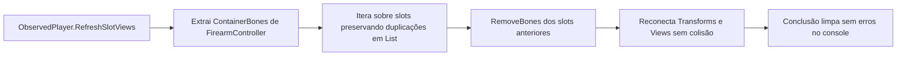

# TRL-Fixes — Integração, Rede e Sincronização FIKA Coop

O modo cooperativo **FIKA** introduz uma camada complexa de replicação cliente-servidor e interpolação de jogadores observados (`ObservedPlayer`). Este documento detalha os quatro patches dedicados a sanar problemas de colisão pós-morte, pacotes de sincronização de rede, renderização de inventário e execução de interface multi-thread no FIKA.

---

## 1. Restauração de Colisão e Placas Pós-Revive (`FixFikaReviveRagdollPatch.cs`)

### 1.1. O Desafio da Mecânica de Reviver
Ao reviver um companheiro de equipe no FIKA coop (`ReviveInteractable.RemoveRagdoll`), o motor do Tarkov precisa transicionar a entidade de um estado puramente físico de boneco de pano (*Ragdoll*) de volta para a máquina de animações e hitboxes do jogador. No FIKA nativo, os colisores corporais e placas de armadura frequentemente permaneciam desativados ou na camada de física errada, resultando em jogadores revividos invulneráveis ou com hitboxes descalibradas.

O [FixFikaReviveRagdollPatch.cs](../modded-V2-audit/Patches/FixFikaReviveRagdollPatch.cs) atua no `Postfix` de `ReviveInteractable.RemoveRagdoll`:



### 1.2. Protocolo de Restauração de Camadas

| Componente | Layer Alvo | Ação de Estado | Justificativa Técnica |
| :--- | :--- | :--- | :--- |
| **GameObject Raiz** | `Player` (Layer 8) | `SetLayersRecursively` | Permite interação de câmera e visão do jogador. |
| **BodyPartColliders** | `HitCollider` (Layer 12) | Ativo + Layer 12 | Restaura detecção de tiros nos membros (cabeça, tórax, pernas). |
| **ArmorPlateColliders** | `HitCollider` (Layer 12) | `SetActive(true)` + Layer 12 | Garante que placas balísticas absorvam danos corretamente. |
| **Rigidbodies** | N/A | `isKinematic = true`<br/>`CollisionMode = Discrete` | Desliga a física livre para que o `Animator` volte a comandar o corpo. |
| **EFTPhysicsClass** | N/A | `GClass745.UnsupportRigidbody` | Desregistra o suporte a físicas ativas da árvore do EFT. |

---

## 2. Validação de Pacotes de Mãos Vazias no FikaServer (`FikaProceedEmptyHandsSafetyPatch.cs`)

### 2.1. O Bug do `ProceedRequestPacket` com `EmptyHands`
Mods de recarga externa contínua (ex.: `SPT-ContinuousLoadAmmo`, `LoadAmmoAnim`) ou desarmamento rápido enviam pacotes de transição de mãos para o servidor FIKA com o enum `ProceedType == EmptyHands` (valor numérico `0`).

No FIKA original, o servidor sempre tentava resolver o item via `TryFindItemForProceedPacket(packet.ItemId)`. Como mãos vazias possuem ID vazio (`000000000000000000000000`), a busca falhava, o servidor rejeitava a transição e o cliente logava:
`[Error : Fika.Core] [HandleCallbackResponse]: Could not execute callback with id XX on the server`.



O arquivo [FikaProceedEmptyHandsSafetyPatch.cs](../modded-V2-audit/Patches/FikaProceedEmptyHandsSafetyPatch.cs) intercepta a requisição, envia a resposta de sucesso diretamente e evita a dessincronização de armas.

---

## 3. Resolução de Colisão em Armas Multi-Trilho (`FikaRefreshSlotViewsSafetyPatch.cs`)

### 3.1. Falha "CRITICAL ERROR DICTIONARY: mod_tactical"
No FIKA nativo, a reconstrução dos ossos de anexos da arma nas mãos (`ObservedPlayer.RefreshSlotViews`) populava um `Dictionary<string, ...>` indexado pelo `slot.FullId`. Armas avançadas contendo múltiplos trilhos ou slots táticos idênticos (ex.: múltiplos trilhos laterais `mod_tactical` em guardamãos modernos) geravam colisões de chave no dicionário, disparando erros críticos nos logs.

### 3.2. Solução Baseada em Pares Chave-Valor
O [FikaRefreshSlotViewsSafetyPatch.cs](../modded-V2-audit/Patches/FikaRefreshSlotViewsSafetyPatch.cs) substitui a indexação vulnerável por uma lista de tuplas:
```csharp
var currentViews = new List<KeyValuePair<string, GClass768.GClass769>>();
```



---

## 4. Despacho Thread-Safe de Mensagens de UI (`FikaMainThreadUISafetyPatch.cs`)

### 4.1. Chamadas Assíncronas de Interface
Quando o FIKA dispara alertas de desconexão, reconexão ou avisos de sincronização a partir de worker threads de rede (ex.: sockets LiteNetLib), a invocação direta de componentes do Unity UI resulta em exceções ou telas em branco, pois a Unity API não permite manipulação gráfica fora da thread principal.

### 4.2. Implementação do Dispatcher
O [FikaMainThreadUISafetyPatch.cs](../modded-V2-audit/Patches/FikaMainThreadUISafetyPatch.cs) intercepta `FikaUIGlobals.ShowFikaMessage(PreloaderUI, ...)`:

```mermaid
flowchart TD
    Call[Chamada ShowFikaMessage] --> CheckThread{Diz.Utils.AsyncWorker.CheckIsMainThread()?}
    CheckThread -->|Sim| RunMain[Executa normalmente na Main Thread]
    CheckThread -->|Não| Dispatch[Despacha delegate para Diz.Utils.AsyncWorker.RunInMainTread]
    Dispatch --> ReturnEmpty[Retorna instância padrão __result]
    ReturnEmpty --> Skip[Retorna false - Pula execução na Worker Thread]
    RunMain --> Finalizer[Finalizer suprime qualquer exceção de thread]
```

- **Thread-Safety**: Garante que o modal de aviso seja renderizado na tela sem congelar nem derrubar a thread de rede secundária.
- **Resolução Estática Específica**: Utiliza reflexão avançada para resolver o overload exato de `PreloaderUI`, evitando exceções de `AmbiguousMatchException`.
