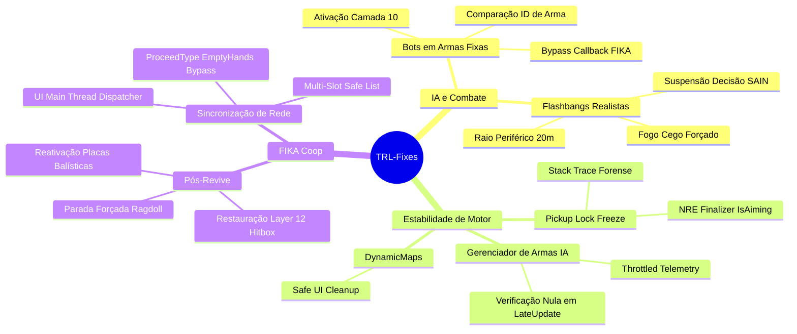

# Documentação Técnica — TRL-Fixes

Guia canônico e documentação modular da suíte de estabilização, inteligência artificial e interoperabilidade cooperativa do **TRL-Fixes** para **Single Player Tarkov (SPT 4.0 / EFT 0.16.9)** e **FIKA**.

---

## 📚 Índice Modular da Documentação

| Documento | Tema / Escopo | Status |
| :--- | :--- | :---: |
| [01. Visão Geral e Arquitetura](./01-visao-geral-e-arquitetura.md) | Arquitetura do plugin, ciclo BepInEx, soft dependencies, mapa geral e padrões de patching Harmony | 🟢 Vivo |
| [02. Patches de IA e Mecânicas de Combate](./02-patches-de-ia-e-combate.md) | Operação de armas estacionárias (NSV/AGS-30), supressão do SAIN sob flashbangs e cálculo de raio | 🟢 Vivo |
| [03. Estabilidade e Tolerância a Falhas](./03-estabilidade-e-tolerancia-a-falhas.md) | Proteção de controles no pickup de itens, segurança em gerenciadores de armas e DynamicMaps | 🟢 Vivo |
| [04. Integração e Sincronização FIKA Coop](./04-integracao-e-sincronizacao-fika-coop.md) | Restauração de física/hitboxes pós-revive, pacotes EmptyHands, colisão multi-slot e UI thread-safe | 🟢 Vivo |
| [Handoff Técnico — Pickup Aiming Safety](./handoff-pickup-aiming-safety.md) | Histórico de diagnóstico, movimentação entre módulos e análise forense da trava de controles | 🟢 Vivo |
| [Relatório de Auditoria Técnica de Código (Review 01)](./relatorio-auditoria-codigo-01.md) | Auditoria estática profunda com 7 achados técnicos (AP-04, Null Safety, Zero-Alloc) | 🟢 Vivo |
| [Relatório de Auditoria e Code Review (Review 02)](./relatorio-auditoria-codigo-02.md) | Validação e aprovação da v1.3.1 após resolução completa de todos os 7 achados | 🟢 Vivo |

---

## 🗂️ Mapeamento do Código-Fonte (`modded-V2-audit/`)

| Arquivo | Subsistema | Linhas | Descrição Técnica |
| :--- | :--- | :---: | :--- |
| [Plugin.cs](../modded-V2-audit/Plugin.cs) | Core | 129 | Entrypoint BepInEx, instanciação controlada de patches com try-catch e declaração de dependências. |
| [TRLFixes.csproj](../modded-V2-audit/TRLFixes.csproj) | Build | 45 | Projeto MSBuild (.NET Framework 4.7.2), referências e SemVer integrado. |
| [CHANGELOG.md](../modded-V2-audit/CHANGELOG.md) | Histórico | 49 | Histórico detalhado de lançamentos e notas de versão. |
| [BotMountWeaponFixPatch.cs](../modded-V2-audit/Patches/BotMountWeaponFixPatch.cs) | IA / Combate | 173 | 5 patches para ativação de Camada 10, resolução de IDs de armas e bypass de rede no FIKA. |
| [BotWeaponManagerSafetyPatch.cs](../modded-V2-audit/Patches/BotWeaponManagerSafetyPatch.cs) | Engine / IA | 119 | Prefixes e Finalizers defensivos contra NREs durante trocas de arma em `LateUpdate`. |
| [DynamicMapsSafetyPatch.cs](../modded-V2-audit/Patches/DynamicMapsSafetyPatch.cs) | UI / Engine | 57 | Finalizer protetor para encerramento de raid no mod DynamicMaps. |
| [FikaMainThreadUISafetyPatch.cs](../modded-V2-audit/Patches/FikaMainThreadUISafetyPatch.cs) | FIKA / UI | 90 | Despacha mensagens de erro do FIKA da thread de rede para a Unity Main Thread. |
| [FikaProceedEmptyHandsSafetyPatch.cs](../modded-V2-audit/Patches/FikaProceedEmptyHandsSafetyPatch.cs) | FIKA / Rede | 165 | Intercepta pacotes de mãos vazias no `FikaServer`, prevenindo rejeições de callbacks. |
| [FikaRefreshSlotViewsSafetyPatch.cs](../modded-V2-audit/Patches/FikaRefreshSlotViewsSafetyPatch.cs) | FIKA / Visual | 187 | Reorganiza montagem de slots de armas em listas para evitar erro crítico de dicionário. |
| [FixFikaReviveRagdollPatch.cs](../modded-V2-audit/Patches/FixFikaReviveRagdollPatch.cs) | FIKA / Física | 145 | Reabilita colisores, placas balísticas e congela físicas após reanimação de jogadores. |
| [FlashbangBotPatch.cs](../modded-V2-audit/Patches/FlashbangBotPatch.cs) | IA / SAIN | 76 | Suspende atualizações do SAIN e força fogo cego enquanto o bot estiver sob efeito de flashbang. |
| [FlashbangRadiusPatch.cs](../modded-V2-audit/Patches/FlashbangRadiusPatch.cs) | Combate | 78 | Amplia a sensibilidade periférica e raio de cegueira de granadas de atordoamento para 20m. |
| [PickupAimingSafetyPatch.cs](../modded-V2-audit/Patches/PickupAimingSafetyPatch.cs) | Engine / FSM | 90 | Harmony Finalizer que impede a trava de controles do personagem ao pegar itens do chão. |

---

## 🔍 Resumo de Problemas e Soluções Implementadas

