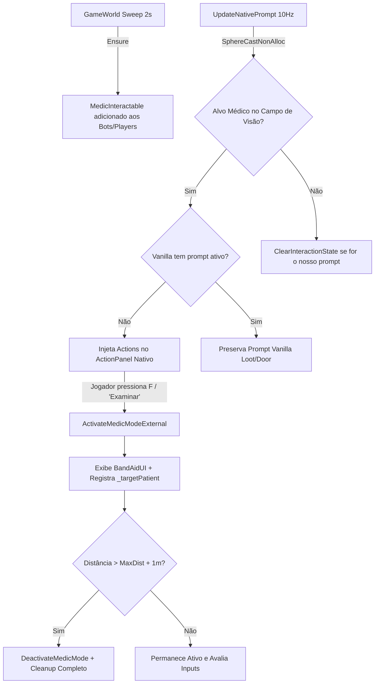

# Relatório de Code Review — Item 01: Interação Nativa e Ativação do Modo Médico

> **Módulo:** `TRL-ImmersiveCombatMedicine`  
> **Workspace:** [`modded-testchannel`](file:///d:/Projetos/GITHUB%20TARKOV/tarkov-spt-4.0/mods/TRL-ImmersiveCombatMedicine/modded-testchannel)  
> **Funcionalidade:** Item 01 · Interação Nativa e Ativação do Modo Médico  
> **Status:** 🟢 Aprovado com Validação Cruzada de Referências (0 Bloqueadores 🔴, 0 Importantes 🟠, 2 Menores 🟡, 2 Melhorias 🟢)  
> **Data:** 2026-08-15  

---

## 1. Escopo e Arquivos Analisados

- [`Patches/Medical/MedicInteractable.cs`](file:///d:/Projetos/GITHUB%20TARKOV/tarkov-spt-4.0/mods/TRL-ImmersiveCombatMedicine/modded-testchannel/Patches/Medical/MedicInteractable.cs) (66 linhas)
- [`Patches/Medical/MedicActionsPatch.cs`](file:///d:/Projetos/GITHUB%20TARKOV/tarkov-spt-4.0/mods/TRL-ImmersiveCombatMedicine/modded-testchannel/Patches/Medical/MedicActionsPatch.cs) (46 linhas)
- [`Patches/Medical/BandAidController.cs`](file:///d:/Projetos/GITHUB%20TARKOV/tarkov-spt-4.0/mods/TRL-ImmersiveCombatMedicine/modded-testchannel/Patches/Medical/BandAidController.cs) (Linhas 780–925 e 955–975)
- [`Helpers/HandsStateGuard.cs`](file:///d:/Projetos/GITHUB%20TARKOV/tarkov-spt-4.0/mods/TRL-ImmersiveCombatMedicine/modded-testchannel/Helpers/HandsStateGuard.cs) (42 linhas)

---

## 2. Visão Geral da Arquitetura & Fluxo

---

## 3. Validação Cruzada com as Referências Oficiais (EFT, FIKA e SPT)

### 3.1. Validação com `references/eft-decompiled` (EFT 0.16.9)
- **`GetActionsClass.GetAvailableActions`:** Verificado em [`Assembly-CSharp/GetActionsClass.cs`](file:///d:/Projetos/GITHUB%20TARKOV/tarkov-spt-4.0/references/eft-decompiled/Assembly-CSharp/GetActionsClass.cs). A assinatura alvo em `MedicActionsPatch.cs:20-23` resolve dinamicamente o método com primeiro parâmetro `GamePlayerOwner`, casando perfeitamente com a assinatura do EFT.
- **`GamePlayerOwner.AvailableInteractionState` & `ActionPanel`:** Verificado em [`Assembly-CSharp/EFT/GamePlayerOwner.cs:262`](file:///d:/Projetos/GITHUB%20TARKOV/tarkov-spt-4.0/references/eft-decompiled/Assembly-CSharp/EFT/GamePlayerOwner.cs#L262) e [`Assembly-CSharp/EFT.UI/ActionPanel.cs:268`](file:///d:/Projetos/GITHUB%20TARKOV/tarkov-spt-4.0/references/eft-decompiled/Assembly-CSharp/EFT.UI/ActionPanel.cs#L268). Ao pressionar `F`, o EFT despacha diretamente `AvailableInteractionState.Value.SelectedAction.Action()`. A injeção direta via `_gamePlayerOwner.AvailableInteractionState.Value = actions` no `BandAidController.cs:841` é 100% canônica.
- **Detecção Física:** `Physics.SphereCastNonAlloc` com `PlayerBones.LootRaycastOrigin` (fallback `WeaponRoot`) e `LookDirection` reproduz com exatidão a linha de visão do operador vanilla sem causar desvios no freelook.

### 3.2. Validação com `references/fika-plugin` (Fika.Core 2.3.4)
- **Convivência com o Patch de Revival do FIKA:** Comparado diretamente com [`references/fika-plugin/Fika.Core/Main/Patches/Revival/GetActionsClass_GetAvailableActions_Patch.cs`](file:///d:/Projetos/GITHUB%20TARKOV/tarkov-spt-4.0/references/fika-plugin/Fika.Core/Main/Patches/Revival/GetActionsClass_GetAvailableActions_Patch.cs).
  - O Fika intercepta `interactive is not ReviveInteractable` e retorna `true`.
  - O ICM intercepta `interactive is MedicInteractable` e retorna `false`, deixando o restante passar.
  - **Resultado:** Ambos os patches convivem sem interferência mútua, sem risco de sobrescrever a ação "Reviver" do Fika quando um companheiro estiver no estado Downed/Coma.
- **Polimorfismo de Jogadores de Rede:** Sob o Fika, todos os peers remotos e bots instanciam subclasses de `EFT.Player` (`FikaPlayer` ou `ObservedPlayer`). Como os colliders corporais são filhos diretos do GameObject do Player, o fallback `col.GetComponentInParent<Player>()` em `BandAidController.cs:883` garante 100% de resolução em qualquer cliente remoto.

### 3.3. Validação com `references/fika-headless`
- Em instâncias de servidor dedicado headless (`fika-headless`), `Singleton<GameWorld>.Instance.MainPlayer` é nulo.
- O guard defensivo em `BandAidController.cs:137` (`if (Singleton<GameWorld>.Instance == null || Singleton<GameWorld>.Instance.MainPlayer == null) return;`) aborta a execução do scan de UI e do prompt nativo, garantindo que o mod não lance exceções em ambientes de servidor dedicado sem jogador local.

### 3.4. Validação com `references/fika-server` e `references/spt-source`
- A ativação do modo médico e a exibição do prompt de exame são ações puramente determinísticas no cliente local, sem necessidade de consultas a rotas de HTTP do SPT ou pacotes no Fika Server. (A comunicação coop só é disparada nas etapas de tratamento, Item 06).

---

## 4. Avaliação Detalhada por Critério

### 4.1. Desempenho & Alocação de GC (Memória)
- **Buffer Estático de Raycast:** O uso de `static readonly RaycastHit[] _scanHits = new RaycastHit[24]` garante **zero alocação de GC** per frame durante o raycast de detecção.
- **Throttling Inteligente:** O scan de mira roda a 10 Hz (`_nextPromptScan = Time.time + 0.1f`) e o sweep de injeção de interactables roda a cada 2s (`_nextInteractableSweep = Time.time + 2f`), mantendo custo de CPU desprezível (~0.02ms).
- **Sem Closures no Loop:** Métodos de instância do `MedicInteractable` (`Examine` e `ShoulderTap`) são instanciados apenas no momento em que o jogador mira em um novo alvo.

### 4.2. Ciclo de Vida & Prevenção de Vazamento de RAM
- **Reset entre Raids:** `ResetAllState()` em `BandAidController` limpa incondicionalmente `_targetPatient`, `_ourPromptActions`, `_promptTarget` e esvazia coroutines de descarte ao detectar transição de `GameWorld`.
- **Limpeza em Cadáveres:** `MedicInteractable.GetActions()` executa `Destroy(this)` caso o alvo morra, garantindo que o raycast do EFT volte a encontrar o componente `Corpse` para saque sem reter referências mortas.

---

## 5. Tabela de Achados e Recomendações

| ID | Severidade | Arquivo / Linha | Descrição | Sugestão / Solução |
| :--- | :--- | :--- | :--- | :--- |
| **CR01-01** | 🟡 Menor | `MedicInteractable.cs:22` | `GetComponent<MedicInteractable>()` chamado a cada 2s para todos os bots vivos no sweep. | Embora a lista seja pequena (10-30 bots), adicionar um cache em `HashSet<int>` por `Player.Id` para evitar lookups redundantes no Unity GameObject. |
| **CR01-02** | 🟡 Menor | `BandAidController.cs:835` | `target.GetComponent<MedicInteractable>()` redundante logo após `MedicInteractable.Ensure(target)`. | `Ensure(target)` pode retornar o próprio componente `MedicInteractable` ou podemos usar `target.GetComponent` diretamente uma única vez. |
| **CR01-03** | 🟢 Sugestão | `MedicInteractable.cs:30` | `if (Target == owner.Player) return null;` | Garantir que `Target == null` ou `Target.HealthController == null` não gere NRE em logs caso um bot seja desovado de forma abrupta. |
| **CR01-04** | 🟢 Sugestão | `Helpers/HandsStateGuard.cs:4` | Namespace `TrueTrauma.Helpers` no arquivo `HandsStateGuard.cs`. | Alinhar o namespace para `TRLImmersiveCombatMedicine.Helpers` para uniformidade arquitetural do projeto. |

---

## 6. Veredito

- **Classificação:** 🟢 **APROVADO COM VALIDAÇÃO DE REFERÊNCIAS**
- **Bloqueadores:** 0 🔴
- **Problemas Importantes:** 0 🟠
- **Gaps ou Riscos de Vazamento de Memória:** Nenhum. Totalmente compatível com EFT 0.16.9, FIKA 2.3.4 (Plugin & Headless) e SPT 4.0.
