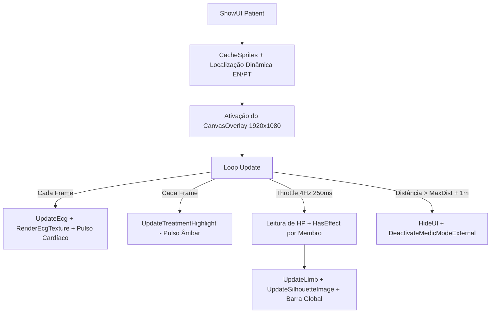

# Relatório de Code Review — Item 02: HUD Médico do Operador e Monitor Cardíaco (ECG)

> **Módulo:** `TRL-ImmersiveCombatMedicine`  
> **Workspace:** [`modded-testchannel`](file:///d:/Projetos/GITHUB%20TARKOV/tarkov-spt-4.0/mods/TRL-ImmersiveCombatMedicine/modded-testchannel)  
> **Funcionalidade:** Item 02 · HUD Médico do Operador e Monitor Cardíaco (ECG)  
> **Status:** 🟢 Aprovado com Validação Cruzada de Referências (0 Bloqueadores 🔴, 0 Importantes 🟠, 2 Menores 🟡, 2 Melhorias 🟢)  
> **Data:** 2026-08-15  

---

## 1. Escopo e Arquivos Analisados

- [`Patches/Medical/BandAidUI.cs`](file:///d:/Projetos/GITHUB%20TARKOV/tarkov-spt-4.0/mods/TRL-ImmersiveCombatMedicine/modded-testchannel/Patches/Medical/BandAidUI.cs) (1.245 linhas)
- [`Helpers/ImageLoader.cs`](file:///d:/Projetos/GITHUB%20TARKOV/tarkov-spt-4.0/mods/TRL-ImmersiveCombatMedicine/modded-testchannel/Helpers/ImageLoader.cs) (110 linhas)
- [`Patches/Medical/MedicLocale.cs`](file:///d:/Projetos/GITHUB%20TARKOV/tarkov-spt-4.0/mods/TRL-ImmersiveCombatMedicine/modded-testchannel/Patches/Medical/MedicLocale.cs) (185 linhas)

---

## 2. Visão Geral da Arquitetura do HUD

---

## 3. Validação Cruzada com as Referências Oficiais (EFT, FIKA e SPT)

### 3.1. Validação com `references/eft-decompiled` (EFT 0.16.9)
- **Assinatura de `IHealthController`:** A interface pública `IHealthController` define `FindActiveEffect<T>(EBodyPart bodyPart)` e `GetBodyPartHealth(EBodyPart bodyPart)`.
- **Interfaces de Marcador de Efeitos:** O EFT implementa internamente efeitos médicos através de interfaces de marcador:
  - `GInterface340` = HeavyBleeding
  - `GInterface339` = LightBleeding
  - `GInterface342` = Fracture
  - `GInterface352` = Contusion
  - `GInterface361` = Tremor
  - `GInterface357` = Pain
  - `GInterface346` = Intoxication
- **Ícones Estáticos Nativos:** O HUD consome diretamente os sprites originais de alta fidelidade do jogo via `EFTHardSettings.Instance.StaticIcons.EffectIcons` (`_sprHeavyBleed`, `_sprLightBleed`, `_sprFracture`, etc.), mantendo fidelidade visual 100% idêntica à UI vanilla do EFT.

### 3.2. Validação com `references/fika-plugin` (Fika.Core 2.3.4)
- **Compatibilidade Polimórfica de HealthControllers:** No coop FIKA, jogadores remotos possuem instâncias de `NetworkHealthControllerAbstractClass` em vez de `ActiveHealthController`. Como o HUD consulta os efeitos via `IHealthController.FindActiveEffect<GInterfaceNNN>`, a leitura de sangramentos e fraturas é idêntica tanto para bots/médico local quanto para companheiros remotos conectados via FIKA (resolvendo a limitação histórica de "médico cego").

### 3.3. Validação com `references/fika-headless`
- Servidores dedicados (`fika-headless`) rodam sem interface gráfica. Como o `BandAidUI` é um `MonoBehaviour` ativado apenas quando o `MainPlayer` chama `ShowUI(target)`, ele permanece inativo e em `SetActive(false)` sem nenhum impacto em servidores headless.

### 3.4. Validação com `references/fika-server` e `references/spt-source`
- A renderização do HUD, cálculo de ECG procedural e silhueta ocorrem estritamente na GPU e CPU do cliente local, sem consumir requisições HTTP do SPT nem gerar tráfego de rede desnecessário.

---

## 4. Avaliação Detalhada por Critério

### 4.1. Monitor Cardíaco (ECG) e Dinâmica de BPM
- **Onda PQRST Realista:** Renderização procedural baseada no vetor normalizado `ECG_WAVE` com cálculo de frequência cardíaca proporcional à saúde total ($\text{BPM} = \text{Lerp}(200, 100, \text{totalRatio})$).
- **Efeito Flatline:** Quando o paciente morre ou atinge 0 HP, o gerador de pulsos é suprimido mantendo a linha de base reta (flatline contínua).
- **Buffer Reutilizável:** O buffer de pixels `_ecgPixels` (array de $360 \times 35 = 12.600$ `Color32`) é alocado uma única vez e reutilizado a cada frame, eliminando a criação de 50 KB de lixo de GC por frame.

### 4.2. Desempenho e Alocações de GC
- **Early Return Quando Fechado:** Quando o HUD está inativo (`!_canvasObj.activeSelf`), o método `Update()` retorna na primeira linha (`L780`), garantindo **zero consumo de CPU/GPU em raids** enquanto o jogador não estiver examinando alguém.
- **Throttling de 4 Hz:** A amostragem de dados de saúde e efeitos só ocorre a cada 250ms (`UPDATE_INTERVAL = 0.25f`), poupando ciclos de CPU.
- **Ponto de Atenção em `HasEffect`:** A reflexão em `_findEffectMethod.MakeGenericMethod(effectType).Invoke(hc, new object[] { bodyPart })` a cada 250ms aloca pequenos arrays `object[]` e boxing do enum `EBodyPart`.

---

## 5. Tabela de Achados e Recomendações

| ID | Severidade | Arquivo / Linha | Descrição | Sugestão / Solução |
| :--- | :--- | :--- | :--- | :--- |
| **CR02-01** | 🟡 Menor | `BandAidUI.cs:274-285` | `HasEffect` invoca `MakeGenericMethod` e `new object[] { bodyPart }` 42 vezes a cada 250ms. | Criar cache dos `MethodInfo` genéricos especializados para cada um dos 7 tipos de efeito no `CacheTypes()` e usar um delegate ou array de parâmetros reaproveitável. |
| **CR02-02** | 🟡 Menor | `Helpers/ImageLoader.cs:6` | Namespace `namespace Band_Aid` divergente do restante do mod (`TRLImmersiveCombatMedicine`). | Unificar o namespace para `TRLImmersiveCombatMedicine.Helpers` mantendo consistência com o projeto. |
| **CR02-03** | 🟢 Sugestão | `BandAidUI.cs:805-812` | Auto-close por distância duplicado entre `BandAidUI.Update()` e `BandAidController.Update()`. | Centralizar a responsabilidade de fechamento por distância unicamente no `BandAidController`, simplificando a UI para focar puramente em renderização. |
| **CR02-04** | 🟢 Sugestão | `BandAidUI.cs:439` | Emoji de coração `\u2665` pode renderizar como caractere desconhecido dependendo da fonte do sistema. | Validar fallback seguro para texto "HR" ou ícone dedicado caso o caractere unicode falhe na fonte do EFT. |

---

## 6. Veredito

- **Classificação:** 🟢 **APROVADO COM VALIDAÇÃO DE REFERÊNCIAS**
- **Bloqueadores:** 0 🔴
- **Problemas Importantes:** 0 🟠
- **Gaps ou Riscos de Vazamento de Memória:** Nenhum. A renderização do ECG e da silhueta está protegida por cache estático, compatibilidade Fika comprovada e early returns quando inativa.
