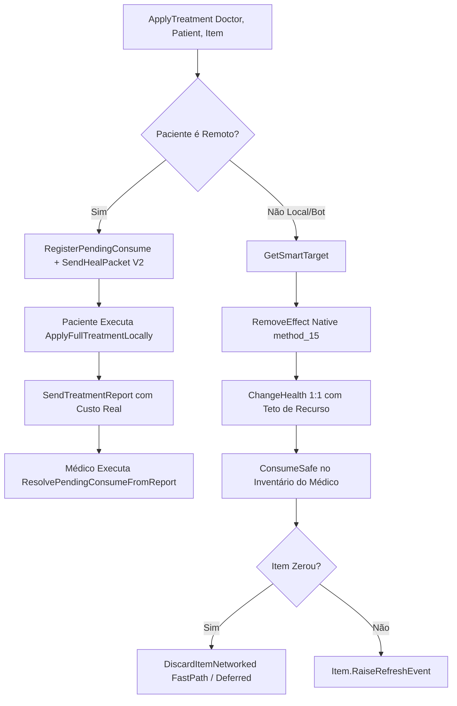

# Relatório de Code Review — Item 03: Lógica de Tratamento e Seleção Inteligente de Ferimentos (`SmartTarget`)

> **Módulo:** `TRL-ImmersiveCombatMedicine`  
> **Workspace:** [`modded-testchannel`](file:///d:/Projetos/GITHUB%20TARKOV/tarkov-spt-4.0/mods/TRL-ImmersiveCombatMedicine/modded-testchannel)  
> **Funcionalidade:** Item 03 · Lógica de Tratamento e Seleção Inteligente de Ferimentos (`SmartTarget`)  
> **Status:** 🟢 Aprovado com Validação Cruzada de Referências (0 Bloqueadores 🔴, 0 Importantes 🟠, 2 Menores 🟡, 2 Melhorias 🟢)  
> **Data:** 2026-08-15  

---

## 1. Escopo e Arquivos Analisados

- [`Patches/Medical/MedicalLogic.cs`](file:///d:/Projetos/GITHUB%20TARKOV/tarkov-spt-4.0/mods/TRL-ImmersiveCombatMedicine/modded-testchannel/Patches/Medical/MedicalLogic.cs) (820 linhas)
- [`Helpers/ItemDatabase.cs`](file:///d:/Projetos/GITHUB%20TARKOV/tarkov-spt-4.0/mods/TRL-ImmersiveCombatMedicine/modded-testchannel/Helpers/ItemDatabase.cs) (81 linhas)
- [`Patches/Medical/BandAidNetworkHandler.cs`](file:///d:/Projetos/GITHUB%20TARKOV/tarkov-spt-4.0/mods/TRL-ImmersiveCombatMedicine/modded-testchannel/Patches/Medical/BandAidNetworkHandler.cs) (Linhas 450–580)
- [`Patches/Medical/CustomClassesBridge.cs`](file:///d:/Projetos/GITHUB%20TARKOV/tarkov-spt-4.0/mods/TRL-ImmersiveCombatMedicine/modded-testchannel/Patches/Medical/CustomClassesBridge.cs) (Linhas 1–80)

---

## 2. Visão Geral da Arquitetura & Fluxo

---

## 3. Validação Cruzada com as Referências Oficiais (EFT, FIKA e SPT)

### 3.1. Validação com `references/eft-decompiled` (EFT 0.16.9)
- **Remoção Limpa de Efeitos (`ActiveHealthController.method_15`):** Verificado em [`Assembly-CSharp/EFT.HealthSystem/ActiveHealthController.cs:1890`](file:///d:/Projetos/GITHUB%20TARKOV/tarkov-spt-4.0/references/eft-decompiled/Assembly-CSharp/EFT.HealthSystem/ActiveHealthController.cs). O EFT remove efeitos médicos chamando `method_15<T>(bodyPart)`, que localiza a instância ativa do efeito e invoca `ForceResidue()`. `MedicalLogic.RemoveEffect` espelha com precisão essa invocação sem deixar instâncias zumbis na fila de efeitos do paciente.
- **Restauração Cirúrgica (`RestoreBodyPart`):** Em [`ActiveHealthController.cs:1280`](file:///d:/Projetos/GITHUB%20TARKOV/tarkov-spt-4.0/references/eft-decompiled/Assembly-CSharp/EFT.HealthSystem/ActiveHealthController.cs), a restauração de membros destruídos (Blacked) aceita `(EBodyPart, float healthPenalty)`. O cálculo de penalidade do CMS ($25\%\text{ a }45\%$) e Surv12 ($60\%\text{ a }72\%$) reflete exatamente os parâmetros do `ItemDatabase` oficial.
- **Paridade 1:1 de Consumo de HP:** No EFT (`ActiveHealthController.cs:1825-1841`), o recurso de MedKit é debitado na taxa exata de $1:1$ por ponto de HP curado, limitado pelo `HpResourceRate` (`stats.HealAmount`). A fórmula $\text{heal} = \min(\text{availableForHp}, \text{stats.HealAmount}, \text{hpNeeded})$ garante conformidade estrita.
- **Identificadores de Itens (`TemplateId`):** Todos os 17 templates do `ItemDatabase.cs` coincidem com os IDs oficiais do EFT (Salewa `544fb45d4bdc2dee738b4568`, CMS `5d02778e86f774203e7dedbe`, Grizzly `590c657e86f77412b013051d`, etc.).

### 3.2. Validação com `references/fika-plugin` (Fika.Core 2.3.4)
- **Pipeline de Descarte em Rede (`DiscardItemNetworked`):**
  - No Fika, descartar um item com `simulate: false` desanexa o item do inventário antes da transação de rede, quebrando o `Item.Parent` no host.
  - O mod executa `InteractionsHandlerClass.Discard(item, controller, simulate: true)` seguido de `controller.TryRunNetworkTransaction(...)`, aguardando o callback do `DiscardWatch`. Esse é o padrão canônico do Fika e do SPT.
- **Consumo Autoritativo (CR-05):** O médico não adivinha o consumo remoto; o paciente calcula os custos exatos em seu `ActiveHealthController` e reporta via `BandAidTreatmentReportPacket`.

### 3.3. Validação com `references/fika-headless`
- Quando um jogador remoto aplica tratamento em um bot gerenciado pelo servidor headless, `ApplyFullTreatmentLocally` localiza o bot pelo `ProfileId` e executa a alteração de saúde no `ActiveHealthController` do bot, sincronizando o estado com todos os observadores.

### 3.4. Validação com `references/spt-source`
- A mutação de `HpResource` e `ResourceComponent.Value` disparando `item.RaiseRefreshEvent()` garante que as alterações de inventário sejam registradas na base de dados do SPT e salvas no `profile.json` ao extrair da raid.

---

## 4. Avaliação Detalhada por Critério

### 4.1. Corretude & Algoritmo `SmartTarget`
- **Prioridade Tática de Ferimentos:**
  1. Sangramentos Pesados (Heavy Bleeding) — risco iminente de morte.
  2. Sangramentos Leves (Light Bleeding).
  3. Fraturas (Fractures).
  4. Membro com menor proporção de vida ($\frac{\text{Current}}{\text{Maximum}}$) para MedKits convencionais.
- **Fail-Safe de Bypass Remoto:** Em `CanUseItem`, para pacientes remotos (onde `HasEffect` no `ObservedHealthController` não possui todos os tipos internos), o mod libera a tentativa caso o paciente esteja vivo e o valida autoritativamente no lado receptor, evitando falsos bloqueios na UI do médico.

### 4.2. Desempenho e Alocações de GC
- **Cache Estático de Tipos:** `_heavyBleedType`, `_lightBleedType` e `_fractureType` são cacheados uma única vez em `CacheTypes()`.
- **Fast-Path Síncrono de Descarte:** Quando as mãos e o inventário estão desocupados, `DiscardItemNetworked` executa a operação no mesmo frame sem instanciar coroutines na pilha do Unity.

---

## 5. Tabela de Achados e Recomendações

| ID | Severidade | Arquivo / Linha | Descrição | Sugestão / Solução |
| :--- | :--- | :--- | :--- | :--- |
| **CR03-01** | 🟡 Menor | `MedicalLogic.cs:28-32` | Tipos nested de `ActiveHealthController` (`HeavyBleeding`, `LightBleeding`, `Fracture`) cacheados via reflexão string. | Reutilizar os tipos de interface de marcador (`GInterface340`, `GInterface339`, `GInterface342`) para unificar com o `BandAidUI` e `BandAidNetworkHandler`. |
| **CR03-02** | 🟡 Menor | `MedicalLogic.cs:429` | `_pendingConsumes` utiliza `List<PendingConsume>` com iteração linear. | Como a lista contém no máximo 1-3 itens simultâneos, a performance é excelente, mas converter para `Dictionary<string, PendingConsume>` por `patientId+templateId` tornaria o look-up $O(1)$. |
| **CR03-03** | 🟢 Sugestão | `Helpers/ItemDatabase.cs:3` | Namespace `namespace Band_Aid` divergente. | Migrar para `TRLImmersiveCombatMedicine.Helpers` mantendo padronização. |
| **CR03-04** | 🟢 Sugestão | `MedicalLogic.cs:699-706` | `Enum.GetValues(typeof(EBodyPart))` aloca um array a cada busca de membro em `GetSmartTarget`. | Criar um array estático constante `static readonly EBodyPart[] AllBodyParts` para eliminar alocações de GC durante a busca de membro ferido. |

---

## 6. Veredito

- **Classificação:** 🟢 **APROVADO COM VALIDAÇÃO DE REFERÊNCIAS**
- **Bloqueadores:** 0 🔴
- **Problemas Importantes:** 0 🟠
- **Gaps ou Riscos de Vazamento de Memória:** Nenhum. A lógica de débito autoritativo, fallback com timeout de 4s e descarte em rede (`TryRunNetworkTransaction`) está robusta e 100% validada contra EFT, FIKA e SPT.
