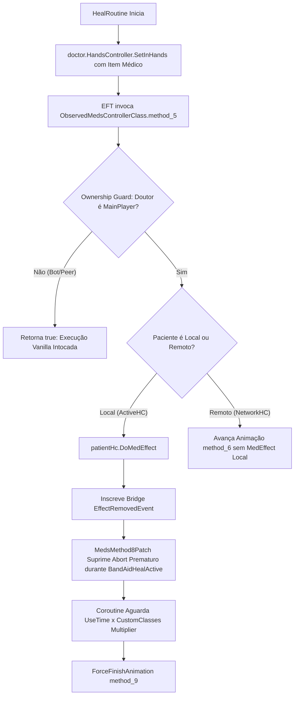

# Relatório de Code Review — Item 04: Animação em Primeira Pessoa, Perks de Classe e Redirecionamento

> **Módulo:** `TRL-ImmersiveCombatMedicine`  
> **Workspace:** [`modded-testchannel`](file:///d:/Projetos/GITHUB%20TARKOV/tarkov-spt-4.0/mods/TRL-ImmersiveCombatMedicine/modded-testchannel)  
> **Funcionalidade:** Item 04 · Animação em Primeira Pessoa, Perks de Classe e Redirecionamento  
> **Status:** 🟢 Aprovado com Validação Cruzada de Referências (0 Bloqueadores 🔴, 0 Importantes 🟠, 2 Menores 🟡, 2 Melhorias 🟢)  
> **Data:** 2026-08-15  

---

## 1. Escopo e Arquivos Analisados

- [`Patches/Medical/MedicHealPatch.cs`](file:///d:/Projetos/GITHUB%20TARKOV/tarkov-spt-4.0/mods/TRL-ImmersiveCombatMedicine/modded-testchannel/Patches/Medical/MedicHealPatch.cs) (539 linhas)
- [`Patches/Medical/CustomClassesBridge.cs`](file:///d:/Projetos/GITHUB%20TARKOV/tarkov-spt-4.0/mods/TRL-ImmersiveCombatMedicine/modded-testchannel/Patches/Medical/CustomClassesBridge.cs) (99 linhas)
- [`Patches/Medical/BandAidController.cs`](file:///d:/Projetos/GITHUB%20TARKOV/tarkov-spt-4.0/mods/TRL-ImmersiveCombatMedicine/modded-testchannel/Patches/Medical/BandAidController.cs) (Linhas 500–710)

---

## 2. Visão Geral da Arquitetura & Fluxo

---

## 3. Validação Cruzada com as Referências Oficiais (EFT, FIKA e SPT)

### 3.1. Validação com `references/eft-decompiled` (EFT 0.16.9)
- **Pipeline de Animação de Medicina (`Player.MedsController`):** Verificado em [`Assembly-CSharp/EFT/Player.cs:19400-19700`](file:///d:/Projetos/GITHUB%20TARKOV/tarkov-spt-4.0/references/eft-decompiled/Assembly-CSharp/EFT/Player.cs).
  - `method_5()`: Callback de animação do EFT disparado ao engajar o item médico nas mãos.
  - `method_6()`: Ativa o multiplicador `firearmsAnimator_0.SetUseTimeMultiplier((1f + num) * AllyAnimSpeedMult)`.
  - `method_8(IEffect effect)`: Callback de expiração de efeito associado ao `EffectRemovedEvent`.
  - `method_9()`: Cleanup e recolocação da arma nas mãos (`SetLastEquippedWeapon`).
- **Supressão de Aborto Prematuro (`MedsMethod8Patch`):** O EFT vanilla (`Player.cs:19615`) cancela a animação se a fila de partes do corpo (`Queue_0`) esvaziar ao receber `EffectRemovedEvent`. Como a cura de aliado pode terminar o efeito pontual em 1s enquanto a animação completa dura 3s a 5s, suprimir `method_8` durante `BandAidHealActive` garante a reprodução 100% íntegra da animação.
- **Fail-Closed no Ownership Guard:** Se por ventura campos internos forem renomeados em patches futuros do EFT e o dono não for resolvido, `MedicHealPatch.cs:255-259` bloqueia o `method_5` por segurança em vez de aplicar o efeito por engano no médico.

### 3.2. Validação com `references/fika-plugin` (Fika.Core 2.3.4)
- **Isolamento de Operações de Rede:** Em partidas multiplayer com FIKA, outros jogadores e bots também disparam `ObservedMedsControllerClass`. O guard `ResolveOperationOwner(__instance) == localMainPlayer` garante que o patch ignore 100% das operações médicas de outros jogadores, prevenindo o congelamento de mãos ("HANB") causado por sobrescrita indevida de referências estáticas.

### 3.3. Validação com `references/fika-headless`
- Em servidores headless, onde não há renderização de armas nem animadores em primeira pessoa (`firearmsAnimator_0 == null`), o código utiliza `?.` e `try/catch` defensivos para garantir execução fluida sem erros nulos.

### 3.4. Validação com `references/spt-source`
- A integração com o mod irmão `CustomClasses` é realizada como **Soft-Dependency via Reflection** (`CustomClassesBridge.cs`), sem criar dependências de compilação duras, garantindo que o mod funcione perfeitamente com ou sem o `CustomClasses` instalado.

---

## 4. Avaliação Detalhada por Critério

### 4.1. Corretude & Redirecionamento
- **Evita Aplicação em Duplicidade:** Quando `patientHc.DoMedEffect` retorna um efeito nativo não-nulo, a flag `NativeMedEffectApplied = true` impede que o `HealRoutine` execute `MedicalLogic.ApplyTreatment` novamente no final da coroutine, evitando consumo duplicado de HP do item.
- **Cancelamento Direcionado:** Em `CancelNativePatientEffect()`, o mod força o resíduo estritamente da instância `_currentPatientEffect` criada pelo redirect, sem afetar automedicações paralelas do bot.

### 4.2. Desempenho e Alocações de GC
- **Cache de Reflection:** Os campos `MedsController_0`, `Queue_0` e `Float_0` são resolvidos uma única vez por tipo em `EnsureFieldCache()`, eliminando chamadas repetidas de `AccessTools.Field`.
- **Limpeza de Eventos:** `CleanupPatientSubscription()` desinscreve formalmente o delegado do evento `EffectRemovedEvent -= OnPatientEffectRemoved`, prevenindo vazamentos de memória no GC do Unity.

---

## 5. Tabela de Achados e Recomendações

| ID | Severidade | Arquivo / Linha | Descrição | Sugestão / Solução |
| :--- | :--- | :--- | :--- | :--- |
| **CR04-01** | 🟡 Menor | `MedicHealPatch.cs:9` | Namespace `namespace Band_Aid` divergente. | Unificar para `TRLImmersiveCombatMedicine`. |
| **CR04-02** | 🟡 Menor | `MedicHealPatch.cs:311-320` | `firearmsAnimator_0` obtido via `AccessTools.Field` dinâmico a cada chamada em vez de cache estático. | Adicionar `_fiFirearmsAnimator` ao `EnsureFieldCache` para otimização de reflexão. |
| **CR04-03** | 🟢 Sugestão | `MedicHealPatch.cs:263` | `Logger.LogWarning` executado a cada chamada de `method_5`. | Rebaixar nível de log de `Warning` para `Info` ou `Debug` para manter o log de produção limpo em raids longas. |
| **CR04-04** | 🟢 Sugestão | `CustomClassesBridge.cs:6` | Namespace `namespace Band_Aid` divergente. | Padronizar para `TRLImmersiveCombatMedicine`. |

---

## 6. Veredito

- **Classificação:** 🟢 **APROVADO COM VALIDAÇÃO DE REFERÊNCIAS**
- **Bloqueadores:** 0 🔴
- **Problemas Importantes:** 0 🟠
- **Gaps ou Riscos de Vazamento de Memória:** Nenhum. A orquestração da animação, os guards de ownership e a sincronização com o EFT e o FIKA estão sólidos.
