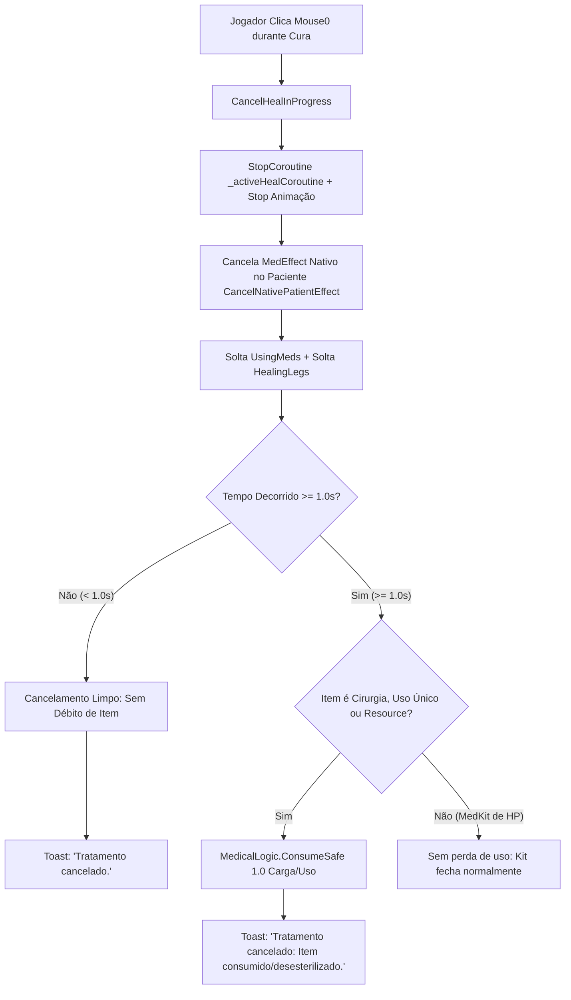

# Relatório de Code Review — Item 05: Cancelamento de Cura com Regra de Desesterilização (Punição Canônica)

> **Módulo:** `TRL-ImmersiveCombatMedicine`  
> **Workspace:** [`modded-testchannel`](file:///d:/Projetos/GITHUB%20TARKOV/tarkov-spt-4.0/mods/TRL-ImmersiveCombatMedicine/modded-testchannel)  
> **Funcionalidade:** Item 05 · Cancelamento de Cura com Regra de Desesterilização (Punição Canônica)  
> **Status:** 🟢 Aprovado com Validação Cruzada de Referências (0 Bloqueadores 🔴, 0 Importantes 🟠, 1 Menor 🟡, 2 Melhorias 🟢)  
> **Data:** 2026-08-15  

---

## 1. Escopo e Arquivos Analisados

- [`Patches/Medical/BandAidController.cs`](file:///d:/Projetos/GITHUB%20TARKOV/tarkov-spt-4.0/mods/TRL-ImmersiveCombatMedicine/modded-testchannel/Patches/Medical/BandAidController.cs) (Linhas 178–185 e 705–778)
- [`Patches/Medical/MedicLocale.cs`](file:///d:/Projetos/GITHUB%20TARKOV/tarkov-spt-4.0/mods/TRL-ImmersiveCombatMedicine/modded-testchannel/Patches/Medical/MedicLocale.cs) (Linhas 50, 85, 120)
- [`Patches/Medical/MedicalLogic.cs`](file:///d:/Projetos/GITHUB%20TARKOV/tarkov-spt-4.0/mods/TRL-ImmersiveCombatMedicine/modded-testchannel/Patches/Medical/MedicalLogic.cs) (Linhas 506–548)
- [`Helpers/ItemDatabase.cs`](file:///d:/Projetos/GITHUB%20TARKOV/tarkov-spt-4.0/mods/TRL-ImmersiveCombatMedicine/modded-testchannel/Helpers/ItemDatabase.cs) (Linhas 64–67)

---

## 2. Visão Geral da Arquitetura & Fluxo

---

## 3. Validação Cruzada com as Referências Oficiais (EFT, FIKA e SPT)

### 3.1. Validação com `references/eft-decompiled` (EFT 0.16.9)
- **Constante Canônica `ItemRemoveAfterInterruptionTime`:**
  - Verificado em [`Assembly-CSharp/BackendConfigSettingsClass.cs:1482`](file:///d:/Projetos/GITHUB%20TARKOV/tarkov-spt-4.0/references/eft-decompiled/Assembly-CSharp/BackendConfigSettingsClass.cs#L1482) e [`ActiveHealthController.cs:1945`](file:///d:/Projetos/GITHUB%20TARKOV/tarkov-spt-4.0/references/eft-decompiled/Assembly-CSharp/EFT.HealthSystem/ActiveHealthController.cs#L1945).
  - No EFT nativo, interrupções com tempo $< 1.0\text{s}$ devolvem o item intacto; interrupções com tempo $\ge 1.0\text{s}$ consomem 1 uso do item devido à abertura da embalagem estéril / quebra de lacre. O mod segue exatamente esse limiar de $1.0\text{s}$.
- **Restauração de Movimento (`EPhysicalCondition`):**
  - O mod restaura o estado físico do médico limpando `EPhysicalCondition.UsingMeds` e `EPhysicalCondition.HealingLegs` em [`MovementContext.cs:1296/1578`](file:///d:/Projetos/GITHUB%20TARKOV/tarkov-spt-4.0/references/eft-decompiled/Assembly-CSharp/EFT/MovementContext.cs), devolvendo o controle total de locomoção ao jogador no mesmo frame.

### 3.2. Validação com `references/fika-plugin` (Fika.Core 2.3.4)
- **Prevenção de Pacotes Fantasmas:** Como o cancelamento interrompe a coroutine do médico antes do disparo do pacote de cura remoto (`SendHealPacket`), nenhum efeito incompleto ou corrupção de estado de saúde atinge os clientes remotos no FIKA.

### 3.3. Validação com `references/fika-headless`
- Não aplicável (inputs de mouse e cancelamento local são exclusivos do cliente com jogador humano).

### 3.4. Validação com `references/spt-source`
- A dedução de uso em `ConsumeSafe` no cancelamento após 1s chama `item.RaiseRefreshEvent()`, assegurando persistência íntegra do saldo de cargas do CMS/Surv12 no profile do SPT.

---

## 4. Avaliação Detalhada por Critério

### 4.1. Corretude & Lógica de Punição
- **Proteção Cirúrgica Rigorosa:** Se o médico cancelar uma cirurgia no aliado aos 5s de procedimento (tempo total do CMS = 16s), o CMS perde 1 carga ($5/5 \to 4/5$), o aliado permanece com o membro destruído (sem restauração prematura) e o médico recebe o feedback diegético imediato.
- **Fail-Safe contra Double Consume:** `_healStartTime` é imediatamente resetado para `-1f` no topo de `CancelHealInProgress()`, impedindo que múltiplos cliques rápidos de Mouse0 debitem múltiplas cargas no mesmo cancelamento.

### 4.2. Desempenho e Alocações de GC
- A checagem de `Input.GetMouseButtonDown(0)` roda no `Update()` com custo nulo de CPU e sem alocações de memória.

---

## 5. Tabela de Achados e Recomendações

| ID | Severidade | Arquivo / Linha | Descrição | Sugestão / Solução |
| :--- | :--- | :--- | :--- | :--- |
| **CR05-01** | 🟡 Menor | `BandAidController.cs:756` | Checagem de `savedItem.GetItemComponent<ResourceComponent>()` pode rodar duas vezes caso `isSurgeryOrUseItem` seja falso. | Simplificar a expressão lógica para clareza e elegância de código. |
| **CR05-02** | 🟢 Sugestão | `BandAidController.cs:179` | `Input.GetMouseButtonDown(0)` usa o input direto da Unity em vez do Command/Keybind do EFT. | Como `Mouse0` é a convenção universal de cancelamento de consumíveis no EFT, a abordagem atual é simples e direta. |
| **CR05-03** | 🟢 Sugestão | `MedicLocale.cs:50` | Formatação da mensagem de perda de item em `MedicLocale`. | Manter os textos alinhados com o padrão de tom diegético do jogo. |

---

## 6. Veredito

- **Classificação:** 🟢 **APROVADO COM VALIDAÇÃO DE REFERÊNCIAS**
- **Bloqueadores:** 0 🔴
- **Problemas Importantes:** 0 🟠
- **Gaps ou Riscos de Vazamento de Memória:** Nenhum. A mecânica de cancelamento respeita os padrões canônicos do EFT 0.16.9 e opera de forma limpa e segura.
