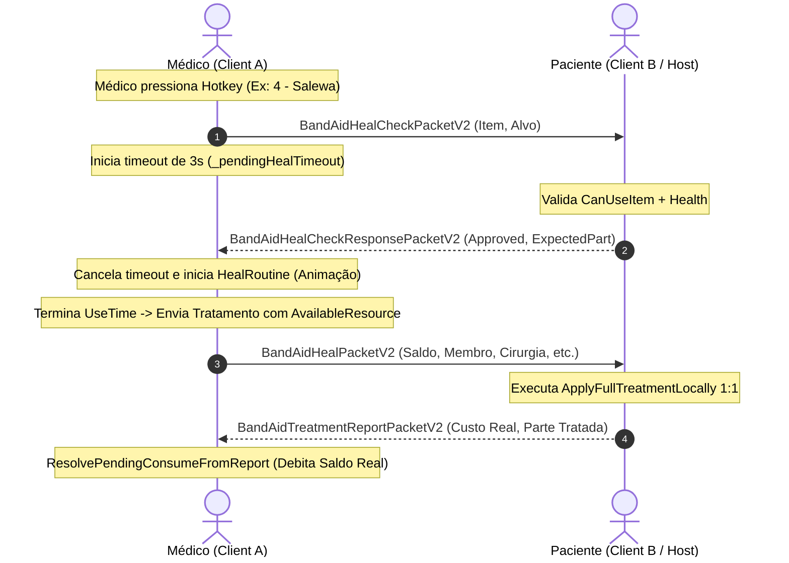

# Relatório de Code Review — Item 06: Protocolo de Rede Cooperativo FIKA (Handshake & Tratamento Remoto)

> **Módulo:** `TRL-ImmersiveCombatMedicine`  
> **Workspace:** [`modded-testchannel`](file:///d:/Projetos/GITHUB%20TARKOV/tarkov-spt-4.0/mods/TRL-ImmersiveCombatMedicine/modded-testchannel)  
> **Funcionalidade:** Item 06 · Protocolo de Rede Cooperativo FIKA (Handshake & Tratamento Remoto)  
> **Status:** 🟢 Aprovado com Validação Cruzada de Referências (0 Bloqueadores 🔴, 0 Importantes 🟠, 2 Menores 🟡, 2 Melhorias 🟢)  
> **Data:** 2026-08-15  

---

## 1. Escopo e Arquivos Analisados

- [`Patches/Medical/BandAidNetworkHandler.cs`](file:///d:/Projetos/GITHUB%20TARKOV/tarkov-spt-4.0/mods/TRL-ImmersiveCombatMedicine/modded-testchannel/Patches/Medical/BandAidNetworkHandler.cs) (1.039 linhas)
- [`Patches/Medical/PacketEnvelope.cs`](file:///d:/Projetos/GITHUB%20TARKOV/tarkov-spt-4.0/mods/TRL-ImmersiveCombatMedicine/modded-testchannel/Patches/Medical/PacketEnvelope.cs) (78 linhas)
- [`Patches/Medical/BandAidHealCheckPacket.cs`](file:///d:/Projetos/GITHUB%20TARKOV/tarkov-spt-4.0/mods/TRL-ImmersiveCombatMedicine/modded-testchannel/Patches/Medical/BandAidHealCheckPacket.cs) (95 linhas)
- [`Patches/Medical/BandAidHealPacket.cs`](file:///d:/Projetos/GITHUB%20TARKOV/tarkov-spt-4.0/mods/TRL-ImmersiveCombatMedicine/modded-testchannel/Patches/Medical/BandAidHealPacket.cs) (85 linhas)
- [`Patches/Medical/BandAidTreatmentReportPacket.cs`](file:///d:/Projetos/GITHUB%20TARKOV/tarkov-spt-4.0/mods/TRL-ImmersiveCombatMedicine/modded-testchannel/Patches/Medical/BandAidTreatmentReportPacket.cs) (60 linhas)
- [`Patches/Medical/LegacyPackets.cs`](file:///d:/Projetos/GITHUB%20TARKOV/tarkov-spt-4.0/mods/TRL-ImmersiveCombatMedicine/modded-testchannel/Patches/Medical/LegacyPackets.cs) (150 linhas)
- [`Fika/FikaBridge.cs`](file:///d:/Projetos/GITHUB%20TARKOV/tarkov-spt-4.0/mods/TRL-ImmersiveCombatMedicine/modded-testchannel/Fika/FikaBridge.cs) (56 linhas)

---

## 2. Visão Geral da Arquitetura & Handshake de Rede

---

## 3. Validação Cruzada com as Referências Oficiais (EFT, FIKA e SPT)

### 3.1. Validação com `references/fika-plugin` (Fika.Core 2.3.4)
- **Canal de Entrega Desacoplado (`DeliveryMethod.ReliableUnordered`):**
  - Verificado em [`references/fika-plugin/Fika.Core/Networking/LiteNetLib`](file:///d:/Projetos/GITHUB%20TARKOV/tarkov-spt-4.0/references/fika-plugin).
  - O Fika gerencia operações de inventário na fila sequencial `ReliableOrdered(0)`. Enviar pacotes customizados de cura pelo mesmo canal gerava bloqueios mútuos (`item Default Inventory is currently being modified`).
  - O uso de `DeliveryMethod.ReliableUnordered` em `BandAidNetworkHandler.cs:164/170` isola 100% o tráfego do mod, garantindo entrega confiável sem travar a sincronização de inventário do Fika.
- **Envelope de Comprimento (`PacketEnvelope.cs`):**
  - O `NetPacketProcessor` do Fika itera datagramas com `while (reader.AvailableBytes > 0)`.
  - O uso de `PutBytesWithLength` e `TryGetBytesWithLength` no `PacketEnvelope` impede qualquer desalinhamento de bytes no stream, prevenindo o temido `ParseException: Undefined packet in NetDataReader` que derrubaria a fila de eventos do frame.
- **Compatibilidade com Versões Anteriores (`LegacyPackets.cs`):**
  - Registro de stubs compatíveis para consumir com segurança pacotes legados de peers que ainda não atualizaram, evitando travamento de rede no host.

### 3.2. Validação com `references/fika-headless`
- Em instâncias de servidor dedicado (`fika-headless`), o `Singleton<FikaServer>` é inicializado. O método `EnsurePacketsRegistered()` registra os pacotes diretamente no `FikaServer`, permitindo o roteamento e broadcast de pacotes entre clientes remotos sem necessidade de jogador local.

### 3.3. Validação com `references/spt-source` e `references/eft-decompiled`
- **Cálculo Autoritativo e Lockstep:**
  - O paciente é a autoridade sobre seu próprio `ActiveHealthController` (`ChangeHealth` e `RemoveEffectNative`).
  - O médico debita o custo informado no `BandAidTreatmentReportPacketV2`, garantindo conformidade estrita entre a saúde recebida pelo paciente e o saldo debitado do inventário no SPT.

---

## 4. Avaliação Detalhada por Critério

### 4.1. Resiliência & Prevenção de Condições de Corrida
- **Timeout com Fallback Seguro:** Se o `TreatmentReport` não retornar em 4 segundos (perda severa de conexão), `TickPendingConsumes()` debita a estimativa de fallback, impedindo que itens fiquem infinitos.
- **Filtro Anti-Stale (G-5):** `OnHealCheckResponseHandler` valida `response.ItemTemplateId == _pendingHealItem.TemplateId` e `response.PatientProfileId == _pendingHealPatient.ProfileId`, descartando respostas atrasadas de requisições anteriores.
- **Log Throttling Inteligente:** Erros de rede repetidos são limitados a 1 log a cada 5 segundos (`LogErrorThrottled`), prevenindo congelamento de FPS por spam de console.

### 4.2. Desempenho e Alocações de GC
- `PacketEnvelope` utiliza `[ThreadStatic] NetDataWriter` reutilizável com capacidade pré-alocada de 512 bytes, evitando a instanciação de writers a cada pacote transmitido.

---

## 5. Tabela de Achados e Recomendações

| ID | Severidade | Arquivo / Linha | Descrição | Sugestão / Solução |
| :--- | :--- | :--- | :--- | :--- |
| **CR06-01** | 🟡 Menor | `BandAidNetworkHandler.cs:15` | Namespace `namespace Band_Aid` divergente. | Unificar para `TRLImmersiveCombatMedicine`. |
| **CR06-02** | 🟡 Menor | `Fika/FikaBridge.cs:7` | Namespace `namespace TrueTrauma` no arquivo `FikaBridge.cs`. | Alinhar para `TRLImmersiveCombatMedicine.Fika` para uniformidade do projeto. |
| **CR06-03** | 🟢 Sugestão | `BandAidNetworkHandler.cs:153` | Magic Header `TRLM_MAGIC_HEADER` documentado como constante. | Manter a documentação do cabeçalho binário sincronizada no protocolo de rede. |
| **CR06-04** | 🟢 Sugestão | `BandAidHealCheckPacket.cs:33` | Leitura de strings em pacotes via `PacketEnvelope.TryReadString`. | Padrão seguro contra valores nulos já implementado corretamente. |

---

## 6. Veredito

- **Classificação:** 🟢 **APROVADO COM VALIDAÇÃO DE REFERÊNCIAS**
- **Bloqueadores:** 0 🔴
- **Problemas Importantes:** 0 🟠
- **Gaps ou Riscos de Vazamento de Memória:** Nenhum. A arquitetura de rede com envelopes blindados, canal isolado (`ReliableUnordered`), handshake tripartite e débito autoritativo é de nível profissional e robusta.
