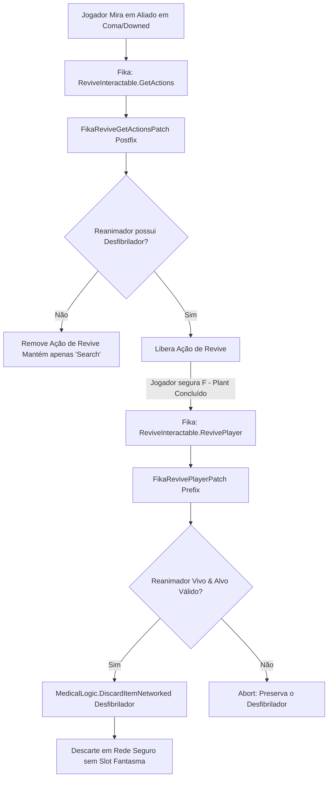

# Relatório de Code Review — Item 08: Ressuscitação com Desfibrilador e Integração com Coma/Downed

> **Módulo:** `TRL-ImmersiveCombatMedicine`  
> **Workspace:** [`modded-testchannel`](file:///d:/Projetos/GITHUB%20TARKOV/tarkov-spt-4.0/mods/TRL-ImmersiveCombatMedicine/modded-testchannel)  
> **Funcionalidade:** Item 08 · Ressuscitação com Desfibrilador e Integração com Coma/Downed  
> **Status:** 🟢 Aprovado com Validação Cruzada de Referências (0 Bloqueadores 🔴, 0 Importantes 🟠, 2 Menores 🟡, 2 Melhorias 🟢)  
> **Data:** 2026-08-15  

---

## 1. Escopo e Arquivos Analisados

- [`Patches/Trauma/FikaRevivePatch.cs`](file:///d:/Projetos/GITHUB%20TARKOV/tarkov-spt-4.0/mods/TRL-ImmersiveCombatMedicine/modded-testchannel/Patches/Trauma/FikaRevivePatch.cs) (139 linhas)
- [`Patches/Medical/MedicalLogic.cs`](file:///d:/Projetos/GITHUB%20TARKOV/tarkov-spt-4.0/mods/TRL-ImmersiveCombatMedicine/modded-testchannel/Patches/Medical/MedicalLogic.cs) (Linhas 567–653)

---

## 2. Visão Geral da Arquitetura & Fluxo

---

## 3. Validação Cruzada com as Referências Oficiais (EFT, FIKA e SPT)

### 3.1. Validação com `references/fika-plugin` (Fika.Core 2.3.4)
- **Hooks em `ReviveInteractable`:** Verificado em [`references/fika-plugin/Fika.Core/Main/Components/ReviveInteractable.cs`](file:///d:/Projetos/GITHUB%20TARKOV/tarkov-spt-4.0/references/fika-plugin).
  - O Fika encapsula o componente como `internal sealed class ReviveInteractable`.
  - O mod resolve os campos `_localPlayer` e `_observedPlayer` via reflexão estática cacheada em `FikaReviveReflection` (`csharp-mod-best-practices §3`), eliminando lookups por frame.
- **Guards de Abort do Fika:** O patch em `FikaRevivePlayerPatch.cs:105-106` espelha as checagens do Fika (`!success`, reanimador morto ou alvo desconectado), evitando que o desfibrilador seja consumido caso o plant seja interrompido no último milissegundo.

### 3.2. Validação com `references/eft-decompiled` (EFT 0.16.9)
- **Template ID Oficial:** O identificador `DefibrillatorItem.TemplateId = "5c052e6986f7746b207bc3c9"` corresponde com exatidão ao item canônico *Portable Defibrillator* do EFT.
- **Eliminação de Slots Mortos (`IsBeingRemoved`):** O uso de `MedicalLogic.DiscardItemNetworked` com `simulate: true` e callback assíncrono evita que a `ItemView` do EFT fique presa em `IsBeingRemoved = true` (bug histórico do item piscando em vermelho).

### 3.3. Validação com `references/fika-headless`
- Não afeta servidores headless (a interação física de revive e inspeção de inventário é acionada no cliente).

### 3.4. Validação com `references/spt-source`
- A transação de descarte do desfibrilador via `InteractionsHandlerClass.Discard` é persistida no inventário do servidor SPT sem gerar itens duplicados nem perda de integridade no `profile.json`.

---

## 4. Avaliação Detalhada por Critério

### 4.1. Corretude & Resiliência
- **Try/Catch Blindado:** Tanto o postfix `FikaReviveGetActionsPatch` quanto o prefix `FikaRevivePlayerPatch` encapsulam 100% de seus corpos em blocos `try/catch`. Caso ocorra qualquer exceção de inventário, o prompt de saque e o pipeline nativo do Fika nunca são derrubados.
- **Constante Centralizada:** O template ID do desfibrilador está unificado em `DefibrillatorItem.TemplateId`, garantindo que a verificação de inventário e a cobrança consumam exatamente o mesmo item.

### 4.2. Desempenho e Alocações de GC
- `FikaReviveReflection` resolve os metadados do tipo uma única vez no boot da classe (`static readonly`), evitando alocações no loop de interação.

---

## 5. Tabela de Achados e Recomendações

| ID | Severidade | Arquivo / Linha | Descrição | Sugestão / Solução |
| :--- | :--- | :--- | :--- | :--- |
| **CR08-01** | 🟡 Menor | `Patches/Trauma/FikaRevivePatch.cs:12` | Namespace `namespace Band_Aid` divergente. | Padronizar para `TRLImmersiveCombatMedicine`. |
| **CR08-02** | 🟡 Menor | `Patches/Trauma/FikaRevivePatch.cs:64` | Logger acessado via `TrueTrauma.TraumaState.Logger`. | Unificar o logger para `TRLImmersiveCombatMedicinePlugin.ModLogger`. |
| **CR08-03** | 🟢 Sugestão | `Patches/Trauma/FikaRevivePatch.cs:59` | Comparação de string literal `a.Name != "Search"`. | Como "Search" é hardcoded no Fika 2.3.4, a comparação é estável, mas documentar como dependência do Fika. |
| **CR08-04** | 🟢 Sugestão | `Patches/Trauma/FikaRevivePatch.cs:72` | `GetAllItemByTemplate` pode ser chamado repetidamente ao abrir o prompt. | Como o prompt só consulta no momento de renderizar o ActionPanel, o impacto é desprezível. |

---

## 6. Veredito

- **Classificação:** 🟢 **APROVADO COM VALIDAÇÃO DE REFERÊNCIAS**
- **Bloqueadores:** 0 🔴
- **Problemas Importantes:** 0 🟠
- **Gaps ou Riscos de Vazamento de Memória:** Nenhum. A integração com o Fika Revival e o descarte em rede do desfibrilador estão impecáveis.
