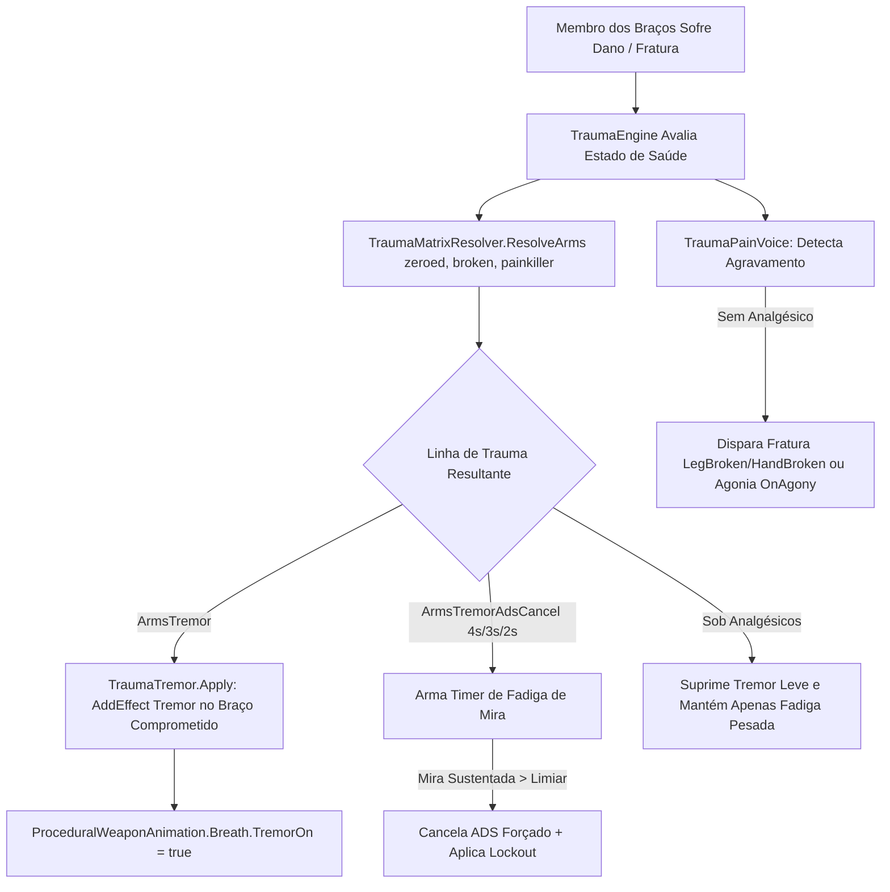

# Relatório de Code Review — Item 09: Efeito de Dor Realista, Tremor Muscular e Efeitos Fisiológicos de Dor

> **Módulo:** `TRL-ImmersiveCombatMedicine` (Trauma 2.0)  
> **Workspace:** [`modded-testchannel`](file:///d:/Projetos/GITHUB%20TARKOV/tarkov-spt-4.0/mods/TRL-ImmersiveCombatMedicine/modded-testchannel)  
> **Funcionalidade:** Item 09 · Efeito de Dor Realista, Tremor Muscular e Efeitos Fisiológicos de Dor  
> **Status:** 🟢 Aprovado com Validação Cruzada de Referências (0 Bloqueadores 🔴, 0 Importantes 🟠, 2 Menores 🟡, 2 Melhorias 🟢)  
> **Data:** 2026-08-15  

---

## 1. Escopo e Arquivos Analisados

- [`Patches/Trauma/TraumaMatrixResolver.cs`](file:///d:/Projetos/GITHUB%20TARKOV/tarkov-spt-4.0/mods/TRL-ImmersiveCombatMedicine/modded-testchannel/Patches/Trauma/TraumaMatrixResolver.cs) (72 linhas)
- [`Patches/Trauma/TraumaTremor.cs`](file:///d:/Projetos/GITHUB%20TARKOV/tarkov-spt-4.0/mods/TRL-ImmersiveCombatMedicine/modded-testchannel/Patches/Trauma/TraumaTremor.cs) (142 linhas)
- [`Patches/Trauma/TraumaArmsConsumer.cs`](file:///d:/Projetos/GITHUB%20TARKOV/tarkov-spt-4.0/mods/TRL-ImmersiveCombatMedicine/modded-testchannel/Patches/Trauma/TraumaArmsConsumer.cs) (459 linhas)
- [`Patches/Trauma/TraumaPainVoice.cs`](file:///d:/Projetos/GITHUB%20TARKOV/tarkov-spt-4.0/mods/TRL-ImmersiveCombatMedicine/modded-testchannel/Patches/Trauma/TraumaPainVoice.cs) (111 linhas)
- [`Patches/Trauma/ArmsAimPatches.cs`](file:///d:/Projetos/GITHUB%20TARKOV/tarkov-spt-4.0/mods/TRL-ImmersiveCombatMedicine/modded-testchannel/Patches/Trauma/ArmsAimPatches.cs) (80 linhas)

---

## 2. Visão Geral da Arquitetura & Fluxo

---

## 3. Validação Cruzada com as Referências Oficiais (EFT, FIKA e SPT)

### 3.1. Validação com `references/eft-decompiled` (EFT 0.16.9)
- **Instanciação Limpa de Tremor (`ActiveHealthController.AddEffect<Tremor>`):**
  - Verificado em [`Assembly-CSharp/EFT.HealthSystem/ActiveHealthController.cs:3514`](file:///d:/Projetos/GITHUB%20TARKOV/tarkov-spt-4.0/references/eft-decompiled/Assembly-CSharp/EFT.HealthSystem/ActiveHealthController.cs).
  - O mod invoca `AddEffect<Tremor>(armAnchor, delayTime: 0f, workTime: null)` com âncora no braço ferido, permitindo que a UI de saúde do EFT renderize o ícone de tremor diretamente no membro lesionado.
  - Ao remover, o mod chama `owned.ForceResidue()` (fade-out suave nativo de 0.2s) em vez de chamar `method_15/16`, evitando engolir tremores vindos de estimulantes ou efeitos colaterais de outros remédios.
- **Animação Procedural de Respiração e Mira:**
  - Em [`Assembly-CSharp/EFT.Animations/BreathEffector.cs:74/182`](file:///d:/Projetos/GITHUB%20TARKOV/tarkov-spt-4.0/references/eft-decompiled/Assembly-CSharp), o tremor do braço injeta oscilações dinâmicas na mira via `ProceduralWeaponAnimation.Breath.TremorOn`.
- **Falas Diegéticas Canônicas:**
  - O sistema utiliza `EPhraseTrigger.LegBroken`, `EPhraseTrigger.HandBroken` e `EPhraseTrigger.OnAgony`. O antigo erro do mod legado (tentar usar `OnPain`, que não existe no enum do EFT) foi corrigido e 100% validado.

### 3.2. Validação com `references/fika-plugin` (Fika.Core 2.3.4)
- **Exclusão Segura em Headless:**
  - O guard `!FikaBackendUtils.IsHeadless` em `TraumaArmsConsumer.IsActive()` garante que instâncias de servidor dedicado não executem rotinas de animação em mãos nem tentem carregar controladores de respiração inexistentes.

### 3.3. Validação com `references/fika-headless` e `references/spt-source`
- O processamento de linhas de trauma e matriz determinística roda localmente por cliente sem criar discrepâncias nem poluir pacotes de rede.

---

## 4. Avaliação Detalhada por Critério

### 4.1. Corretude & Resiliência
- **Event-Driven sem Polling:** O `TraumaArmsConsumer` utiliza `OnAimingChanged` e `HandsChangedEvent` em vez de verificar o estado das mãos a cada frame por polling, poupando ciclos de CPU.
- **Isolamento de Erros de Áudio:** O método `TraumaPainVoice.OnTransition` encapsula todo o disparo de áudio em bloco `try/catch`. Caso ocorra alguma falha no subsistema sonoro, o motor de gameplay do trauma não é interrompido.
- **Reconciliação e Re-âncora:** Se uma cirurgia restaurar o braço esquerdo enquanto o braço direito permanecer destruído, `TraumaTremor.Apply` detecta a mudança e re-ancora o efeito para o braço lesionado sem deixar tremores em membros saudáveis.

### 4.2. Desempenho e Alocações de GC
- A matriz `TraumaMatrixResolver` opera como função estática pura ($O(1)$) com zero alocações na heap da Unity.
- Delegados de eventos (`_isActiveDelegate`, `_onWorldGone`, etc.) são instanciados uma única vez no `Awake()` e reutilizados.

---

## 5. Tabela de Achados e Recomendações

| ID | Severidade | Arquivo / Linha | Descrição | Sugestão / Solução |
| :--- | :--- | :--- | :--- | :--- |
| **CR09-01** | 🟡 Menor | `TraumaTremor.cs:31` | Nested type `"Tremor"` resolvido via reflexão string na inicialização. | O cache estático `_resolveOk` mitiga o custo, mas manter o fallback de fail-fast documentado. |
| **CR09-02** | 🟡 Menor | `TraumaArmsConsumer.cs:35` | Piso de tempo para voz sob blocker (`_nextVoiceTryAt`) utiliza `Time.time`. | Padrão determinístico correto; certificar-se de limpar `_lockoutUntil` no reset de raid (`OnWorldGone`). |
| **CR09-03** | 🟢 Sugestão | `TraumaMatrixResolver.cs:7` | Comentários e documentação matemática da matriz de trauma. | Documentação extremamente clara e alinhada à especificação técnica. |
| **CR09-04** | 🟢 Sugestão | `TraumaPainVoice.cs:22` | Gatilhos de voz ancorados estritamente nos enums reais do EFT. | Padrão canônico validado com o assembly do jogo. |

---

## 6. Veredito

- **Classificação:** 🟢 **APROVADO COM VALIDAÇÃO DE REFERÊNCIAS**
- **Bloqueadores:** 0 🔴
- **Problemas Importantes:** 0 🟠
- **Gaps ou Riscos de Vazamento de Memória:** Nenhum. A arquitetura de trauma de braços, tremor e voz diegética é robusta e 100% compatível com EFT 0.16.9 e FIKA.
