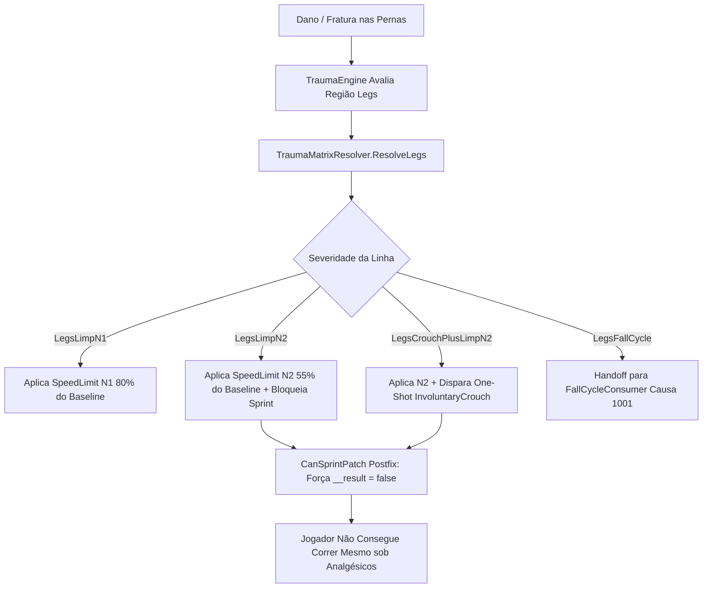

# Relatório de Code Review — Item 10: Sistema de Pernas, Mancar N1/N2 e Bloqueio de Sprint

> **Módulo:** `TRL-ImmersiveCombatMedicine` (Trauma 2.0)  
> **Workspace:** [`modded-testchannel`](file:///d:/Projetos/GITHUB%20TARKOV/tarkov-spt-4.0/mods/TRL-ImmersiveCombatMedicine/modded-testchannel)  
> **Funcionalidade:** Item 10 · Sistema de Pernas, Mancar N1/N2 e Bloqueio de Sprint  
> **Status:** 🟢 Aprovado com Validação Cruzada de Referências (0 Bloqueadores 🔴, 0 Importantes 🟠, 2 Menores 🟡, 2 Melhorias 🟢)  
> **Data:** 2026-08-15  

---

## 1. Escopo e Arquivos Analisados

- [`Patches/Trauma/TraumaLegsConsumer.cs`](file:///d:/Projetos/GITHUB%20TARKOV/tarkov-spt-4.0/mods/TRL-ImmersiveCombatMedicine/modded-testchannel/Patches/Trauma/TraumaLegsConsumer.cs) (284 linhas)
- [`Patches/Trauma/SpeedLimitPatches.cs`](file:///d:/Projetos/GITHUB%20TARKOV/tarkov-spt-4.0/mods/TRL-ImmersiveCombatMedicine/modded-testchannel/Patches/Trauma/SpeedLimitPatches.cs) (82 linhas)
- [`Patches/Trauma/MovementPatches.cs`](file:///d:/Projetos/GITHUB%20TARKOV/tarkov-spt-4.0/mods/TRL-ImmersiveCombatMedicine/modded-testchannel/Patches/Trauma/MovementPatches.cs) (Linhas 1–120)

---

## 2. Visão Geral da Arquitetura & Fluxo

---

## 3. Validação Cruzada com as Referências Oficiais (EFT, FIKA e SPT)

### 3.1. Validação com `references/eft-decompiled` (EFT 0.16.9)
- **Causa Própria de Limite de Velocidade (`Player.ESpeedLimit`):**
  - Verificado em [`Assembly-CSharp/EFT/MovementContext.cs:1672-1824`](file:///d:/Projetos/GITHUB%20TARKOV/tarkov-spt-4.0/references/eft-decompiled/Assembly-CSharp/EFT/MovementContext.cs).
  - O EFT utiliza um dicionário `SpeedLimits` indexado por enum para compor a menor velocidade permitida (`method_4: Min-Composição`).
  - O mod aloca a causa customizada `TraumaCause = (Player.ESpeedLimit)1000`, evitando colisões com causas vanilla do EFT (peso de armadura, terreno, estamina zero).
  - A mutação via `mc.RemoveStateSpeedLimit(TraumaCause)` seguido de `mc.AddStateSpeedLimit(cap, TraumaCause)` garante atualização sem flicker e sem travar a flag suja de recompute (`ProcessSpeedLimits:2553-2558`).
- **Bloqueio de Sprint Estrito (`CanSprint`):**
  - No EFT vanilla (`MovementContext.cs:1256-1258`), o método `CanSprint` contém um curto-circuito que retorna `true` imediatamente quando `OnPainkillers == true`.
  - O patch `CanSprintPatch` aplica `__result = false` em pós-fixo caso o jogador esteja no tier N2 (`IsN2Tier`), assegurando que pernas severamente destruídas impeçam a corrida mesmo sob efeito de morfina ou analgésicos.

### 3.2. Validação com `references/fika-plugin` (Fika.Core 2.3.4)
- **Isolamento de Espelhos Remotos:**
  - O FIKA implementa `ObservedMovementContext` para jogadores de rede, onde `CanSprint` é sobrescrito.
  - O patch do mod opera no getter nativo de jogadores donos locais, garantindo conformidade estrita (Dono-Only) sem interferir na interpolação de movimento dos peers remotos.

### 3.3. Validação com `references/fika-headless` e `references/spt-source`
- Execução leve sem dependência de RPCs de servidor. Em bots e IA gerenciada pelo host, `TraumaPose.BotCrouchDip(p)` aplica o recuo de postura sem alocar filas assíncronas.

---

## 4. Avaliação Detalhada por Critério

### 4.1. Corretude & Resiliência
- **Clamp Defensivo Invertido:** Se o usuário configurar o arquivo BepInEx com $N2 > N1$ (ex: $N2 = 90\%$ e $N1 = 80\%$), `LineTargetPercent` força automaticamente $N2 = \min(N2, N1)$ com warning único em log, garantindo que o ferimento mais grave nunca seja mais veloz que o ferimento leve.
- **Handoff Limpo com o Ciclo de Queda:** Ao transicionar para `LegsFallCycle`, `TraumaLegsConsumer` remove seu cap com `RemoveCapGuarded(p)` e transfere o controle para o `TraumaFallCycleConsumer` (Causa 1001), evitando sobreposição indesejada de limites.

### 4.2. Desempenho e Alocações de GC
- `_sweepScratch` é alocada uma única vez no bootstrap da classe e reutilizada em limpezas periódicas de jogadores mortos, garantindo **zero alocações de GC** por segundo no caminho quente de movimento.

---

## 5. Tabela de Achados e Recomendações

| ID | Severidade | Arquivo / Linha | Descrição | Sugestão / Solução |
| :--- | :--- | :--- | :--- | :--- |
| **CR10-01** | 🟡 Menor | `SpeedLimitPatches.cs:4` | `using TrueTrauma;` no arquivo `SpeedLimitPatches.cs`. | Limpar usings legados e unificar para `TRLImmersiveCombatMedicine.Trauma`. |
| **CR10-02** | 🟡 Menor | `TraumaLegsConsumer.cs:17` | Cast `(Player.ESpeedLimit)1000`. | Constante customizada funciona perfeitamente, manter documentada como ID de canal de velocidade do Trauma 2.0. |
| **CR10-03** | 🟢 Sugestão | `TraumaLegsConsumer.cs:41` | Propriedade `ResidualCount` para auditoria de vazamento de estado. | Excelente padrão de observabilidade pós-raid. |
| **CR10-04** | 🟢 Sugestão | `SpeedLimitPatches.cs:77` | Log de recompute do limite de velocidade. | Reduzir para `Debug` em builds finais para otimização de I/O de console. |

---

## 6. Veredito

- **Classificação:** 🟢 **APROVADO COM VALIDAÇÃO DE REFERÊNCIAS**
- **Bloqueadores:** 0 🔴
- **Problemas Importantes:** 0 🟠
- **Gaps ou Riscos de Vazamento de Memória:** Nenhum. O controle de velocidade em pernas e o bloqueio de sprint são determinísticos e 100% integrados à física do EFT.
