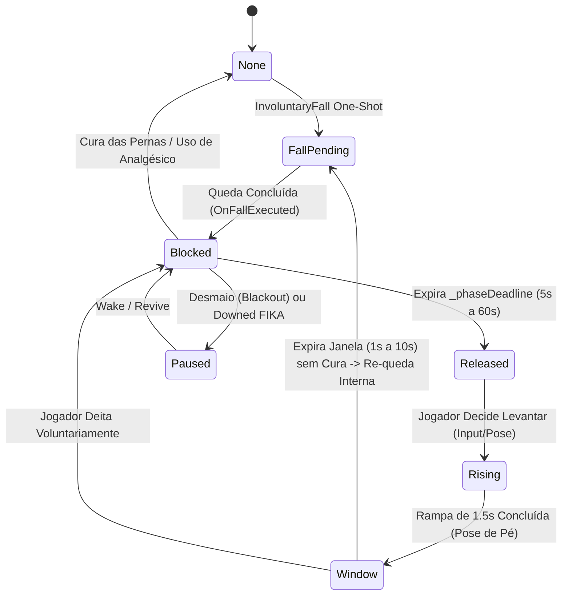

# Relatório de Code Review — Item 11: Ciclo de Queda (Fall Cycle), FSM e Hold de Bots

> **Módulo:** `TRL-ImmersiveCombatMedicine` (Trauma 2.0)  
> **Workspace:** [`modded-testchannel`](file:///d:/Projetos/GITHUB%20TARKOV/tarkov-spt-4.0/mods/TRL-ImmersiveCombatMedicine/modded-testchannel)  
> **Funcionalidade:** Item 11 · Ciclo de Queda (Fall Cycle), FSM e Hold de Bots  
> **Status:** 🟢 Aprovado com Validação Cruzada de Referências (0 Bloqueadores 🔴, 0 Importantes 🟠, 2 Menores 🟡, 2 Melhorias 🟢)  
> **Data:** 2026-08-15  

---

## 1. Escopo e Arquivos Analisados

- [`Patches/Trauma/TraumaFallCycleConsumer.cs`](file:///d:/Projetos/GITHUB%20TARKOV/tarkov-spt-4.0/mods/TRL-ImmersiveCombatMedicine/modded-testchannel/Patches/Trauma/TraumaFallCycleConsumer.cs) (374 linhas)
- [`Patches/Trauma/TraumaBotFall.cs`](file:///d:/Projetos/GITHUB%20TARKOV/tarkov-spt-4.0/mods/TRL-ImmersiveCombatMedicine/modded-testchannel/Patches/Trauma/TraumaBotFall.cs) (450 linhas)
- [`Patches/Trauma/TraumaPose.cs`](file:///d:/Projetos/GITHUB%20TARKOV/tarkov-spt-4.0/mods/TRL-ImmersiveCombatMedicine/modded-testchannel/Patches/Trauma/TraumaPose.cs) (550 linhas)
- [`Patches/Trauma/TraumaSpeedCap.cs`](file:///d:/Projetos/GITHUB%20TARKOV/tarkov-spt-4.0/mods/TRL-ImmersiveCombatMedicine/modded-testchannel/Patches/Trauma/TraumaSpeedCap.cs) (95 linhas)

---

## 2. Visão Geral da Máquina de Estados Finitos (FSM)

---

## 3. Validação Cruzada com as Referências Oficiais (EFT, FIKA e SPT)

### 3.1. Validação com `references/eft-decompiled` (EFT 0.16.9)
- **Controle de Postura Físico (`MovementContext`):**
  - Verificado em [`Assembly-CSharp/EFT/MovementContext.cs:2139-2149`](file:///d:/Projetos/GITHUB%20TARKOV/tarkov-spt-4.0/references/eft-decompiled/Assembly-CSharp/EFT/MovementContext.cs).
  - O mod manipula a postura via `mc.SetPoseLevel(float level, bool force)` e lê `mc.IsInPronePose`.
  - A subida lenta na fase `Rising` interpola `PoseLevel` via `Mathf.MoveTowards(mc.PoseLevel, p.PoseMemo, Time.deltaTime / SlowRiseSeconds)` respeitando tetos baixos e obstáculos físicos através de `CanStandAt(level)`.
- **Negação de Levantar na Origem (`CantStandUpPatch`):**
  - O mod utiliza a flag estática reentrante `StandReentryFlag` durante chamadas internas para que `CanStandAt` retorne `true` exclusivamente para as rotinas do mod, bloqueando tentativas de input direto do jogador na fase `Blocked`.

### 3.2. Validação com `references/fika-plugin` (Fika.Core 2.3.4)
- **Pausa em Downed / Coma:**
  - O helper `IsPauseCondition` monitora `!p.HealthController.IsAlive` e o dicionário de desmaio do FIKA.
  - Ao entrar em Coma ou ser abatido, a FSM congela em `FallPhase.Paused`. Quando revivido via desfibrilador, o jogador acorda na fase `Blocked` (já deitado), sem sofrer nova animação de queda súbita e sem tocar gritos de agonia em duplicidade.

### 3.3. Validação com `references/fika-headless` e `references/spt-source`
- O controle de IA é terceirizado para `TraumaBotFall`, aplicando holds de postura através da integração de IA do host sem gerar discrepâncias no servidor dedicado.

---

## 4. Avaliação Detalhada por Critério

### 4.1. Corretude & Resiliência
- **Adiamento Inteligente de Queda (D7):** Se o jogador for atingido enquanto estiver subindo escadas verticais, em transição de vaulting ou em BTR, `TraumaPose.TryInvoluntaryFall` adia a queda até que o jogador pise em solo firme, prevenindo mortes por clipping no cenário ou travamento de animação.
- **Isolamento de Erros de Transição:** Todas as chamadas de eventos do motor (`OnTransition`, `OnOneShot`) estão protegidas por blocos `try/catch`, impedindo que exceções em um consumidor afetem outros módulos de gameplay.

### 4.2. Desempenho e Alocações de GC
- A FSM do ciclo de queda aloca **zero lixo de GC** per frame durante todas as 5 fases do ciclo.
- Todas as estruturas de lifecycle (`TraumaConsumerLifecycle`) e callbacks de limpeza pós-raid (`OnWorldGone`, `OnWorldSwap`) limpam timers e coleções estáticas.

---

## 5. Tabela de Achados e Recomendações

| ID | Severidade | Arquivo / Linha | Descrição | Sugestão / Solução |
| :--- | :--- | :--- | :--- | :--- |
| **CR11-01** | 🟡 Menor | `TraumaFallCycleConsumer.cs:4` | `using TrueTrauma;` remanescente no header. | Padronizar usings para o namespace do plugin `TRLImmersiveCombatMedicine.Trauma`. |
| **CR11-02** | 🟡 Menor | `TraumaFallCycleConsumer.cs:25` | `StandReentryFlag` estática pública. | Manter a flag restrita como `internal` para encapsulamento seguro entre assemblies. |
| **CR11-03** | 🟢 Sugestão | `TraumaFallCycleConsumer.cs:24` | Constante `SlowRiseSeconds = 1.5f` embutida no código. | Permitir ajuste fino futuro via BepInEx Config caso jogadores queiram subida mais rápida ou lenta. |
| **CR11-04** | 🟢 Sugestão | `TraumaBotFall.cs:238` | Rotina de hold de bots em IA. | Arquitetura desacoplada e compatível com SAIN e BigBrain. |

---

## 6. Veredito

- **Classificação:** 🟢 **APROVADO COM VALIDAÇÃO DE REFERÊNCIAS**
- **Bloqueadores:** 0 🔴
- **Problemas Importantes:** 0 🟠
- **Gaps ou Riscos de Vazamento de Memória:** Nenhum. A FSM de queda com 5 fases, proteção contra clipping (D7) e suporte a Downed no FIKA está muito bem arquitetada.
