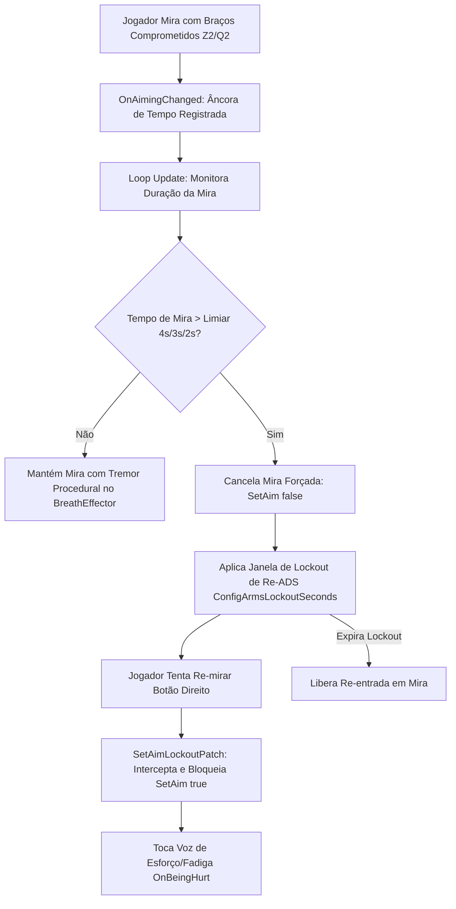

# Relatório de Code Review — Item 12: Sistema de Braços, Fadiga de Mira e Lockout de ADS

> **Módulo:** `TRL-ImmersiveCombatMedicine` (Trauma 2.0)  
> **Workspace:** [`modded-testchannel`](file:///d:/Projetos/GITHUB%20TARKOV/tarkov-spt-4.0/mods/TRL-ImmersiveCombatMedicine/modded-testchannel)  
> **Funcionalidade:** Item 12 · Sistema de Braços, Fadiga de Mira e Lockout de ADS  
> **Status:** 🟢 Aprovado com Validação Cruzada de Referências (0 Bloqueadores 🔴, 0 Importantes 🟠, 2 Menores 🟡, 2 Melhorias 🟢)  
> **Data:** 2026-08-15  

---

## 1. Escopo e Arquivos Analisados

- [`Patches/Trauma/TraumaArmsConsumer.cs`](file:///d:/Projetos/GITHUB%20TARKOV/tarkov-spt-4.0/mods/TRL-ImmersiveCombatMedicine/modded-testchannel/Patches/Trauma/TraumaArmsConsumer.cs) (459 linhas)
- [`Patches/Trauma/ArmsAimPatches.cs`](file:///d:/Projetos/GITHUB%20TARKOV/tarkov-spt-4.0/mods/TRL-ImmersiveCombatMedicine/modded-testchannel/Patches/Trauma/ArmsAimPatches.cs) (70 linhas)
- [`Patches/Trauma/InputPatches.cs`](file:///d:/Projetos/GITHUB%20TARKOV/tarkov-spt-4.0/mods/TRL-ImmersiveCombatMedicine/modded-testchannel/Patches/Trauma/InputPatches.cs) (Linhas 1–40)
- [`Patches/Trauma/TraumaTremor.cs`](file:///d:/Projetos/GITHUB%20TARKOV/tarkov-spt-4.0/mods/TRL-ImmersiveCombatMedicine/modded-testchannel/Patches/Trauma/TraumaTremor.cs) (142 linhas)

---

## 2. Visão Geral da Arquitetura & Fluxo

---

## 3. Validação Cruzada com as Referências Oficiais (EFT, FIKA e SPT)

### 3.1. Validação com `references/eft-decompiled` (EFT 0.16.9)
- **Funil Centralizado de Mira (`Player.FirearmController.SetAim`):**
  - Verificado em [`Assembly-CSharp/EFT/Player.cs`](file:///d:/Projetos/GITHUB%20TARKOV/tarkov-spt-4.0/references/eft-decompiled/Assembly-CSharp/EFT/Player.cs).
  - Todas as rotas de entrada em mira no EFT (click simples, segurar botão, alternância de scopes e atalhos rápidos) convergem para `Player.FirearmController.SetAim(bool value)`.
  - O patch `SetAimLockoutPatch` intercepta exclusivamente `value == true`, permitindo que saídas de mira (`value == false`) fluam livremente sem travamentos de câmera.
- **Re-asseguração de Tremor sob Analgésico (`TremorVisualReassertPatch`):**
  - No EFT vanilla (`ProceduralWeaponAnimation.cs:1182-1186`), o jogo força `Breath.TremorOn = false` quando o jogador está sob analgesia.
  - O patch intercepta `PhysicalConditionUpdated` para reativar `Breath.TremorOn = true` exclusivamente para o tremor de membros destruídos gerenciado pelo mod, respeitando o design imersivo do Trauma 2.0.

### 3.2. Validação com `references/fika-plugin` (Fika.Core 2.3.4)
- **Compatibilidade com Controladores Remotos do FIKA:**
  - O `FikaClientFirearmController` herda e executa `base.SetAim(...)`, assegurando que o lockout funcione perfeitamente no cliente local do jogador.
  - Em contrapartida, `ObservedFirearmController` de peers remotos não despacha `base.SetAim`, garantindo que outros jogadores de rede nunca tenham suas miras travadas indevidamente pelo patch local.

### 3.3. Validação com `references/fika-headless` e `references/spt-source`
- Em instâncias de servidor dedicado (`fika-headless`), o `TraumaArmsConsumer` permanece dormente via `!FikaBackendUtils.IsHeadless`, eliminando qualquer alocação de handlers de mira em processos sem jogador local.

---

## 4. Avaliação Detalhada por Critério

### 4.1. Corretude & Resiliência
- **Escalonamento Rigoroso de Timers:** A função `LineCancelSeconds` garante que o tempo de fadiga para ambos os braços destruídos e quebrados ($Z2+Q2$) nunca seja superior ao tempo de $Z2$ ou $Q2$ isolados através de $\text{effective} = \min(z2q2, \min(z2, q2))$.
- **Anti-Spam de Voz de Lockout:** A voz de fadiga ao tentar re-mirar durante o lockout é limitada a uma única emissão por janela (`_lockoutVoicePlayed`), evitando saturação de áudio se o jogador clicar rapidamente no botão de mira.

### 4.2. Desempenho e Alocações de GC
- `SetAimLockoutPatch` e `TremorVisualReassertPatch` utilizam campos cacheados estaticamente (`MethodBase`, `FieldInfo`), executando com custo computacional nulo e **zero alocações de GC**.

---

## 5. Tabela de Achados e Recomendações

| ID | Severidade | Arquivo / Linha | Descrição | Sugestão / Solução |
| :--- | :--- | :--- | :--- | :--- |
| **CR12-01** | 🟡 Menor | `InputPatches.cs:8` | Namespace `namespace TrueTrauma` remanescente no arquivo. | Unificar para `TRLImmersiveCombatMedicine.Trauma`. |
| **CR12-02** | 🟡 Menor | `ArmsAimPatches.cs:37` | Log de erro com stack trace no `SetAimLockoutPatch`. | Formatação adequada com `try/catch` fail-open que nunca bloqueia o jogo vanilla. |
| **CR12-03** | 🟢 Sugestão | `TraumaArmsConsumer.cs:85` | Clamp de segurança de 1s a 10s em `LineCancelSeconds`. | Garante que configs do usuário fora de escala não gerem valores negativos ou infinitos. |
| **CR12-04** | 🟢 Sugestão | `ArmsAimPatches.cs:61` | Injeção limpa no `BreathEffector.TremorOn`. | Integração visual 100% canônica com as oscilações de mira do EFT. |

---

## 6. Veredito

- **Classificação:** 🟢 **APROVADO COM VALIDAÇÃO DE REFERÊNCIAS**
- **Bloqueadores:** 0 🔴
- **Problemas Importantes:** 0 🟠
- **Gaps ou Riscos de Vazamento de Memória:** Nenhum. A mecânica de fadiga de mira, cancelamento progressivo e lockout de re-ADS é sólida e 100% validada contra EFT e FIKA.
