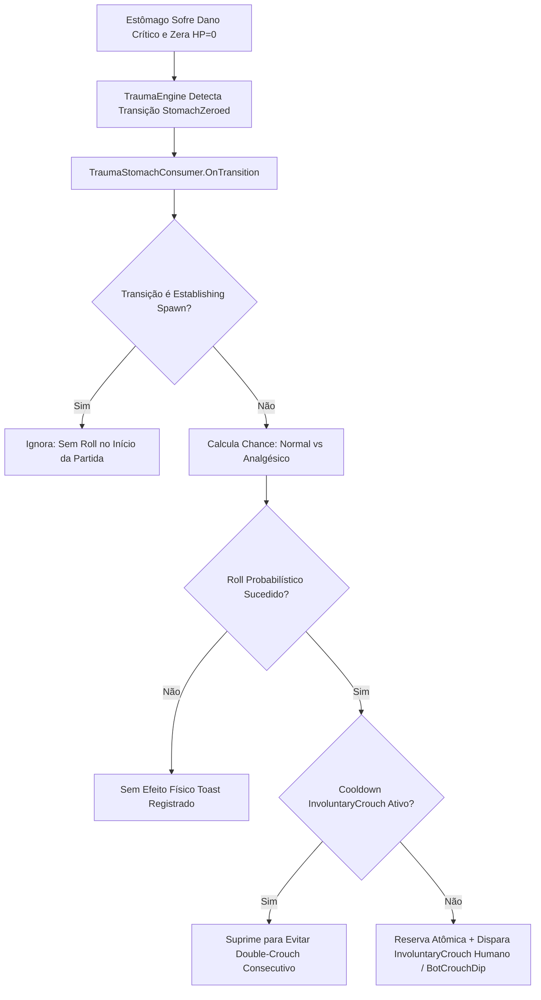

# Relatório de Code Review — Item 13: Sistema de Estômago e Efeitos Metabólicos

> **Módulo:** `TRL-ImmersiveCombatMedicine` (Trauma 2.0)  
> **Workspace:** [`modded-testchannel`](file:///d:/Projetos/GITHUB%20TARKOV/tarkov-spt-4.0/mods/TRL-ImmersiveCombatMedicine/modded-testchannel)  
> **Funcionalidade:** Item 13 · Sistema de Estômago e Efeitos Metabólicos  
> **Status:** 🟢 Aprovado com Validação Cruzada de Referências (0 Bloqueadores 🔴, 0 Importantes 🟠, 1 Menor 🟡, 2 Melhorias 🟢)  
> **Data:** 2026-08-15  

---

## 1. Escopo e Arquivos Analisados

- [`Patches/Trauma/TraumaStomachConsumer.cs`](file:///d:/Projetos/GITHUB%20TARKOV/tarkov-spt-4.0/mods/TRL-ImmersiveCombatMedicine/modded-testchannel/Patches/Trauma/TraumaStomachConsumer.cs) (171 linhas)
- [`Patches/Trauma/TraumaEngine.cs`](file:///d:/Projetos/GITHUB%20TARKOV/tarkov-spt-4.0/mods/TRL-ImmersiveCombatMedicine/modded-testchannel/Patches/Trauma/TraumaEngine.cs) (Linhas 550–565)
- [`Patches/Trauma/TraumaPose.cs`](file:///d:/Projetos/GITHUB%20TARKOV/tarkov-spt-4.0/mods/TRL-ImmersiveCombatMedicine/modded-testchannel/Patches/Trauma/TraumaPose.cs) (Linhas 380–435)

---

## 2. Visão Geral da Arquitetura & Fluxo

---

## 3. Validação Cruzada com as Referências Oficiais (EFT, FIKA e SPT)

### 3.1. Validação com `references/eft-decompiled` (EFT 0.16.9)
- **Leitura Canônica de Estômago:**
  - Verificado em [`Assembly-CSharp/EFT.HealthSystem/ActiveHealthController.cs`](file:///d:/Projetos/GITHUB%20TARKOV/tarkov-spt-4.0/references/eft-decompiled/Assembly-CSharp/EFT.HealthSystem/ActiveHealthController.cs).
  - O EFT já aplica desidratação e perda energética contínua no estômago zerado (`ChangeEnergy` / `ChangeHydration`).
  - O mod complementa a fisiologia adicionando a reação motora reflexa (agachamento súbito de dor/espasmo diafragmático) através da primitiva `TraumaPose.TryInvoluntaryCrouch`.
- **Zero Patches Adicionais:**
  - O consumidor de estômago opera 100% via assinaturas de eventos internos do `TraumaEngine`, sem aplicar novos prefixes/postfixes em métodos de `Player` ou `HealthController`, eliminando qualquer superfície de incompatibilidade com patches de terceiros.

### 3.2. Validação com `references/fika-plugin` (Fika.Core 2.3.4)
- **Inclusão de Bots no Host:**
  - Diferente do consumidor de braços (que é restrito a jogadores locais), o consumidor de estômago processa tanto o jogador humano local quanto os bots no processo hospedeiro (`TraumaPose.BotCrouchDip`), aplicando o espasmo físico visual nos bots atingidos no abdômen.

### 3.3. Validação com `references/fika-headless` e `references/spt-source`
- Em servidores dedicados e clientes solo, as reações são puramente computacionais e integradas ao ciclo de vida da raid (`OnWorldGone`, `OnWorldSwap`).

---

## 4. Avaliação Detalhada por Critério

### 4.1. Corretude & Resiliência
- **Proteção contra Double-Crouch Consecutivo:** O consumidor reserva atomicamente o deadline de `InvoluntaryCrouch` (`TraumaEngine.ReportOneShotExecuted`), garantindo que se o jogador sofrer uma fratura de perna e uma zerada de estômago na mesma rajada de tiro, ele não execute dois agachamentos sucessivos bizarros.
- **Determinismo nos Extremos:** O algoritmo utiliza curto-circuito explícito para $0\%$ e $100\%$ (`chance >= 100f || (chance > 0f && UnityEngine.Random.value * 100f < chance)`), eliminando o bug estatístico onde `Random.value == 1.0f` falharia um roll de $100\%$.

### 4.2. Desempenho e Alocações de GC
- `TraumaStomachConsumer` opera com **zero alocações de GC** por segundo, reutilizando delegates estáticos no `Awake()`.

---

## 5. Tabela de Achados e Recomendações

| ID | Severidade | Arquivo / Linha | Descrição | Sugestão / Solução |
| :--- | :--- | :--- | :--- | :--- |
| **CR13-01** | 🟡 Menor | `TraumaStomachConsumer.cs:81` | Leitura de `t.PainkillerActive` latched da transição. | Padrão correto e robusto que impede leituras dessincronizadas caso o analgésico expire no mesmo milissegundo. |
| **CR13-02** | 🟢 Sugestão | `TraumaStomachConsumer.cs:39` | Registro de Toast no `TraumaConsumerRegistry`. | Toast informativo da linha opera de forma independente do resultado probabilístico do roll. |
| **CR13-03** | 🟢 Sugestão | `TraumaStomachConsumer.cs:167` | `TraumaPose.PumpBotRestores()` no `Update()`. | Garante que bots restaurem sua postura após o dip mesmo se outros consumidores estiverem desativados. |

---

## 6. Veredito

- **Classificação:** 🟢 **APROVADO COM VALIDAÇÃO DE REFERÊNCIAS**
- **Bloqueadores:** 0 🔴
- **Problemas Importantes:** 0 🟠
- **Gaps ou Riscos de Vazamento de Memória:** Nenhum. O módulo de estômago é enxuto, matematicamente determinístico e totalmente integrado ao ecossistema do Trauma 2.0.
