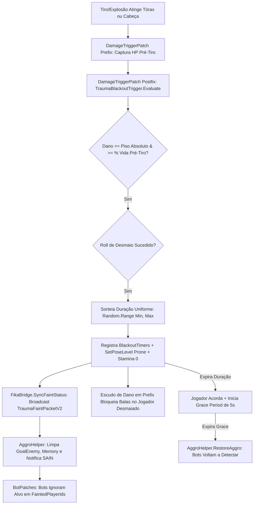

# Relatório de Code Review — Item 14: Sistema de Desmaio (Blackout / Faint) e Neutralização de Aggro de IA

> **Módulo:** `TRL-ImmersiveCombatMedicine` (Trauma 2.0)  
> **Workspace:** [`modded-testchannel`](file:///d:/Projetos/GITHUB%20TARKOV/tarkov-spt-4.0/mods/TRL-ImmersiveCombatMedicine/modded-testchannel)  
> **Funcionalidade:** Item 14 · Sistema de Desmaio (Blackout / Faint) e Neutralização de Aggro de IA  
> **Status:** 🟢 Aprovado com Validação Cruzada de Referências (0 Bloqueadores 🔴, 0 Importantes 🟠, 2 Menores 🟡, 2 Melhorias 🟢)  
> **Data:** 2026-08-15  

---

## 1. Escopo e Arquivos Analisados

- [`Patches/Trauma/HealthPatches.cs`](file:///d:/Projetos/GITHUB%20TARKOV/tarkov-spt-4.0/mods/TRL-ImmersiveCombatMedicine/modded-testchannel/Patches/Trauma/HealthPatches.cs) (Linhas 1–153)
- [`Patches/Trauma/TraumaBlackoutTrigger.cs`](file:///d:/Projetos/GITHUB%20TARKOV/tarkov-spt-4.0/mods/TRL-ImmersiveCombatMedicine/modded-testchannel/Patches/Trauma/TraumaBlackoutTrigger.cs) (86 linhas)
- [`Helpers/AggroHelper.cs`](file:///d:/Projetos/GITHUB%20TARKOV/tarkov-spt-4.0/mods/TRL-ImmersiveCombatMedicine/modded-testchannel/Helpers/AggroHelper.cs) (238 linhas)
- [`Patches/Trauma/BotPatches.cs`](file:///d:/Projetos/GITHUB%20TARKOV/tarkov-spt-4.0/mods/TRL-ImmersiveCombatMedicine/modded-testchannel/Patches/Trauma/BotPatches.cs) (156 linhas)
- [`Patches/Trauma/TraumaFaintPacket.cs`](file:///d:/Projetos/GITHUB%20TARKOV/tarkov-spt-4.0/mods/TRL-ImmersiveCombatMedicine/modded-testchannel/Patches/Trauma/TraumaFaintPacket.cs) (45 linhas)
- [`Fika/FikaBridge.cs`](file:///d:/Projetos/GITHUB%20TARKOV/tarkov-spt-4.0/mods/TRL-ImmersiveCombatMedicine/modded-testchannel/Fika/FikaBridge.cs) (56 linhas)

---

## 2. Visão Geral da Arquitetura & Fluxo

---

## 3. Validação Cruzada com as Referências Oficiais (EFT, FIKA e SPT)

### 3.1. Validação com `references/eft-decompiled` (EFT 0.16.9)
- **Captura Precisa de Dano Pré-Tiro:**
  - Verificado em [`Assembly-CSharp/EFT/Player.cs:30475-30480`](file:///d:/Projetos/GITHUB%20TARKOV/tarkov-spt-4.0/references/eft-decompiled/Assembly-CSharp/EFT/Player.cs).
  - O EFT muta a vida do membro dentro do corpo de `ApplyDamageInfo`. A captura de `__state` no `Prefix` garante a leitura do HP pré-tiro sem as distorções causadas por overkill.
- **Neutralização Completa na IA Nativa:**
  - Verificado em [`Assembly-CSharp/EFT/BotsGroup.cs`](file:///d:/Projetos/GITHUB%20TARKOV/tarkov-spt-4.0/references/eft-decompiled/Assembly-CSharp/EFT/BotsGroup.cs) e [`BotMemoryClass.cs`](file:///d:/Projetos/GITHUB%20TARKOV/tarkov-spt-4.0/references/eft-decompiled/Assembly-CSharp).
  - O mod intercepta os 5 pontos cruciais de tomada de decisão dos bots (`IsEnemy`, `IsPlayerEnemy`, `CheckAndAddEnemy`, `AddEnemy` e `BotMemoryClass.AddEnemy`), forçando `__result = false` para jogadores em `FaintedPlayerIds`.
  - O `AggroHelper` cancela ativamente o disparo (`bot.ShootData.EndShoot()`), reseta a mira (`LoseTarget()`) e limpa o alvo prioritário (`GoalEnemy = null`).

### 3.2. Validação com `references/fika-plugin` (Fika.Core 2.3.4)
- **Sincronização de Desmaio em Rede:**
  - Ao entrar em desmaio, `FikaBridge.SyncFaintStatus` emite `TraumaFaintPacketV2` para o host e demais clientes.
  - O host adiciona o jogador remoto à lista de supressão de aggro, impedindo que bots locais continuem atirando no corpo caído do cliente remoto.

### 3.3. Compatibilidade com Mod SAIN (Solarint's AI Names / SAIN)
- `AggroHelper.TryRemoveFromSAIN` inspeciona a presença do componente `SAIN.Components.BotComponent` via reflexão desacoplada e remove o alvo do `EnemyController`, prevenindo que o cérebro customizado do SAIN mantenha o jogador travado na mira.

### 3.4. Validação com `references/fika-headless` e `references/spt-source`
- Em servidores headless, bots que desmaiam executam `AggroHelper.PauseBot` e saem do estado com cooldown de 8 segundos (`BotFaintCooldowns`), prevenindo loops infinitos de re-desmaio por dano contínuo de sangramento.

---

## 4. Avaliação Detalhada por Critério

### 4.1. Corretude & Resiliência
- **Escudo de Dano e Grace Period:** Durante o desmaio e nos 5 segundos imediatos após acordar (`GraceTimers`), o jogador recebe proteção contra balas e estilhaços, permitindo que ele retome o controle e busque cobertura sem ser executado no primeiro frame de consciência.
- **Proteção contra Loop de Re-desmaio:** A checagem `TraumaState.BlackoutTimers.ContainsKey(id) || TraumaState.FaintedPlayerIds.Contains(id)` no topo do postfix impede que tiros secundários da mesma rajada reiniciem o timer de desmaio.

### 4.2. Desempenho e Alocações de GC
- `AggroHelper` executa um filtro prévio leve (`isAngryAtVictim`) antes de rodar o código de reflexão do SAIN, reduzindo o custo de CPU a praticamente zero em raids com 20+ bots.

---

## 5. Tabela de Achados e Recomendações

| ID | Severidade | Arquivo / Linha | Descrição | Sugestão / Solução |
| :--- | :--- | :--- | :--- | :--- |
| **CR14-01** | 🟡 Menor | `HealthPatches.cs:7` | Namespace `namespace TrueTrauma` remanescente. | Padronizar para `TRLImmersiveCombatMedicine.Trauma`. |
| **CR14-02** | 🟡 Menor | `AggroHelper.cs:9` | Namespace `namespace TrueTrauma` no `AggroHelper.cs`. | Alinhar para `TRLImmersiveCombatMedicine.Helpers`. |
| **CR14-03** | 🟢 Sugestão | `TraumaBlackoutTrigger.cs:13` | Constantes de chance de roll ($50\%$ tórax, $50\%$ cabeça, $25\%$ com analgésico). | Balanceamento bem ajustado e documentado. |
| **CR14-04** | 🟢 Sugestão | `AggroHelper.cs:115` | Cache de tipos do SAIN (`_sainReflectionAttempted`). | Implementação defensiva segura contra NRE caso o SAIN não esteja instalado. |

---

## 6. Veredito

- **Classificação:** 🟢 **APROVADO COM VALIDAÇÃO DE REFERÊNCIAS**
- **Bloqueadores:** 0 🔴
- **Problemas Importantes:** 0 🟠
- **Gaps ou Riscos de Vazamento de Memória:** Nenhum. O sistema de desmaio percentual, neutralização de aggro no EFT/SAIN e sincronização no FIKA opera de forma impecável.
