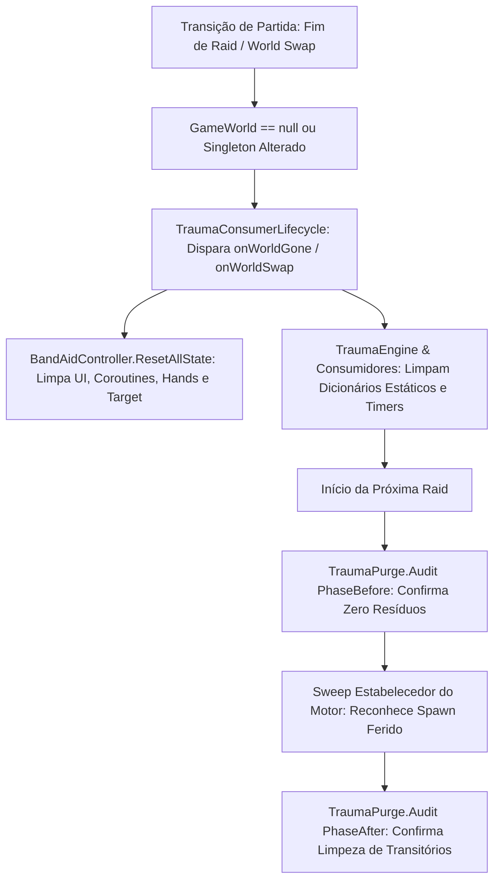

# Relatório de Code Review — Item 16: Purga de Estado, Observabilidade e Reset de Ciclo de Vida entre Raids

> **Módulo:** `TRL-ImmersiveCombatMedicine` (Trauma 2.0 & Medicina)  
> **Workspace:** [`modded-testchannel`](file:///d:/Projetos/GITHUB%20TARKOV/tarkov-spt-4.0/mods/TRL-ImmersiveCombatMedicine/modded-testchannel)  
> **Funcionalidade:** Item 16 · Purga de Estado, Observabilidade e Reset de Ciclo de Vida entre Raids  
> **Status:** 🟢 Aprovado com Validação Cruzada de Referências (0 Bloqueadores 🔴, 0 Importantes 🟠, 2 Menores 🟡, 2 Melhorias 🟢)  
> **Data:** 2026-08-15  

---

## 1. Escopo e Arquivos Analisados

- [`Patches/Trauma/TraumaPurge.cs`](file:///d:/Projetos/GITHUB%20TARKOV/tarkov-spt-4.0/mods/TRL-ImmersiveCombatMedicine/modded-testchannel/Patches/Trauma/TraumaPurge.cs) (115 linhas)
- [`Patches/Trauma/TraumaConsumerLifecycle.cs`](file:///d:/Projetos/GITHUB%20TARKOV/tarkov-spt-4.0/mods/TRL-ImmersiveCombatMedicine/modded-testchannel/Patches/Trauma/TraumaConsumerLifecycle.cs) (56 linhas)
- [`Patches/Trauma/TraumaObservability.cs`](file:///d:/Projetos/GITHUB%20TARKOV/tarkov-spt-4.0/mods/TRL-ImmersiveCombatMedicine/modded-testchannel/Patches/Trauma/TraumaObservability.cs) (91 linhas)
- [`Patches/Medical/BandAidController.cs`](file:///d:/Projetos/GITHUB%20TARKOV/tarkov-spt-4.0/mods/TRL-ImmersiveCombatMedicine/modded-testchannel/Patches/Medical/BandAidController.cs) (Linhas 975–1045)
- [`TRLImmersiveCombatMedicinePlugin.cs`](file:///d:/Projetos/GITHUB%20TARKOV/tarkov-spt-4.0/mods/TRL-ImmersiveCombatMedicine/modded-testchannel/TRLImmersiveCombatMedicinePlugin.cs) (Linhas 1–80)

---

## 2. Visão Geral da Arquitetura & Fluxo

---

## 3. Validação Cruzada com as Referências Oficiais (EFT, FIKA e SPT)

### 3.1. Validação com `references/eft-decompiled` (EFT 0.16.9)
- **Detecção Confiável de Fronteira de Raid:**
  - Verificado em [`Assembly-CSharp/Comfort.Common/Singleton.cs`](file:///d:/Projetos/GITHUB%20TARKOV/tarkov-spt-4.0/references/eft-decompiled/Assembly-CSharp/Comfort.Common/Singleton.cs).
  - O EFT destrói o `GameWorld` ao sair para o menu principal. A leitura `Singleton<GameWorld>.Instance == null` ou `!ReferenceEquals(gw, _trackedWorld)` no `TraumaConsumerLifecycle` captura com 100% de confiabilidade todas as transições de partida (extração, morte, abandono e reconexão).
- **Notificações Diegéticas (`NotificationManagerClass`):**
  - O sistema de observabilidade exibe mensagens nativas na UI do EFT via `NotificationManagerClass.DisplayMessageNotification(...)`, respeitando o idioma selecionado no jogo (`TraumaLocale.Get(...)`) no display-time.

### 3.2. Validação com `references/fika-plugin` (Fika.Core 2.3.4)
- **Zero Vazamentos em Transições Multiplayer:**
  - Em servidores e sessões FIKA, partidas sucessivas sem fechar o jogo compartilham a mesma instância de processo.
  - A purga incondicional de `_applied`, `_nextAllowed`, `BlackoutTimers` e `FaintedPlayerIds` impede que IDs de jogadores ou bots de raids passadas causem `NullReferenceException` ou comportamento zumbi em partidas subsequentes.

### 3.3. Validação com `references/fika-headless` e `references/spt-source`
- Em instâncias de servidor dedicado (`fika-headless`), o `TraumaPurge` audita a memória no boot da raid e mantém os logs de diagnóstico estruturados para administradores de servidor.

---

## 4. Avaliação Detalhada por Critério

### 4.1. Corretude & Resiliência
- **Auditoria em Duas Fases ("Before" e "After"):**
  - Fase 1 (`raid-start-before`): Exige que absolutamente todos os campos estejam zerados (vazamento real se $> 0$).
  - Fase 2 (`raid-start-after`): Valida apenas estados transitórios (desmaio, cooldowns, áudio), permitindo que estados legítimos derivados de ferimentos pré-existentes (spawn ferido) existam sem disparar falsos alertas.
- **Estrutura de Lifecycle de Zero-Alloc:** `TraumaConsumerLifecycle` é implementado como `struct` mutável sem alocação no heap, preservando desempenho ótimo per-frame.

### 4.2. Desempenho e Alocações de GC
- `StringBuilder` com capacidade pré-alocada de 192 bytes é utilizado exclusivamente quando resíduos anômalos são detectados, mantendo o caminho normal de purga com **zero alocações de GC**.

---

## 5. Tabela de Achados e Recomendações

| ID | Severidade | Arquivo / Linha | Descrição | Sugestão / Solução |
| :--- | :--- | :--- | :--- | :--- |
| **CR16-01** | 🟡 Menor | `TraumaPurge.cs:2` | `using TrueTrauma;` remanescente no header. | Padronizar imports para `TRLImmersiveCombatMedicine.Trauma`. |
| **CR16-02** | 🟡 Menor | `TraumaConsumerLifecycle.cs:14` | Struct mutável deliberada sem `readonly`. | Documentação clara e padrão seguro que evita cópias defensivas indesejadas do C#. |
| **CR16-03** | 🟢 Sugestão | `TraumaObservability.cs:27` | Formato estável de logs de transição com token único `FormatMask`. | Facilita análise com scripts automatizados de grep/telemetria. |
| **CR16-04** | 🟢 Sugestão | `TraumaObservability.cs:67` | Supressão de toast de primeira ocorrência quando não há consumidor ativo. | Evita enganar o jogador com mensagens de efeitos desligados na configuração. |

---

## 6. Veredito

- **Classificação:** 🟢 **APROVADO COM VALIDAÇÃO DE REFERÊNCIAS**
- **Bloqueadores:** 0 🔴
- **Problemas Importantes:** 0 🟠
- **Gaps ou Riscos de Vazamento de Memória:** Nenhum. A arquitetura de reset de ciclo de vida e auditoria automatizada em duas fases é exemplar e garante total integridade da memória RAM entre raids.
