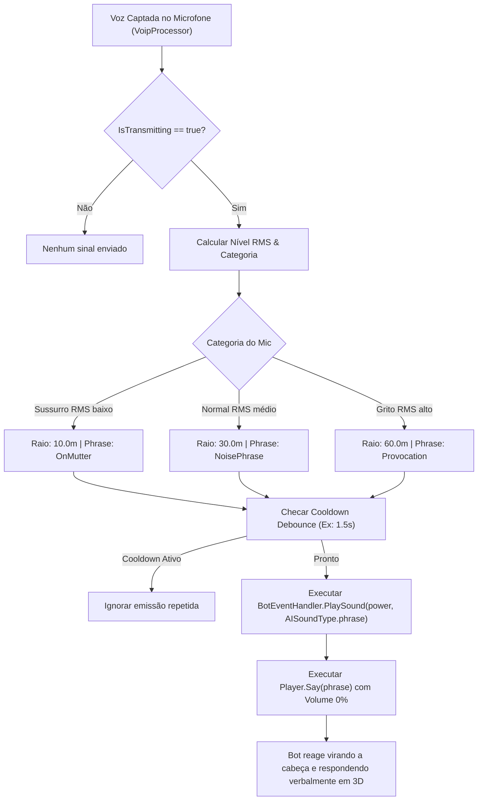

# 005 — Especificação Técnica: Interação com IA & Bots (SAIN / Vanilla)

**Mod:** TRL-SpeakFromTarkov  
**Item:** 005-interacao-ia-bots-sain  
**Status:** 🔵 Especificação Técnica  
**Data:** 2026-07-24  

---

## 1. Arquitetura & Evidências do Assembly

A integração de fala por microfone com os bots baseia-se na hierarquia de audição de IA do cliente EFT:

1. 🥇 **`EFT.Player.Say(EPhraseTrigger phrase, ...)`** ([`Assembly-CSharp/EFT/Player.cs:L28799`](file:///d:/Projetos/GITHUB%20TARKOV/tarkov-spt-4.0/references/eft-decompiled/Assembly-CSharp/EFT/Player.cs#L28799)):
   Dispara frases nativas e notifica o `BotEventHandler`.
2. 🥇 **`BotEventHandler.Instance.PlaySound(IPlayer player, Vector3 position, float power, AISoundType type)`** ([`Assembly-CSharp/BotHearingSensor.cs:L50`](file:///d:/Projetos/GITHUB%20TARKOV/tarkov-spt-4.0/references/eft-decompiled/Assembly-CSharp/BotHearingSensor.cs#L50)):
   Dispara um sinal de áudio no mapa 3D direto para os sensores de audição de todos os bots vivos no raio em metros (`power`).
3. 🥇 **`EPhraseTrigger`** ([`Assembly-CSharp/EPhraseTrigger.cs:L1`](file:///d:/Projetos/GITHUB%20TARKOV/tarkov-spt-4.0/references/eft-decompiled/Assembly-CSharp/EPhraseTrigger.cs#L1)):
   - `OnMutter` (Resmungar casual em patrulha)
   - `NoisePhrase` / `Greetings` (Detecção verbal)
   - `Provocation` / `OnFight` (Alerta de combate imediato)

---

## 2. Fluxo de Execução & Modulação por Sensibilidade



---

## 3. Mapeamento Técnico de Parâmetros

| Categoria | Faixa RMS do Mic | Alcance 3D (`power`) | `EPhraseTrigger` | Reação Esperada da IA (SAIN / Vanilla) |
| :--- | :--- | :---: | :--- | :--- |
| **Sussurro** | `RMS < 0.015` | `10.0f` | `EPhraseTrigger.OnMutter` | Bot escuta sutilmente, fica intrigado e anda devagar investigar a área de onde veio o som. |
| **Voz Normal** | `0.015 <= RMS < 0.06` | `30.0f` | `EPhraseTrigger.NoisePhrase` | Bot identifica presença humana 3D, vira a cabeça e responde verbalmente (*"Cheki Breki!"*). |
| **Grito** | `RMS >= 0.06` | `60.0f` | `EPhraseTrigger.Provocation` | Bot entra em estado de alerta de combate imediato, grita de volta e busca cobertura! |

---

## 4. Design da Classe Helper (`BotVoiceBridge.cs`)

Criação da classe de integração em `mods/TRL-SpeakFromTarkov/modded/Audio/BotVoiceBridge.cs`:

```csharp
using System;
using EFT;
using Comfort.Common;
using UnityEngine;

namespace TRL_SpeakFromTarkov.Audio
{
    public class BotVoiceBridge : MonoBehaviour
    {
        private float lastTriggerTime = 0f;
        private const float COOLDOWN_INTERVAL = 1.5f; // Evita flood nos sensores da IA

        public void EmitVoiceToBots(Player player, float displayLevel)
        {
            if (player == null || !player.HealthController.IsAlive) return;
            if (Time.time - lastTriggerTime < COOLDOWN_INTERVAL) return;

            float power;
            EPhraseTrigger trigger;

            if (displayLevel < 0.25f)
            {
                power = 10.0f; // Sussurro
                trigger = EPhraseTrigger.OnMutter;
            }
            else if (displayLevel < 0.65f)
            {
                power = 30.0f; // Voz Normal
                trigger = EPhraseTrigger.NoisePhrase;
            }
            else
            {
                power = 60.0f; // Grito
                trigger = EPhraseTrigger.Provocation;
            }

            lastTriggerTime = Time.time;

            // 1. Envia o sinal posicional exato no raio 3D em metros para os Bots
            if (Singleton<BotEventHandler>.Instantiated)
            {
                Vector3 soundPos = player.PlayerBones != null && player.PlayerBones.Head != null 
                    ? player.PlayerBones.Head.Original.position 
                    : player.Transform.position;

                Singleton<BotEventHandler>.Instance.PlaySound(
                    player, 
                    soundPos, 
                    power, 
                    AISoundType.phrase
                );
            }

            // 2. Dispara a frase nativa a 0% de volume local (mudo para humanos, perceptível para IA)
            try
            {
                player.Say(trigger, demand: true);
            }
            catch (Exception ex)
            {
                VoIPPlugin.Log.LogWarning($"[SFT] Aviso ao disparar frase de IA: {ex.Message}");
            }
        }
    }
}
```

---

## 5. Integração com o `VoipProcessor.cs`

No evento de codificação/transmissão de voz ativa:

```csharp
if (IsTransmitting && botVoiceBridge != null)
{
    botVoiceBridge.EmitVoiceToBots(localPlayer, DisplayLevel);
}
```

---

## 6. Plano de Verificação & Testes

1. **Teste de Proximidade:** Falar sussurrado perto de um Scav (~5m) e validar no console se a IA se vira para investigar.
2. **Teste de Coordenada 3D:** Falar atrás de uma parede ou esconderijo e checar se a IA vira na direção correta da parede.
3. **Teste de Silêncio Humano:** Confirmar que o áudio do jogo `player.Say` não se sobrepõe nem duplica a voz natural falada pelo microfone no headset do jogador/parceiro.
4. **Compatibilidade com SAIN:** Validar se os sensores do SAIN reagem ativando o estado de busca de cobertura ao receber o `AISoundType.phrase`.
