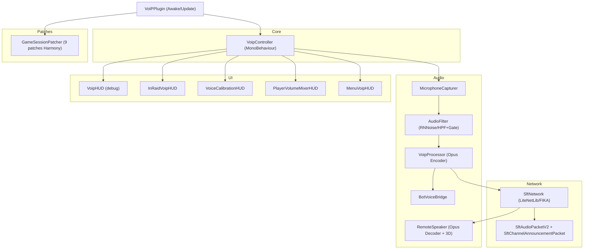
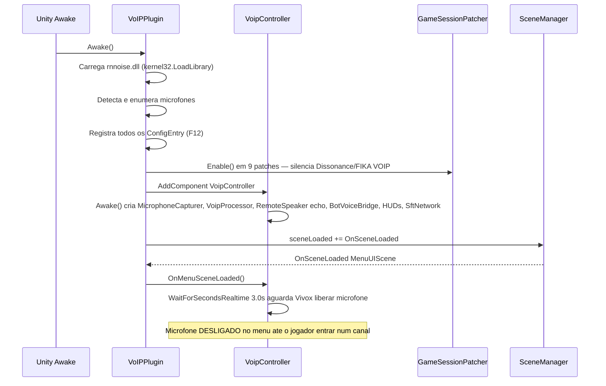

# TRL-SpeakFromTarkov — Visão Geral e Arquitetura

Mod client BepInEx para FIKA (SPT 4.0 / EFT 0.16.9) que substitui completamente o VOIP nativo do Dissonance por um sistema de voz em tempo real próprio: captura PCM do microfone, filtragem neural (RNNoise) ou clássica (HPF+Gate), codificação Opus, transporte via LiteNetLib sobre a infra do FIKA e reprodução 3D posicional no mundo do jogo.

---

## Identificação

| Campo | Valor |
|---|---|
| **Plugin ID** | `trl.speakfromtarkov` |
| **Versão** | `1.5.1` (fonte: `[BepInPlugin]` em [`VOIPPlugin.cs`](../modded-V3-audit/VOIPPlugin.cs#L11)) |
| **Dependência dura** | `com.fika.core` (FIKA) |
| **Namespace raiz** | `TRL_SpeakFromTarkov` |
| **Escopo documentado** | `modded-V3-audit/` |

---

## Diagrama de Componentes

---

## Ciclo de Vida do Mod

---

## Módulos e Responsabilidades

| Módulo | Arquivo | Responsabilidade |
|---|---|---|
| **Plugin Entry Point** | [`VOIPPlugin.cs`](../modded-V3-audit/VOIPPlugin.cs) | Bootstrap BepInEx, ConfigEntry F12, patches, redundância de rede no `Update` |
| **Core Controller** | [`Core/VoipController.cs`](../modded-V3-audit/Core/VoipController.cs) | Orquestrador: liga Capturer → Processor → Network; states de raid; teclas |
| **Captura de Microfone** | [`Audio/MicrophoneCapturer.cs`](../modded-V3-audit/Audio/MicrophoneCapturer.cs) | Leitura raw via `Microphone.GetPosition` + ring buffer + thread de captura |
| **Filtragem DSP** | [`Audio/AudioFilter.cs`](../modded-V3-audit/Audio/AudioFilter.cs) | RNNoise (neural P/Invoke) ou HPF+NoiseGate (fallback); AGC; Limiter; LPF |
| **Codificação / VAD** | [`Audio/VoipProcessor.cs`](../modded-V3-audit/Audio/VoipProcessor.cs) | Modos VAD/PTT/Open; encoder Opus Concentus; evento `OnOpusDataEncoded` |
| **Reatividade de Bots** | [`Audio/BotVoiceBridge.cs`](../modded-V3-audit/Audio/BotVoiceBridge.cs) | Nível de voz → `EPhraseTrigger` + `BotEventHandler.PlaySound` + `BotTalk.Say` |
| **Reprodução 3D** | [`Audio/RemoteSpeaker.cs`](../modded-V3-audit/Audio/RemoteSpeaker.cs) | Decoder Opus + stream buffer + jitter buffer + pan estéreo + oclusão física |
| **Camada de Rede** | [`Network/SftNetwork.cs`](../modded-V3-audit/Network/SftNetwork.cs) | Registro de pacotes FIKA, fila de envio thread-safe, roteamento para RemoteSpeakers |
| **Pacotes V1/V2** | [`SftAudioPacket.cs`](../modded-V3-audit/SftAudioPacket.cs) | V1 legado (recepção) + V2 com envelope ushort (envio) |
| **Pacote de Canal** | [`Network/SftChannelAnnouncementPacket.cs`](../modded-V3-audit/Network/SftChannelAnnouncementPacket.cs) | Announce/Join/Leave/Kick/Ban de canais de menu |
| **HUD Debug** | [`UI/VoipHUD.cs`](../modded-V3-audit/UI/VoipHUD.cs) | Painel IMGUI: VU meter, estado TX, botão profiler |
| **HUD In-Raid** | [`UI/InRaidVoipHUD.cs`](../modded-V3-audit/UI/InRaidVoipHUD.cs) | Barra vertical 7px ancorada ao BattleStancePanel; modos de visibilidade; ícones PNG |
| **Calibração de Voz** | [`UI/VoiceCalibrationHUD.cs`](../modded-V3-audit/UI/VoiceCalibrationHUD.cs) | Wizard interativo para limiares Whisper/Normal/Loud |
| **Mixer de Volume** | [`UI/PlayerVolumeMixerHUD.cs`](../modded-V3-audit/UI/PlayerVolumeMixerHUD.cs) | Modal de volume per-player em raid |
| **HUD Menu** | [`UI/MenuVoipHUD.cs`](../modded-V3-audit/UI/MenuVoipHUD.cs) | Canais de voz no menu principal |
| **Patches EFT/FIKA** | [`GameSessionPatcher.cs`](../modded-V3-audit/GameSessionPatcher.cs) | 9 patches Harmony; silencia Dissonance; gerencia ciclo de raid |

---

## Dependências de Runtime

| Biblioteca | Origem | Uso |
|---|---|---|
| `Concentus` | NuGet/lib | Encoder e decoder Opus puro C# |
| `rnnoise.dll` | lib nativo Win64 | Supressão neural de ruído (P/Invoke) |
| `Fika.Core` | FIKA Plugin | `IFikaNetworkManager`, `RegisterPacket`, `SendData`, `FikaVOIPClient` |
| `SPT.Reflection` | SPT | `ModulePatch` base para patches Harmony |
| `LiteNetLib` | via FIKA | UDP: `Unreliable` para voz, `ReliableOrdered` para anúncios de canal |

---

## Estados de Canal de Áudio

| Canal (byte) | Contexto | Comportamento |
|---|---|---|
| `0` | Em raid — Proximidade 3D | Áudio 3D posicional, culling espacial, filtro vivos/mortos |
| `1` | Menu / Lobby | Áudio 2D estéreo plano |
| `2` | Espectador pós-morte | Atribuído após `Player.OnDead` |

---

> Próximos documentos:
> - [02 — Pipeline de Áudio DSP](./02-pipeline-audio-dsp.md)
> - [03 — Camada de Rede e Protocolo](./03-rede-e-protocolo.md)
> - [04 — Reatividade de Bots e Áudio 3D](./04-bots-e-audio-3d.md)
> - [05 — Interface, HUDs e Configurações F12](./05-interface-huds-e-configuracoes.md)
