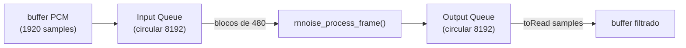
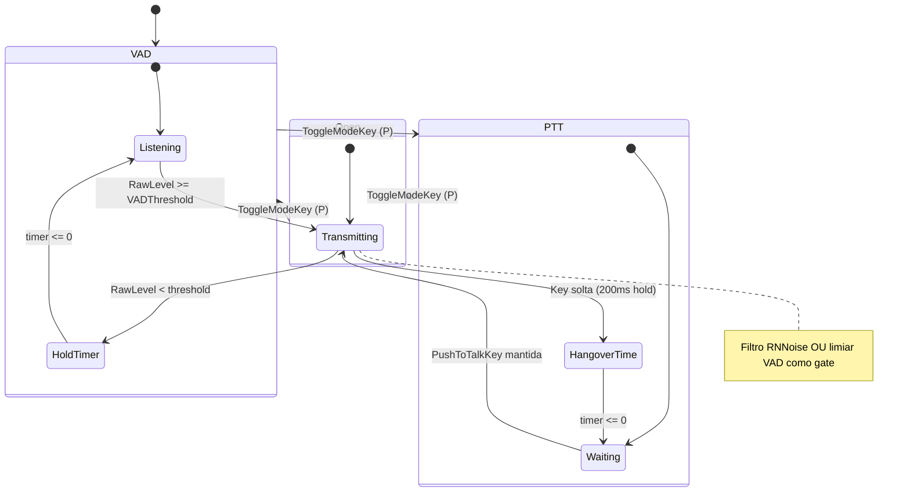

# TRL-SpeakFromTarkov — Pipeline de Áudio DSP

Documenta a cadeia completa de processamento de áudio: da captura bruta do microfone até os bytes Opus prontos para transmissão. Inclui o sistema de filtragem dual (RNNoise neural + fallback HPF/Gate), controle de transmissão VAD/PTT/Open e a decodificação/reprodução remota.

---

## Visão Geral do Pipeline

```mermaid
flowchart LR
    MIC["Microphone.GetPosition\nPCM raw 48kHz"]
    RB["Ring Buffer\n(thread-safe lock)"]
    CT["CaptureThread\n(AboveNormal priority)"]
    RS["Resample\n(Catmull-Rom cubic)\nse HW != 48kHz"]
    AF["AudioFilter.Apply()"]
    subgraph DSP["DSP Path"]
        HPF["HPF IIR\n(80Hz padrão)"]
        RNN["RNNoise\n480-sample frames\nP/Invoke nativo"]
        LPF["LPF IIR\n(8kHz padrão)"]
        AGC["AGC opcional\n(max 3x boost)"]
        LIM["Limiter\n(soft-clip 0.98)"]
        NG["NoiseGate fallback\n(attack 5ms / release 80ms)"]
    end
    VP["VoipProcessor\nProcessAudio()"]
    VAD["UpdateTransmittingState\n(VAD / PTT / Open)"]
    ENC["OpusEncoder.Encode\n(Concentus, VBR, 24kbps)"]
    EVT["OnOpusDataEncoded\nevent (byte[], float)"]

    MIC -->|PollMicrophoneData| RB
    RB --> CT
    CT --> RS
    RS --> AF
    AF --> HPF
    HPF --> RNN
    RNN --> LPF
    LPF --> LIM
    LIM -->|UseRNNoise=true| VP
    AF --> NG
    NG --> LIM
    LIM -->|UseRNNoise=false fallback| VP
    VP --> VAD
    VAD -->|IsTransmitting=true| ENC
    ENC --> EVT
```



---

## 1. MicrophoneCapturer — Captura e Ring Buffer

**Arquivo:** [`Audio/MicrophoneCapturer.cs`](../modded-V3-audit/Audio/MicrophoneCapturer.cs)

### Estratégia de captura

O Unity expõe o microfone como um `AudioClip` circular. `MicrophoneCapturer` usa **polling direto** via `Microphone.GetPosition()` no `Update()` da main thread, evitando dependência do callback DSP do Unity (que causava glitches de timing no EFT).

```
Main Thread Update()
  └── PollMicrophoneData()
        ├── currentPos = Microphone.GetPosition(deviceName)
        ├── linear: copia [lastPos, currentPos) para ringBuffer
        └── wrap: copia chunk1 (lastPos→fim) + chunk2 (0→currentPos)
```

Os dados escritos no `ringBuffer` são consumidos pela `CaptureThread` (background, prioridade `AboveNormal`):

```
CaptureThread (loop dedicado)
  ├── availableSamples >= captureFrameSize (40ms @ 48kHz = 1920 samples)
  │   └── ProcessFrame(captureBuffer)
  └── else: Thread.Sleep(2ms) — não frita CPU
```

### Resampling (Catmull-Rom cúbico)

Se a DSP do Windows entregar áudio em frequência diferente de 48kHz (ex: 44100Hz), o método `Resample()` usa interpolação cúbica de Catmull-Rom para converter para 48kHz antes do filtro.

| Condição | Ação |
|---|---|
| `actualSampleRate == targetSampleRate` | `Array.Copy` direto (zero processamento) |
| `actualSampleRate != targetSampleRate` | Catmull-Rom cúbico: 4 pontos vizinhos, polinômio de grau 3 |

> ⚠️ **Alerta:** `IsResampling == true` indica degradação de qualidade. O profiler loga alerta em tempo real.

### Fallback de dispositivo

Ao iniciar captura, tenta a lista de sample rates em sequência:

```
Tentativas: 48000 → 44100 → 32000 → 24000 → 16000 → 8000 Hz
  ├── Dispositivo configurado pelo usuário
  └── Fallback: dispositivo padrão do SO (null)
```

Se nenhum rate funcionar → `LogError` e retorna `false`.

### Retry automático

O `VoipController.Update()` faz retry a cada **5 segundos** caso `capturer.IsRecording == false`.

---

## 2. AudioFilter — Cadeia de Filtros DSP

**Arquivo:** [`Audio/AudioFilter.cs`](../modded-V3-audit/Audio/AudioFilter.cs)

### Modo RNNoise (padrão, recomendado)

```
HPF (IIR 1ª ordem) → LPF (IIR 1ª ordem) → RNNoise (480-sample blocks) → Limiter (soft-clip)
```

#### RNNoise (rede neural, P/Invoke)

- Frame fixo de **480 samples** @ 48kHz (= 10ms)
- A entrada não vem em múltiplos de 480 necessariamente; um **par de filas circulares** (input/output, 8192 samples cada) resolve o problema de alignment sem glitches:



- **Otimização de silêncio:** se RMS do bloco < 0.0003f (–70dB), pula o processamento pesado e zera o buffer diretamente.
- **Silenciamento VAD:** se `LastVadProbability < 0.20f` E RMS < 0.01f, zera o buffer de saída (elimina ruído residual).
- `LastVadProbability` é exposto como propriedade pública para uso pelo `VoipProcessor` (modo Open).

#### HPF — High-Pass Filter (IIR 1ª ordem)

```
Fórmula: y[n] = α × (y[n-1] + x[n] - x[n-1])
α = RC / (RC + dt)   onde RC = 1 / (2π × cutoff)
```

| Parâmetro | Padrão | Range F12 |
|---|---|---|
| `HPFCutoff` | 80 Hz | 20–500 Hz |

#### LPF — Low-Pass Filter (IIR 1ª ordem)

```
Fórmula: y[n] = y[n-1] + α × (x[n] - y[n-1])
α = dt / (RC + dt)
```

| Parâmetro | Padrão | Range F12 |
|---|---|---|
| `LPFCutoff` | 8000 Hz | 3000–20000 Hz |

### Modo Fallback (HPF + Noise Gate)

Ativado quando `rnnoise.dll` não está disponível ou `UseRNNoise == false`.

```
HPF → NoiseGate → Limiter
```

#### Noise Gate

| Estado | Condição | Gain |
|---|---|---|
| Abre | RMS >= `OpenThreshold` (0.008f padrão) | Sobe para 1.0 (attack: 5ms) |
| Hold | RMS < threshold, mas `holdTimer > 0` | Mantém gain 1.0 |
| Fecha | `holdTimer <= 0` | Cai para 0.0 (release: 80ms) |

### AGC — Controle Automático de Ganho (opcional)

```
targetGain = targetRMS (0.05f) / rms
targetGain = Clamp(targetGain, 0.2f, 3.0f)   // boost máximo: 3x
```

- Só aplica quando RMS > 0.008f (nunca amplifica silêncio).
- Interpolação suave: `Lerp(currentGain, targetGain, 0.01f)` por sample.

### Limiter (sempre ativo ao final)

Soft-clip em ±0.98f. Última barreira de proteção antes do encoder.

---

## 3. VoipProcessor — Decisão de Transmissão e Encoding Opus

**Arquivo:** [`Audio/VoipProcessor.cs`](../modded-V3-audit/Audio/VoipProcessor.cs)

### Modos de Transmissão



| Modo | Config Key | Lógica de Gate |
|---|---|---|
| **VAD** | default | `RawLevel >= VADThreshold` → abre timer de hold (`VADDecayTime` 0.7s) |
| **PTT** | `V` (padrão) | Tecla pressionada → transmite + 200ms hangover ao soltar |
| **Open** | — | `LastVadProbability >= 0.30f` OU `RawLevel >= vadThreshold` |

### Encoder Opus (Concentus)

| Parâmetro | Padrão F12 | Range | Nota |
|---|---|---|---|
| `OpusBitrate` | 24000 bps | 8000–64000 | 12k=básico, 24k=Discord, 64k=cristal |
| `OpusComplexity` | 5 | 0–10 | CPU vs qualidade |
| `UseVBR` | `true` hardcoded | — | Sem DTX (quebra Concentus C#) |
| `OpusFEC` | `false` | bool | Redundância em redes com perda de pacotes |

- Buffer de encoding: `opusBuffer = new byte[1275]` — alocação única (0 GC por frame).
- Grampo de proteção pré-encoding: amostras fora de ±0.95f são cortadas para evitar clipping digital no Opus.
- Frame: `sampleRate × 0.040` = **1920 samples** @ 48kHz (40ms por frame).

---

## 4. RemoteSpeaker — Decodificação e Reprodução 3D

**Arquivo:** [`Audio/RemoteSpeaker.cs`](../modded-V3-audit/Audio/RemoteSpeaker.cs)

### Jitter Buffer

```
EnqueuePacket() [callback de rede / off-thread]
  └── decode Opus → streamBuffer (ring circular 3s @ 48kHz)

OnAudioFilterRead() [DSP thread Unity]
  ├── available = (writePos - readPos + len) % len
  ├── isBuffering: aguarda available >= jitterTarget antes de tocar
  ├── underrun: isBuffering=true, jitterTarget = recoverySamples (50ms)
  └── overrun (available > 2x jitter): avança readPos para evitar delay crescente
```

| Parâmetro | Modo 3D | Modo 2D (menu) |
|---|---|---|
| `jitterInitialSamples` | `NetworkJitterBufferMs` × sampleRate / 1000 | 100ms × sampleRate / 1000 |
| `jitterRecoverySamples` | 50ms × sampleRate / 1000 | idem |

### Atenuação 3D Manual (OnAudioFilterRead)

O `AudioSource` do Unity usa rolloff logarítmico como base, mas o mod adiciona **atenuação personalizada** diretamente nos samples do DSP:

| Distância | Atenuação de Amplitude |
|---|---|
| ≤ `minDistance` (2m) | 1.0 (máximo) |
| Entre 2m e `maxDistance` | `Pow(1.0 - normD, 1.2)` (curva acústica suave -3dB/dobra) |
| ≥ `maxDistance` (30m padrão) | 0.0 (silêncio absoluto) |

### Absorção Atmosférica do Ar

LPF single-pole por sample no `OnAudioFilterRead`, com `airDampingAlpha` interpolado entre 1.0 (perto) e 0.60 (no limite da distância). Isso abafa progressivamente os agudos conforme a distância aumenta.

### Panning Estéreo (Constant Power Pan Law)

```
pan = Dot(dirToSpeaker, listenerRight)          // -1.0 esq até +1.0 dir
angle = (pan + 1.0) * π * 0.25                 // [0, π/2]
panLeftGain  = cos(angle)
panRightGain = sin(angle)
```

### Oclusão Física (Geometria + Portas)

Verificada a cada 200ms (5Hz) usando `Physics.Linecast` com `LayerMaskClass.HighPolyWithTerrainMask | DoorLayer | InteractiveLayer`:

| Estado | Fator de Volume | Fator de Ar (LPF) |
|---|---|---|
| Sem oclusão | 1.0 | 1.0 |
| Ocluído | 0.50 (–6dB) | 0.25 (graves abafados) |

Interpolação suave com `Lerp(factor, target, 0.05f)` por frame DSP evita clique brusco.

### Re-ancoragem Dinâmica

Se o `RemoteSpeaker` não está parentado ao osso da cabeça do jogador remoto (posição 0,0,0), tenta re-ancorar a cada 2s buscando `Player.PlayerBones.Head.Original` no `GameWorld`.

---

## Resumo de Parâmetros DSP

| Config F12 (seção) | Padrão | Efeito |
|---|---|---|
| Microphone Gain (General) | 1.0 | Amplifica PCM bruto antes de todos os filtros |
| Output Volume (General) | 1.0 | Multiplica samples antes do encoder Opus |
| Sample Rate (General) | 48000 | Taxa de amostragem de captura e encoding |
| RNNoise Suppressor (Audio Filters) | true | Ativa RNNoise neural vs HPF+Gate fallback |
| RNNoise VAD Threshold (Audio Filters) | 0.35 | Probabilidade mínima de voz para transmitir |
| RNNoise Hold Time ms (Audio Filters) | 150ms | Tempo de hold após fala parar |
| VAD Sensitivity Threshold (Audio Filters) | 0.005 | Sensibilidade RMS para ativar VAD |
| VAD Decay Time s (Audio Filters) | 0.7s | Timer de hold do VAD clássico |
| HPF Cutoff Hz (Audio Filters) | 80 Hz | Remove rumble/cliques de teclado |
| LPF Cutoff Hz (Audio Filters) | 8000 Hz | Remove ruído de alta frequência |
| Noise Gate Threshold (Audio Filters) | 0.008 | Limiar RMS para abrir o gate clássico |
| Noise Gate Hold ms (Audio Filters) | 150ms | Hold do gate clássico |
| AGC (Audio Filters) | false | Normalização automática de volume |
| Audio Limiter (Audio Filters) | true | Soft-clip ±0.98f |
| Opus Bitrate kbps (Network) | 24000 | Qualidade de compressão |
| Encoder Complexity (Network) | 5 | CPU vs qualidade Opus |
| Forward Error Correction (Network) | false | Redundância para redes com perda |
| Initial Jitter Buffer ms (Network) | 150ms | Buffer de jitter na recepção |
| Max VOIP Hearing Distance m (Network) | 30m | Distância máxima de escuta 3D |
| Physical Wall Occlusion (Network) | true | Abafa voz atrás de paredes |
