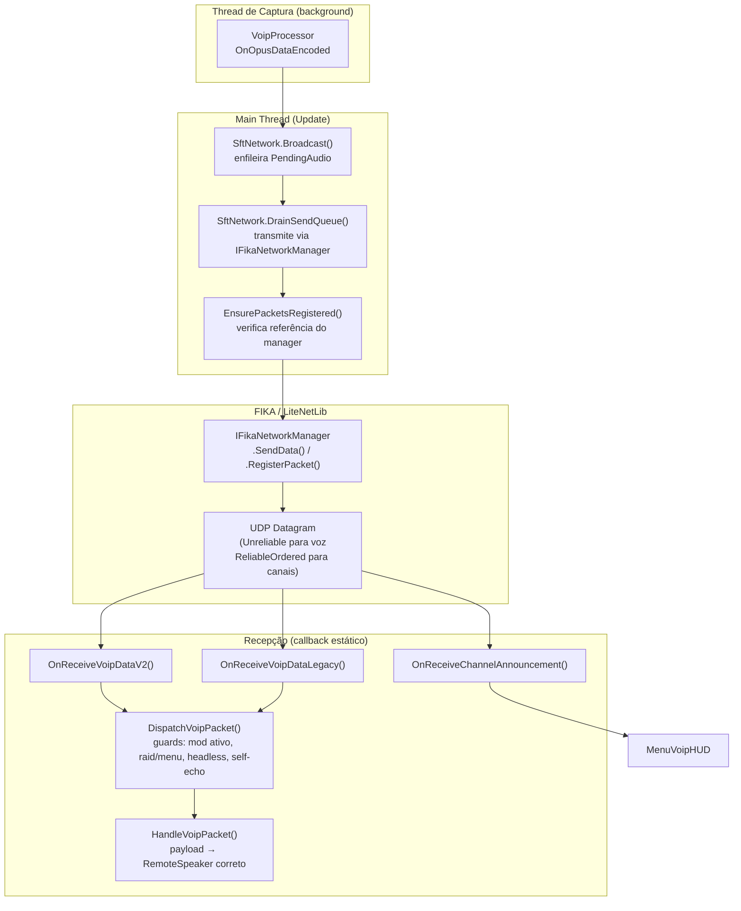
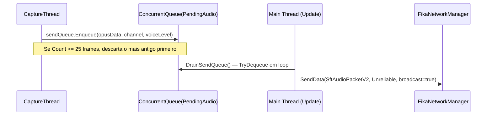
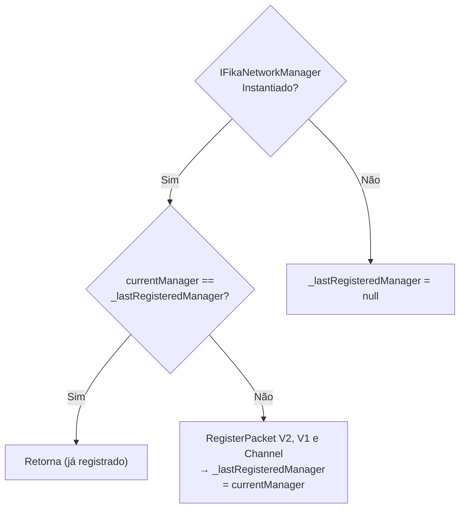
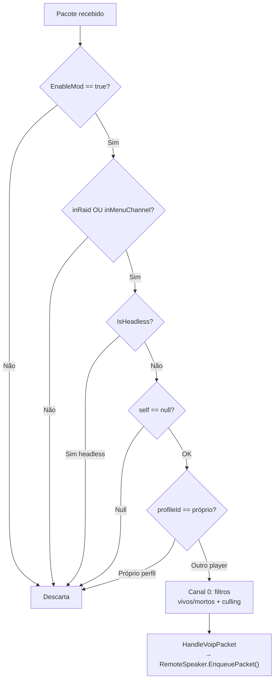
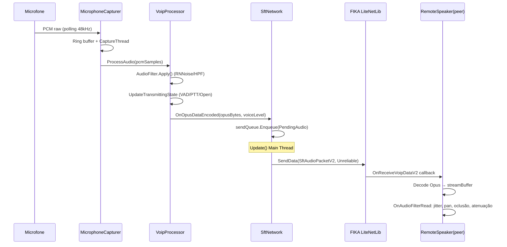

# TRL-SpeakFromTarkov — Camada de Rede e Protocolo de Pacotes

Documenta o protocolo de transporte de áudio sobre LiteNetLib/FIKA: estrutura dos pacotes, versionamento, fila de envio thread-safe, registro dinâmico no NetPacketProcessor e roteamento de pacotes recebidos para os RemoteSpeakers corretos.

---

## Visão Geral da Camada de Rede



---

## Estrutura dos Pacotes

### SftAudioPacketV2 (formato atual, ≥ 1.4.0)

**Arquivo:** [`SftAudioPacket.cs`](../modded-V3-audit/SftAudioPacket.cs#L73)

```
[Datagrama LiteNetLib]
  [ushort hash CRC-16 do tipo = hash("SftAudioPacketV2")]
  [ushort body_length]         ← prefixo PutBytesWithLength (ENVELOPE)
  [body]
    [string ProfileId]         ← ID do jogador remetente
    [byte   Channel]           ← 0=raid 3D, 1=menu/lobby, 2=spectator
    [ushort audio_length]
    [byte[] AudioData]         ← payload Opus (max 1275 bytes + cabeçalho)
    [float  VoiceLevel]        ← RMS de DisplayLevel do VoipProcessor
```

**Motivo do envelope (`PutBytesWithLength`):**
O `NetPacketProcessor` do FIKA processa múltiplos pacotes no mesmo datagrama (`while (reader.AvailableBytes > 0)`). Sem o envelope de comprimento, um Deserialize que consumir bytes a mais/menos desalinha o `NetDataReader` e faz o próximo hash ser lido como lixo → `ParseException` → toda a fila de rede do frame é descartada (inclusive posição/movimento FIKA).

**`[ThreadStatic] _innerWriter`:** buffer interno por thread para serialização sem GC extra, mesmo se futuramente serializado de outra thread.

---

### SftAudioPacket (formato legado V1, ≤ 1.3.0)

**Arquivo:** [`SftAudioPacket.cs`](../modded-V3-audit/SftAudioPacket.cs#L27)

```
[Datagrama LiteNetLib]
  [ushort hash CRC-16 do tipo = hash("SftAudioPacket")]
  [string ProfileId]
  [byte   Channel]
  [ushort audio_length]
  [byte[] AudioData]
  [float  VoiceLevel]
```

**Compatibilidade:**
- V1.4.0 OUVE V1.3.0 (registra handler para V1)
- V1.3.0 NÃO ouve V1.4.0 (hash diferente → `ParseException` no peer antigo)
- Política: **LOCKSTEP** — todos os peers + headless devem atualizar juntos

---

### SftChannelAnnouncementPacket

**Arquivo:** [`Network/SftChannelAnnouncementPacket.cs`](../modded-V3-audit/Network/SftChannelAnnouncementPacket.cs)

```
[Datagrama LiteNetLib / DeliveryMethod.ReliableOrdered]
  [envelope PutBytesWithLength]
    [byte   ChannelId]
    [string ChannelName]
    [string HostProfileId]
    [string HostNickname]
    [string TargetProfileId]    ← string.Empty para broadcast
    [byte   Action]             ← enum abaixo
```

| Action | Valor | Semântica |
|---|---|---|
| Announce | 0 | Canal criado / atualizado |
| Close | 1 | Canal encerrado pelo host |
| Join | 2 | Jogador entrou no canal |
| Leave | 3 | Jogador saiu do canal |
| Kick | 4 | Jogador expulso |
| Ban | 5 | Jogador banido do canal |

Além do LiteNetLib, o mesmo anúncio é enviado via **HTTP POST** para `sft/channels/announce` no servidor SPT (visível para jogadores ainda no menu antes da sessão FIKA existir).

---

## SftNetwork — Gestão de Estado e Thread-Safety

**Arquivo:** [`Network/SftNetwork.cs`](../modded-V3-audit/Network/SftNetwork.cs)

### Fila de Envio Thread-Safe



**Por que a thread de captura não transmite diretamente:**
`FikaClient._dataWriter` é um `NetDataWriter` de instância compartilhado **sem lock**. Chamar `SendData` fora da main thread corromperia esse buffer e produziria datagramas malformados → `ParseException: Undefined packet in NetDataReader` nos peers.

**Teto da fila:** `MaxQueuedFrames = 25` (~500ms de áudio @ 20ms/frame). Protege contra hitches típicos do Tarkov (entrada de jogador, carregamento de loot).

---

### Registro Dinâmico de Pacotes (EnsurePacketsRegistered)



**Motivo da comparação por referência:**
O FIKA destrói e recria o `IFikaNetworkManager` a cada transição menu→lobby→raid. A nova instância tem o `NetPacketProcessor` vazio. Comparar a referência detecta essa troca e re-registra os handlers.

Chamado em:
1. `SftNetwork.Update()` — todo frame
2. `VoIPPlugin.Update()` — redundância defensiva (caso o `SftNetwork` seja destruído)
3. `DrainSendQueue()` — antes de cada lote de envio
4. `InitFikaSession()` — ao entrar em raid

---

### Guards de Recepção (DispatchVoipPacket + HandleVoipPacket)



**Filtros específicos do Canal 0 (raid 3D):**

| Filtro | Condição de descarte |
|---|---|
| Vivos/mortos | `isLocalAlive && !isSenderAlive` → descarta (jogadores vivos não ouvem fantasmas) |
| Culling espacial (sqrMagnitude) | distância > `MaxHearingDistance × 1.10f` → descarta antes de alocar RemoteSpeaker |

---

### Gerenciamento de RemoteSpeakers

Cada `profileId` único recebe um `RemoteSpeaker` próprio:

```
HandleVoipPacket()
  ├── remoteSpeakers.TryGetValue(profileId, out speaker)
  │   └── não encontrado: CreateRemoteSpeaker(profileId)
  ├── inRaid: ancora speaker ao PlayerBones.Head (3D)
  └── menu: SetEmergency2DMode(true) (2D estéreo plano)
```

**`StopSession()`:** Nunca chama `UnregisterPacket<>()`. Remover handlers do NetPacketProcessor compartilhado do FIKA causa `ParseException` em pacotes ainda em voo. O gate de "fora de raid" é feito por guard clause nos callbacks estáticos.

---

### Throttle de Log de Erros

Para evitar que falhas sistemáticas de rede gerem dezenas de stack traces por segundo (causando hitching):

- Primeira ocorrência de cada tipo de exceção: loga stack trace completo.
- Ocorrências subsequentes: suprimidas por 5 segundos, depois loga `(+N falhas suprimidas)`.
- Thread-safe via `Environment.TickCount` (não usa `Time.time`, indisponível fora da main thread).

---

## Resumo de Fluxo Completo


