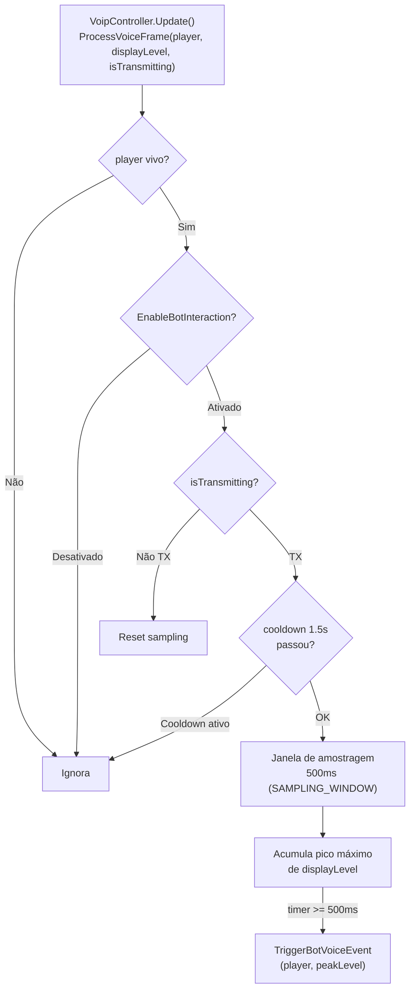
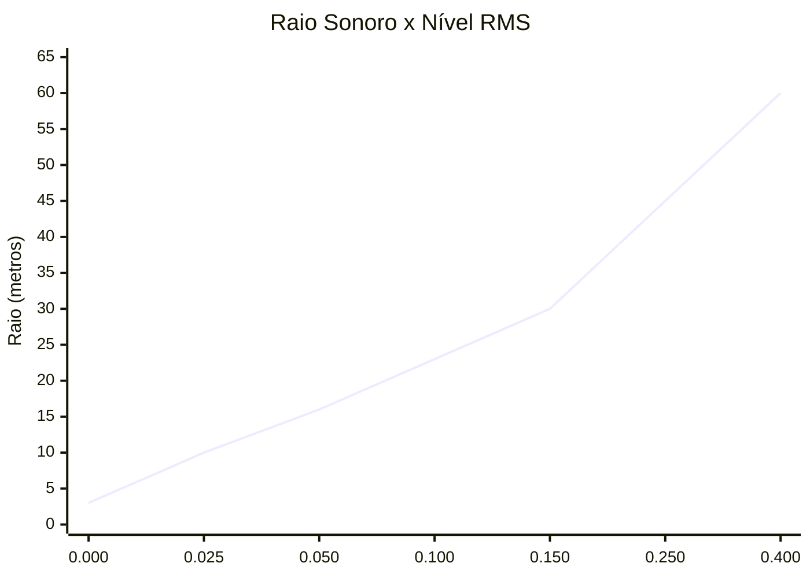
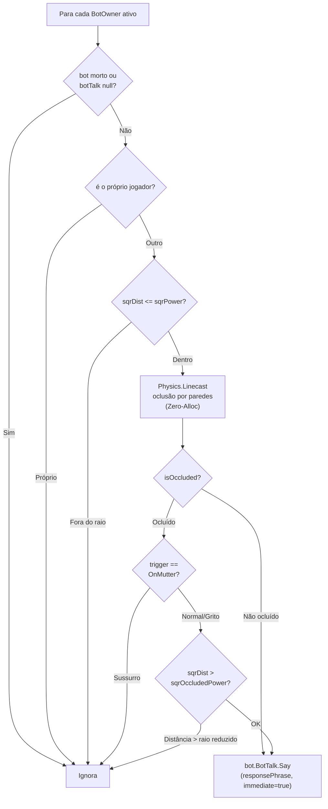
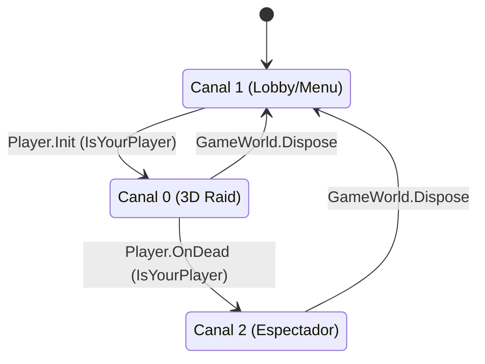
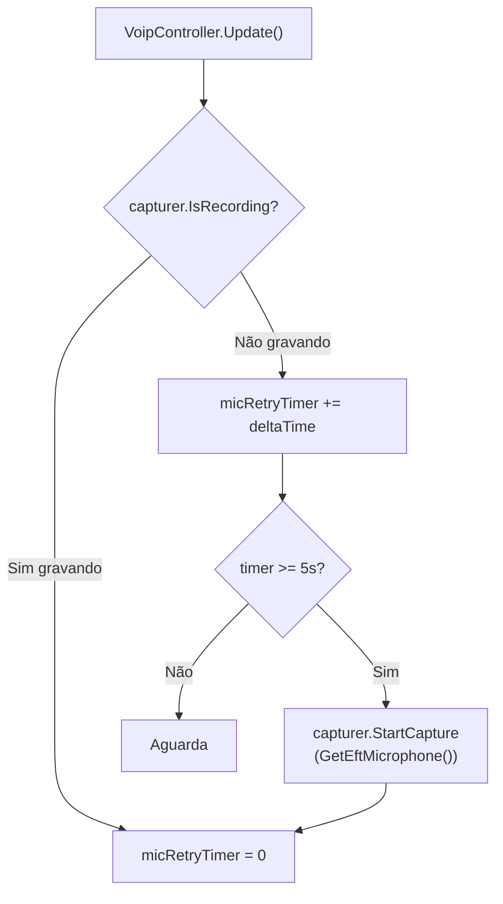

# TRL-SpeakFromTarkov — Reatividade de Bots e Áudio 3D

Documenta o sistema de interação com bots baseado em voz e a reprodução 3D posicional da voz remota: sensor de audição dos bots, interpolação de raio por intensidade vocal, respostas forçadas com oclusão por paredes, re-ancoragem dinâmica ao jogador remoto e patches de ciclo de raid.

---

## 1. BotVoiceBridge — Interação Voz → Bots

**Arquivo:** [`Audio/BotVoiceBridge.cs`](../modded-V3-audit/Audio/BotVoiceBridge.cs)

### Fluxo de Decisão



**Janela de 500ms:** garante que o pico real da frase inteira (não o onset instável) seja capturado antes de decidir o raio de impacto sonoro.

**Debounce 1.5s:** evita spam de eventos sonoros para os bots durante fala contínua.

---

### Interpolação de Raio por Intensidade Vocal

O `peakLevel` (RMS) capturado durante a janela de 500ms é mapeado para um raio sonoro contínuo e para um `EPhraseTrigger`:

| Faixa de peakLevel | Faixa de Raio | EPhraseTrigger | Modo |
|---|---|---|---|
| 0.0 – 0.025 | 3.0m – 10.0m | `OnMutter` (sussurro) | Não agressivo |
| 0.025 – 0.150 | 10.0m – 30.0m | `NoisePhrase` (voz normal) | Não agressivo |
| 0.150 – 0.400 | 30.0m – 60.0m | `OnFight` (grito) | `aggressive=true` |

A interpolação é feita com `Mathf.Lerp` + `Mathf.Clamp01(t)` dentro de cada faixa, produzindo raio **contínuo e gradual** sem saltos discretos.



---

### Ações sobre os Bots

Para cada evento disparado, três ações são executadas em sequência:

#### 1. BotEventHandler.PlaySound — Sensor de Audição

```csharp
Singleton<BotEventHandler>.Instance.PlaySound(
    player,
    soundPos,         // posição da cabeça do jogador
    power,            // raio em metros (calculado acima)
    AISoundType.step  // tipo de som para o sistema de AI do EFT
);
```

Notifica o sistema de percepção dos bots EFT em 3D, usando o raio calculado. Os bots dentro do raio entram em estado de alerta/combate via lógica nativa do EFT.

#### 2. Player.Say — Frase de Depuração Local

```csharp
player.Say(trigger, demand: true, 0f, (ETagStatus)0, 100, aggressive: isAggressive);
```

Faz o personagem do jogador emitir a frase de voz nativa. Controlado por `BotVoiceDebugVolume` (padrão 0.0 = silencioso). Usar volume > 0 torna o personagem audível localmente para debug.

#### 3. ForceBotResponsesInRadius — Resposta Instantânea

Varredura de todos os `BotOwner` ativos via `IBotGame.BotsController.Bots.BotOwners`:



**Mapeamento de resposta por gatilho:**

| EPhraseTrigger enviado | EPhraseTrigger de resposta do bot |
|---|---|
| `OnMutter` | `OnMutter` |
| `NoisePhrase` | `Greetings` |
| `OnFight` | `OnFight` |

**Oclusão por paredes para bots:**

| Trigger | Comportamento com oclusão |
|---|---|
| `OnMutter` (sussurro) | Descartado — sussurro não atravessa paredes de concreto |
| `NoisePhrase` (normal) | Raio reduzido a 50% (`occludedPowerMult = 0.50f`) |
| `OnFight` (grito) | Raio reduzido a 65% (`occludedPowerMult = 0.65f`) |

---

## 2. Reprodução 3D e Ancoragem ao Jogador Remoto

**Arquivo:** [`Audio/RemoteSpeaker.cs`](../modded-V3-audit/Audio/RemoteSpeaker.cs)

### Ancoragem ao Osso da Cabeça

Ao receber o primeiro pacote de áudio de um `profileId`, o `SftNetwork` cria um `RemoteSpeaker` e tenta ancorar ao osso da cabeça do jogador remoto:

```csharp
Transform targetBone = player.PlayerBones?.Head?.Original
    ?? player.Transform.Original;
speaker.transform.SetParent(targetBone, false);
speaker.transform.localPosition = (targetBone == player.Transform.Original)
    ? Vector3.up * 1.6f   // fallback: 1.6m acima da raiz
    : Vector3.zero;        // direto no osso da cabeça
```

**Re-ancoragem dinâmica:** Se o `RemoteSpeaker` ficar sem parent (ex: ao carregar a cena), a cada 2 segundos tenta re-ancorar buscando o player por `profileId` em `GameWorld.GetAlivePlayerByProfileID()` e `AllAlivePlayersList` como fallback.

---

### Modo 3D (raid) vs Modo 2D (menu)

| Modo | `spatialBlend` | `spatialize` | Ativação |
|---|---|---|---|
| 3D Raid | 1.0 | true | `inRaid == true` |
| 2D Menu | 0.0 | false | `inRaid == false` |
| Emergency 2D | 0.0 | false | `SetEmergency2DMode(true)` — fallback se player não localizado |

---

### Distância Máxima Dinâmica por Nível de Voz

```
voiceLevel = RemoteSpeaker.VoiceLevel (float 0-1 do SftAudioPacketV2)
distanceMultiplier = Clamp(voiceLevel × 10, 0.65, 2.0)
currentDistanceTarget = MaxHearingDistance × distanceMultiplier
```

| VoiceLevel | distanceMultiplier | Distância (base 30m) |
|---|---|---|
| ~0.01 (sussurro) | 0.65 | ~20m |
| ~0.10 (normal) | 1.0 | ~30m |
| ≥ 0.30 (grito) | 2.0 | ~60m |

A `maxDistance` do AudioSource é suavizada com `Lerp(smoothed, target, dt × 5f)` para evitar saltos bruscos.

---

### AudioSource — Configurações Anti-Interferência do Tarkov

```csharp
audioSource.ignoreListenerVolume = true;    // Ignora o mixer de volume do Tarkov
audioSource.ignoreListenerPause = true;     // Não pausa quando o jogo pausa
audioSource.bypassEffects = true;           // Sem efeitos do DSP do Unity
audioSource.bypassListenerEffects = true;   // Sem AudioListener effects
audioSource.bypassReverbZones = true;       // Sem reverb zones do EFT
audioSource.rolloffMode = Logarithmic;      // Rolloff base (complementado manualmente)
audioSource.dopplerLevel = 0f;             // Sem efeito Doppler
```

---

## 3. GameSessionPatcher — Patches do Ciclo de Raid

**Arquivo:** [`GameSessionPatcher.cs`](../modded-V3-audit/GameSessionPatcher.cs)

### Patches de Gerenciamento de Estado

| Patch | Target | Trigger | Ação |
|---|---|---|---|
| `PlayerInitPatch` | `EFT.Player.Init` | Postfix | `SetGameStateChannel(true)` + `StartVoipCapture()` se `IsYourPlayer` |
| `PlayerOnDeadPatch` | `EFT.Player.OnDead` | Postfix | `SetPlayerStatus(true)` → canal 2 (espectador) se `IsYourPlayer` |
| `GameWorldDisposePatch` | `GameWorld.Dispose` | Prefix | `SetGameStateChannel(false)` → encerra sessão FIKA, canal volta a 1 |



---

### Patches de Silenciamento do FIKA VOIP (Dissonance)

Todos com flag condicional: se `EnableMod == false`, deixa o FIKA rodar normalmente.

| Patch | Target | Tipo | Motivo |
|---|---|---|---|
| `FikaVoipSendPatch` | `FikaVOIPClient.SendVoiceData` | Prefix/skip | Impede envio pelo Dissonance |
| `FikaVoipReceivePatch` | `FikaVOIPClient.NetworkReceivedPacket` | Prefix/skip | Impede recepção pelo Dissonance |
| `FikaClientInitializeVoipPatch` | `FikaClient.InitializeVOIP` | Prefix/skip | Retorna `Task.CompletedTask` — evita loading lento do Dissonance Scene |
| `FikaServerInitializeVoipPatch` | `FikaServer.InitializeVOIP` | Prefix/skip | Idem para o servidor FIKA |
| `FikaVoipControllerUpdatePatch` | `FikaVOIPController.Update` | Prefix/skip | Silencia tick do VOIP FIKA (evita NRE em `MicrophoneFailState`) |
| `FikaFixVoipAudioDevicePatch` | `BaseGameController.FixVOIPAudioDevice` | Prefix/skip | Substitui enumerator por `EmptyEnumerator` — evita NRE em `DissonanceComms.Instance` |
| `FikaObservedPlayerInitVoipPatch` | `ObservedPlayer.InitVoip` | Prefix/skip | Silencia InitVoip que chamava Dissonance |
| `FikaPlayerInitVoipPatch` | `FikaPlayer.InitVoip` | Prefix/skip | Idem para FikaPlayer |
| `BoundSlotViewRefreshSelectViewPatch` | `BoundSlotView.RefreshSelectView` | Finalizer | Absorve NRE durante spawn em coop (equip de arma) |

**Nota:** A configuração `Allow VOIP` do FIKA é forçada para `false` automaticamente no `Awake()` do plugin para evitar logs de erro inofensivos do Dissonance no console do BepInEx.

---

## 4. Retry de Microfone



`GetEftMicrophone()`: tenta obter o dispositivo configurado no próprio Tarkov via `SoundSettingsControllerClass.DefaultMicrophone`; se falhar, usa o dispositivo selecionado no F12 do mod como fallback.
