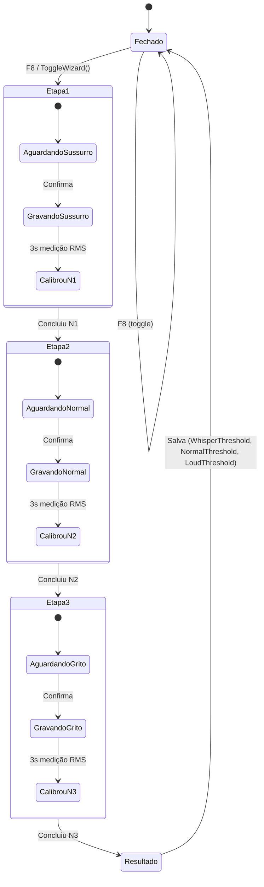
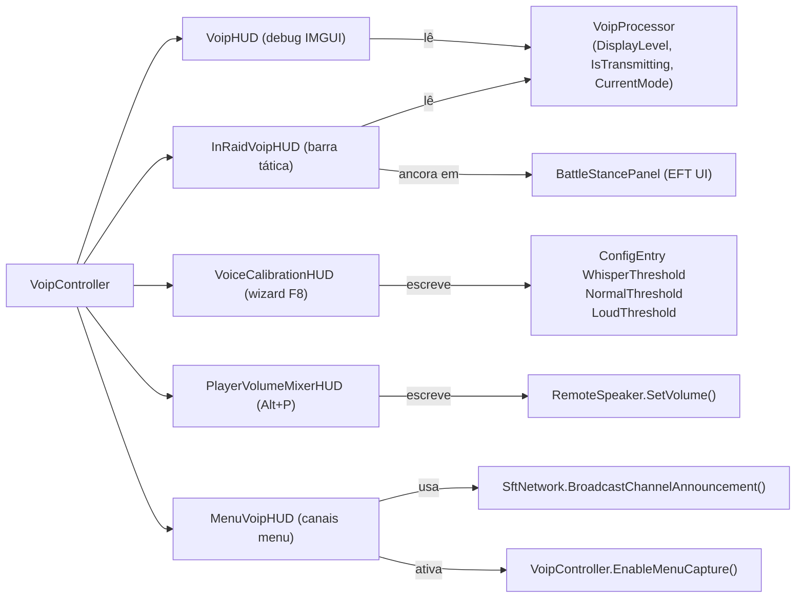

# TRL-SpeakFromTarkov — Interface, HUDs e Configurações F12

Documenta todos os elementos de interface de usuário do mod: HUD de raid, painel de debug, wizard de calibração de voz, mixer de volume por jogador, HUD do menu e o catálogo completo de configurações F12.

---

## 1. InRaidVoipHUD — Barra Tática In-Raid

**Arquivo:** [`UI/InRaidVoipHUD.cs`](../modded-V3-audit/UI/InRaidVoipHUD.cs)

Barra vertical slim (7px × ~110px) ancorada dinamicamente ao lado esquerdo do `BattleStancePanel` (painel de postura/stamina nativo do EFT). Renderizada via Unity IMGUI (`OnGUI`).

### Elementos Visuais

```
[Ícone de Modo — 40px]    ← abaixo da barra (PTT/VAD/OPEN/MUTE PNG)
[Borda externa 1px]
[Fundo escuro semi-transparente]
[Status Dot 3px — topo]    ← vermelho=mudo | amarelo=aguardando | verde=TX
[Preenchimento VU Meter]   ← bottom-up, cor por nível
  [Notch N1 — limiar Whisper]   ← linha horizontal 1px
  [Notch N2 — limiar Normal]    ← linha horizontal 1px
```

### Modos de Visibilidade (`HudVisibilityMode`)

| Modo | Comportamento |
|---|---|
| `Hidden` | Nunca exibe (`hudAlpha = 0`) |
| `AlwaysVisible` | Sempre visível durante raid (`hudAlpha = 1`) |
| `SyncHUD` | Sincroniza com o `CanvasGroup.alpha` do BattleStancePanel (autohide nativo) |
| `VoiceActivity` | Aparece só quando `IsTransmitting` ou `DisplayLevel > 0.002f`; fade-out 1s após silêncio |

### Localização e Offset

- Posição base: canto esquerdo do `BattleStancePanel` (obtido via `RectTransform.GetWorldCorners`)
- O painel de postura original é deslocado `+ShiftStancePanelX` pixels para a direita para dar espaço ao HUD
- Ajuste manual via F12: `InRaidHUDOffsetX` e `InRaidHUDOffsetY`

### Carregamento de Ícones PNG

Busca em 3 localizações: `<pluginDir>/assets/`, `<pluginDir>/`, `<pluginDir>/../` (raiz do mod).

| Arquivo | Modo |
|---|---|
| `ptt.png` | PTT (Push-to-Talk) |
| `vad.png` | VAD (Voice Activity Detection) |
| `open.png` | Open (sempre ligado) |
| `mute.png` | Microfone mudo |

---

## 2. VoipHUD — Painel de Debug/Diagnóstico

**Arquivo:** [`UI/VoipHUD.cs`](../modded-V3-audit/UI/VoipHUD.cs)

Exibido apenas com `EnableDebugVoipHUD = true` (F12 → seção Debug). Painel IMGUI no canto superior esquerdo da tela.

### Elementos

```
[Status Dot 20px]  [Canal] [Modo] — [Estado TX] 
[Barra MIC IN     ──────────────────────────────] (verde/amarelo/vermelho)
[Label: SAÍDA / RETORNO (DEBUG ECO): TOCANDO/SILÊNCIO]
[Barra SAÍDA      ──────────────────────────────] (cyan)
[CPU DSP: ~0.08ms | Banda: ~24 kbps | GC: 0 KB/s]  ← profiler ativo
[Botão [PROFILER ON/OFF]]
```

### Estados de Transmissão (label de texto)

| Condição | Texto |
|---|---|
| `IsMuted` | `MUDO` |
| `IsTransmitting` + nível < 0.025 | `TX [SUSSURRO (Xm)]` |
| `IsTransmitting` + nível < 0.150 | `TX [NORMAL (Xm)]` |
| `IsTransmitting` + nível >= 0.150 | `TX [GRITO (Xm)]` |
| Modo PTT, não transmitindo | `AGUARDANDO PTT` |
| Modo VAD, não transmitindo | `OUVINDO (VAD)` |
| Modo Open, não transmitindo | `ABERTO` |

---

## 3. VoiceCalibrationHUD — Wizard de Calibração

**Arquivo:** [`UI/VoiceCalibrationHUD.cs`](../modded-V3-audit/UI/VoiceCalibrationHUD.cs)

Wizard interativo de 3 etapas para calibrar os limiares de voz. Ativado com `OpenCalibrationKey` (F8 padrão).

### Fluxo do Wizard



Os valores medidos são salvos diretamente nas `ConfigEntry` do BepInEx, persistindo no arquivo de configuração.

---

## 4. PlayerVolumeMixerHUD — Mixer de Volume In-Raid

**Arquivo:** [`UI/PlayerVolumeMixerHUD.cs`](../modded-V3-audit/UI/PlayerVolumeMixerHUD.cs)

Modal que permite ajustar o volume de cada jogador remoto individualmente durante a raid.

- Ativação: `PlayerMixerKey` (Alt+P padrão)
- Persiste os volumes por `profileId` entre sessões
- `GetPlayerEffectiveVolume(profileId)` consultado pelo `SftNetwork` ao criar um `RemoteSpeaker`

---

## 5. MenuVoipHUD — Canais de Voz no Menu

**Arquivo:** [`UI/MenuVoipHUD.cs`](../modded-V3-audit/UI/MenuVoipHUD.cs)

Interface para criação e gerenciamento de canais de voz no menu principal (antes de entrar em raid).

- Usa `SftNetwork.BroadcastChannelAnnouncement()` para sincronizar estado de canal via LiteNetLib + HTTP POST
- O microfone é ativado/desativado via `VoipController.EnableMenuCapture(bool)` ao entrar/sair de um canal
- `ConnectedChannelId` (nullable byte) controla se áudio do menu deve ser roteado no `DispatchVoipPacket`

---

## 6. Catálogo Completo de Configurações F12

### General

| Config | Tipo | Padrão | Descrição |
|---|---|---|---|
| Microphone Device | string (lista) | 1º microfone | Dispositivo de captura ativo |
| Voice Mod | bool | true | Liga/desliga todo o sistema VOIP |
| Transmission Mode | string (lista) | VAD | Modo de transmissão: VAD / PTT / Open |
| Microphone Gain | float | 1.0 | Amplificação do PCM bruto (pré-filtros) |
| Output Volume | float [0.1, 5.0] | 1.0 | Volume de saída final (pós-filtros, pré-encoder) |
| Sample Rate | int | 48000 | Taxa de amostragem de captura |

### Shortcuts & Controls

| Config | Tipo | Padrão | Descrição |
|---|---|---|---|
| Push To Talk Key | KeyboardShortcut | V | Tecla PTT |
| Toggle Mode Key | KeyboardShortcut | P | Alterna VAD → PTT → Open ciclicamente |
| Mute Key | KeyboardShortcut | Ctrl+M | Mudo do microfone |
| In-Raid Player Mixer Key | KeyboardShortcut | Alt+P | Abre o PlayerVolumeMixerHUD |

### UI / HUD Settings

| Config | Tipo | Padrão | Descrição |
|---|---|---|---|
| In-Raid VOIP HUD | bool | true | Exibe a barra tática in-raid |
| HUD Visibility | enum | VoiceActivity | Modo de visibilidade (Hidden/AlwaysVisible/SyncHUD/VoiceActivity) |
| Vanilla Stance Panel Offset X | float [-50, 150] | 15px | Desloca o painel de postura do EFT para a direita |
| In-Raid HUD Offset X | float [-300, 300] | 0px | Ajuste horizontal do HUD do mod |
| In-Raid HUD Offset Y | float [-300, 300] | 0px | Ajuste vertical do HUD do mod |

### Voice Calibration

| Config | Tipo | Padrão | Range | Descrição |
|---|---|---|---|---|
| Open Calibration Wizard Shortcut | KeyboardShortcut | F8 | — | Abre o wizard de calibração |
| Whisper Threshold (Notch 1) | float | 0.015 | 0.001–0.300 | Limiar RMS para sussurro |
| Normal Voice Threshold (Notch 2) | float | 0.060 | 0.002–0.400 | Limiar RMS para voz normal |
| Loud Voice Threshold (Max Ceiling) | float | 0.180 | 0.005–0.500 | Limiar RMS para grito |

### Audio Filters & DSP

| Config | Tipo | Padrão | Range | Descrição |
|---|---|---|---|---|
| RNNoise Suppressor | bool | true | — | Ativa RNNoise neural vs fallback HPF+Gate |
| RNNoise VAD Threshold | float | 0.35 | 0.0–1.0 | Probabilidade mínima de voz do RNNoise |
| RNNoise Hold Time ms | float | 150ms | 50–500 | Hold após fala parar (RNNoise) |
| RNNoise Queue Latency | int | 960 | 1–4096 | Latência inicial da fila RNNoise em samples |
| VAD Sensitivity Threshold | float | 0.005 | — | Sensibilidade RMS para VAD clássico |
| VAD Decay Time s | float | 0.7s | — | Timer de hold do VAD clássico |
| Max Audio Level Ceiling | float | 0.015 | — | Teto máximo de nível de áudio |
| AGC | bool | false | — | Controle Automático de Ganho |
| Audio Limiter | bool | true | — | Soft-clip ±0.98f |
| HPF Cutoff Hz | float | 80 | 20–500 | Filtro passa-alta (remove rumble) |
| LPF Cutoff Hz | float | 8000 | 3000–20000 | Filtro passa-baixa (remove chiado) |
| Noise Gate Threshold | float | 0.008 | 0.001–0.1 | Limiar do noise gate clássico |
| Noise Gate Hold ms | float | 150ms | 50–500 | Hold do noise gate clássico |

### Network & 3D Audio

| Config | Tipo | Padrão | Range | Descrição |
|---|---|---|---|---|
| Bot Reactivity | bool | true | — | Ativa reação verbal dos bots à voz |
| Max VOIP Hearing Distance m | float | 30m | 5–200 | Distância máxima de escuta 3D |
| Initial Jitter Buffer ms | float | 150ms | 50–1000 | Buffer de jitter na recepção |
| Opus Bitrate kbps | int | 24000 | 8000–64000 | Qualidade de compressão Opus |
| Encoder Complexity | int | 5 | 0–10 | CPU vs qualidade do encoder |
| Forward Error Correction | bool | false | — | FEC para redes com perda de pacotes |
| Physical Wall Occlusion | bool | true | — | Abafa voz atrás de paredes/portas |

### Debug

| Config | Tipo | Padrão | Descrição |
|---|---|---|---|
| Local Echo Loopback | bool | false | Reproduz localmente a própria voz para teste |
| Echo Delay s | float | 0.0s | Delay do eco local (0 = imediato) |
| Echo Volume | float | 1.0 | Volume do eco local |
| Profiler / Debug HUD | bool | false | Exibe o painel de diagnóstico IMGUI (VoipHUD) |
| Debug Logs | bool | false | Loga detalhes de pacotes no console BepInEx |
| Bot Speech Debug Volume | float [0, 1] | 0.0 | Volume da frase de voz do personagem (debug de bots) |

---

## 7. Diagrama de Relações entre HUDs


