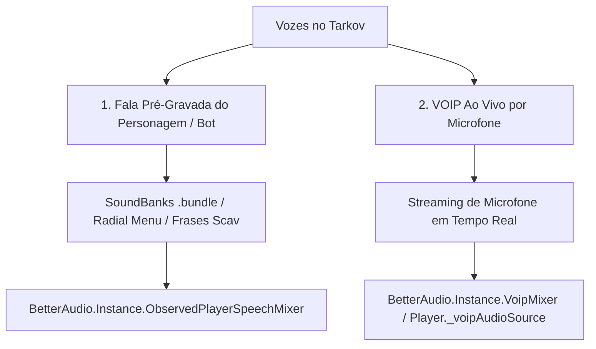

# Mapeamento da Arquitetura Nativa de Áudio do Tarkov (VOIP ao Vivo vs Vozes Pré-Gravadas)

**Data:** 2026-07-21  
**Status:** 🟢 Documentado / Mapeamento Atualizado e Validado no Assembly-CSharp  
**Autor:** TRL Team & AI Assistant  

---

## 1. Distinção Crucial de Arquitetura: Voz Ao Vivo vs Vozes Pré-Gravadas

No *Assembly-CSharp* do Escape From Tarkov, a Battlestate Games (BSG) possui **duas rotas de áudio completamente separadas** para comunicação verbal:

---

## 2. Mapeamento de Mixer Groups no `Assembly-CSharp` (`BetterAudio.cs`)

O `BetterAudio.cs` gerencia a mesa de som virtual do Tarkov com canais isolados:

| Nome do Mixer Group (`BetterAudio`) | Identificador Nativo no Mixer | Tipo de Sinal | Finalidade no Jogo |
| :--- | :--- | :--- | :--- |
| **`VoipMixer`** | **`FindMixerGroup("Voip")`** | **VOIP Ao Vivo (Microfone)** | **Canal nativo do Tarkov exclusivo para áudio de microfone em tempo real.** |
| **`ObservedPlayerSpeechMixer`** | `ObservedPlayer/ObservedPlayerSpeech` | Voz Pré-Gravada | Falas automáticas de PMCs/Scavs inimigos (frases do menu radial). |
| **`ClientPlayerSpeechMixer`** | `ClientPlayer/ClientPlayerSpeech` | Voz Pré-Gravada | Falas em 1ª pessoa do próprio personagem. |
| **`SelfSpeechReverb`** | `ClientPlayer/ClientPlayerSelfSpeechReverb` | Reverb de Voz | Sub-sistema de eco para fala própria. |

---

## 3. O Componente Nativo de VOIP na Classe `EFT.Player`

No `Assembly-CSharp` descompilado (classe `EFT.Player.cs`), o Tarkov mantém a infraestrutura nativa de streaming de microfone:

- **`Player._voipAudioSource`**: O `AudioSource` 3D nativo instanciado no boneco do jogador para reproduzir a voz ao vivo recebida pela rede.
- **`Player.InitVoip(EVoipState voipState)`**: Método nativo que inicializa o suporte a VOIP no jogador.
- **`Player.IsHeard(in Vector3 voicePos, float sqrDistance)`**: Método nativo de cálculo de alcance da voz.

---

## 4. Efeitos de Ambiente Aplicados ao `VoipMixer`

Ao vincular o `AudioSource` do nosso mod ao **`BetterAudio.Instance.VoipMixer`**:

1. **Reverberação e Eco de Sala (Reverb Zones):**
   - O `VoipMixer` é roteado para a zona de reverb do mapa (Bunker da Reserve, Estacionamento da Interchange, Galpões da Customs).
2. **Filtros de Fones Táticos e Capacetes:**
   - O volume e equalização da voz ao vivo respondem aos fones equipados (ComTac 4, Sordin) e abafam com capacetes fechados (Altyn).
3. **Oclusão por Paredes (Wall Occlusion):**
   - Áudio de microfone ao vivo vindo de trás de paredes espessas recebe atenuação de agudos automática.

---

## 5. Comparativo de Curva de Distância (Nativa vs Nosso Mod)

- **Curva Vanilla (`Preset.SoundRolloff` / `AnimationCurve`):** Projetada pela BSG para tiros e passos.
- **Nossa Curva Acústica (`Mathf.Pow(1.0f - normD, 2.2f)`):** Desenhada para inteligibilidade de fala humana em tempo real (-6dB por dobra de distância).

**Estratégia Recomendada:** Ao ativar o `VoipMixer` no futuro, desativaremos a multiplicação manual em `OnAudioFilterRead` e deixaremos o `VoipMixer` + `AudioSource.maxDistance = 30f` cuidarem do decaimento e eco nativo do jogo.
