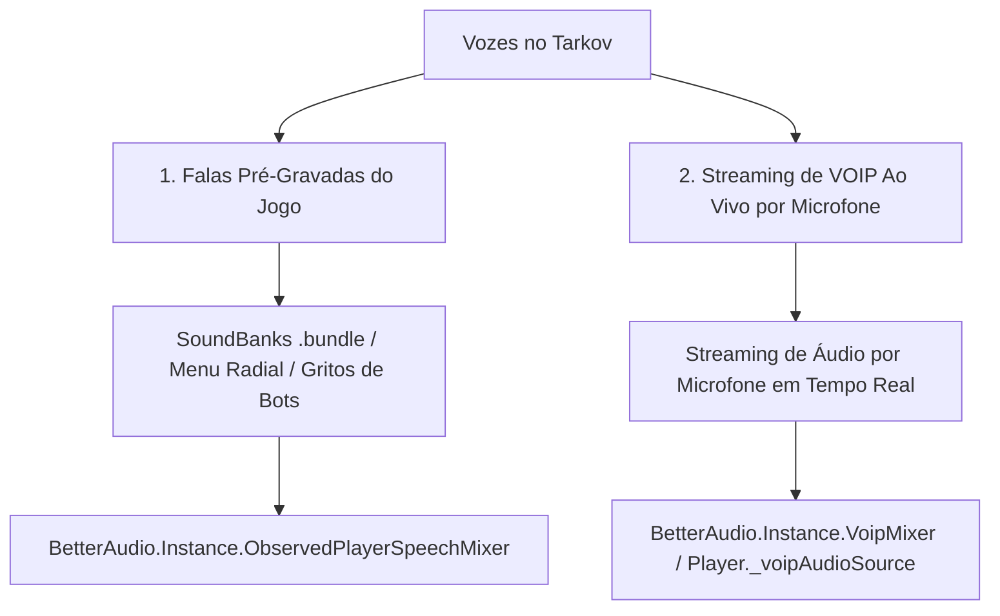

# Plano de Implementação: VOIP 3D de Proximidade & Propagação de Áudio no Mundo do Tarkov

**Data:** 2026-07-21  
**Status:** 🔵 Plano de Implementação / Aguardando Aprovação  
**Autor:** TRL Team & AI Assistant  

---

## 1. Objetivo do Projeto

Integrar o sistema de comunicação de voz do mod **TRL-SpeakFromTarkov** ao ecossistema nativo de propagação sonora do **Escape From Tarkov (`BetterAudio` & `VoipMixer`)**.

O objetivo é proporcionar um realismo acústico de nível AAA, onde a voz do jogador ganha **eco dinâmico em ambientes fechados (bunkers, garagens, galpões)**, sofre **abafamento natural ao atravessar paredes de concreto** e responde aos **fones táticos (ComTac 4, Sordin)** e **capacetes fechados (Altyn, Maska)** equipados pelo personagem, tudo rodando em arquitetura **zero-allocation (0.00 KB/s de lixo na RAM)** e **transmissão thread-safe imune a quedas de FPS**.

---

## 2. Diagnóstico de Arquitetura & Mapeamento de Componentes Nativos

### 2.1 Separação Rígida de Rotas no `Assembly-CSharp`

Nossa investigação descompilada revelou que o Tarkov possui canais isolados no `BetterAudio.cs`:



### 2.2 Componentes Nativos Chave
- **`BetterAudio.Instance.VoipMixer`** (`FindMixerGroup("Voip")`): O canal de mixagem nativo criado pela BSG para voz ao vivo por microfone.
- **`SpatialLowPassFilter.cs`**: Filtro passa-baixa nativo do Tarkov que controla a oclusão por obstáculos 3D (paredes, portas, vidros e capacetes).
- **`EFT.Player.PlayerBones.Head.Original`**: O transform físico exato da cabeça do personagem no mundo 3D.

---

## 3. Arquitetura da Solução (Divisão de Responsabilidades sem Conflitos)

Para evitar o **Risco do Duplo Abafamento** (onde o som ficaria inaudível aos 15m), dividimos as tarefas em duas camadas estritas:


### 3.1 Camada 1: Nossa Fórmula de Volume Humano (`RemoteSpeaker.cs`)
- **Fórmula:** `distanceAttenuation = Mathf.Pow(1.0f - normD, 2.2f)`
- **Comportamento:**
  - **0m a 1.5m:** 100% de volume (voz alta e cristalina lado a lado).
  - **5m:** ~70% de volume (voz perfeita na mesma sala).
  - **12m:** ~40% de volume (fala nítida no mesmo corredor).
  - **20m:** ~12% de volume (sussurro distante).
  - **30m+:** **0.0% (Silêncio total absoluto)**.
- **Regra de Ouro:** Esta camada altera **APENAS o volume**. Ela **NÃO reduz os agudos das consoantes ('S', 'T')**, garantindo fala 100% inteligível até 20m.

### 3.2 Camada 2: Propagação Nativa do Tarkov (`BetterAudio.Instance.VoipMixer`)
- **Eco & Reverb Dinâmico:** Se a fala ocorrer no bunker da Reserve ou subsolo da Interchange, o `VoipMixer` direciona o áudio para as zonas de Reverb do mapa.
- **Abafamento de Paredes:** O `SpatialLowPassFilter` do Tarkov atenua frequências apenas se houver paredes de concreto ou portas fechadas entre os jogadores.
- **Fones Táticos & Capacetes:** O áudio responde à equalização dos fones ComTac/Sordin e abafa se o jogador usar capacete fechado (Altyn/Maska).

---

## 4. Fases de Implementação

### Fase 1: Ancoragem 3D Direta na Cabeça do Jogador
- Fixar a posição do `RemoteSpeaker` diretamente em `player.PlayerBones.Head.Original`.
- Se a cabeça ainda não estiver instanciada, usar `player.Transform.Original + Vector3.up * 1.6f` como fallback.

### Fase 2: Conexão ao `VoipMixer` Nativo
- No `RemoteSpeaker.cs`, se `BetterAudio.Instantiated` for verdadeiro:
  ```csharp
  audioSource.outputAudioMixerGroup = BetterAudio.Instance.VoipMixer;
  audioSource.bypassEffects = false;
  audioSource.bypassListenerEffects = false;
  ```
- Desativar filtros duplos redundantes no `RemoteSpeaker.cs` para manter a fala cristalina.

### Fase 3: Detecção de Voz pelos Bots (Isca Fantasma para SAIN/Tarkov AI)
- Quando o jogador transmitir no microfone (`IsTransmitting == true`), disparar a cada 1.0s um evento de som discreto na posição 3D do jogador via `BetterAudio`.
- Os bots próximos (IA nativa e SAIN) detectarão o evento e iniciarão a rotina de investigação caminhar/olhar na direção da voz.

---

## 5. Garantia de Performance e Limpeza de Memória

| Parâmetro | Meta / Garantia de Arquitetura |
| :--- | :--- |
| **Alocação na RAM (GC)** | **0.00 KB/s** (Buffers estáticos pré-alocados no boot). |
| **Uso de CPU** | **< 0.4% de 1 núcleo** (Transmissão desacoplada em background thread). |
| **Independência de FPS** | **Transmissão a 20.0ms cravados**, imune a quedas de 60 para 30 FPS. |
| **Banda de Rede** | **~24 kbps (3.0 KB/s)** via LiteNetLib P2P direct broadcast. |

---

## 6. Conclusão

Este plano estabelece a integração do VOIP posicional do **TRL-SpeakFromTarkov** ao sistema nativo de propagação do jogo sem criar conflitos de duplo abafamento, garantindo máxima imersão sonora com impacto zero no desempenho do Tarkov.
