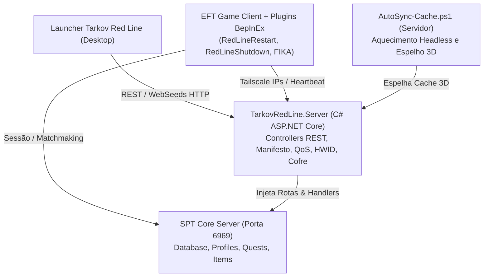

# Tarkov Red Line Server & Client — Visão Geral e Arquitetura

O **Tarkov Red Line 4.0** é o conjunto central de serviços de infraestrutura, mod de servidor C# e utilitários client-side responsáveis por orquestrar a distribuição de conteúdo, sincronização de mods, controle de largura de banda, autenticação com cofre seguro e gerenciamento de rede privada (Tailscale) para o ecossistema SPT 4.0 do Tarkov Red Line.

---

## 1. Arquitetura do Ecossistema

O projeto integra quatro frentes complementares:

---

## 2. Divisão de Módulos e Componentes

| Módulo / Camada | Localização | Descrição e Papel |
|---|---|---|
| **C# Server Mod** | [Server/TarkovRedLine.Server/](../Server/TarkovRedLine.Server/) | Mod ASP.NET Core carregado pelo servidor SPT via `IOnLoad`, implementando controllers REST para distribuição, HWID, cofre de senhas e QoS |
| **Pipeline de Cache 3D** | [AutoSync-Cache.ps1](../AutoSync-Cache.ps1) | Script PowerShell que audita bundles 3D dos mods instalados e aquece o cache headless do cliente sob demanda |
| **Scripts de Distribuição** | [Server/scripts/](../Server/scripts/) | Ferramentas de suporte como `generate-base-torrent.js` para indexação do jogo base via WebSeeds HTTP |
| **Client BepInEx Plugins** | [Client/](../Client/) | Plugins de controle de sessão do cliente (`RedLineRestart`, `RedLineShutdown`) |

---

## 3. Principais Controllers do Servidor C#

```mermaid
classDiagram
    class ModUpdater {
        +GetModsManifest()
        +DownloadModFile()
        +GenerateManifestAsync()
    }
    class BaseGameDownloadController {
        +DownloadBaseFile()
        +RangeRequestsSupport()
    }
    class PasswordController {
        +ChangePassword()
        +ProfileInfo()
        +DeletePassword()
    }
    class HwidManager {
        +RegisterHwid()
        +ResetPassword()
    }
    class ServerBandwidthController {
        +GetBandwidthStatus()
        +UpdateRaidState()
    }
    class PlayerIpsManager {
        +RegisterPlayerIp()
        +GetPlayerIps()
    }
    class CarouselController {
        +GetCarouselImages()
        +ServeImage()
    }
    class LauncherUpdater {
        +GetVersion()
        +DownloadLauncher()
        +DownloadSignature()
    }
```

- **[ModUpdater.cs](../Server/TarkovRedLine.Server/Controllers/ModUpdater.cs):** Varre `Launcher-Updater/mods_repo` e entrega o manifesto em memória com hashes e tamanhos para o Launcher.
- **[BaseGameDownloadController.cs](../Server/TarkovRedLine.Server/Controllers/BaseGameDownloadController.cs):** Serve os 56 GB de arquivos do jogo base com suporte a *HTTP Range Requests (206 Partial Content)* para WebSeeds.
- **[PasswordController.cs](../Server/TarkovRedLine.Server/Controllers/PasswordController.cs):** Implementa o cofre seguro `redline_passwords.json` com leitura case-insensitive e escrita atômica.
- **[HwidManager.cs](../Server/TarkovRedLine.Server/Controllers/HwidManager.cs):** Gerencia a vinculação de hardware de jogadores para segurança contra acessos não autorizados.
- **[ServerBandwidthController.cs](../Server/TarkovRedLine.Server/Controllers/ServerBandwidthController.cs):** Throttle adaptativo de banda (reduz a taxa de download de novos jogadores quando há raids ativas no servidor).
- **[PlayerIpsManager.cs](../Server/TarkovRedLine.Server/Controllers/PlayerIpsManager.cs):** Hub de descoberta de IPs da malha Tailscale para cooperação direta P2P.
