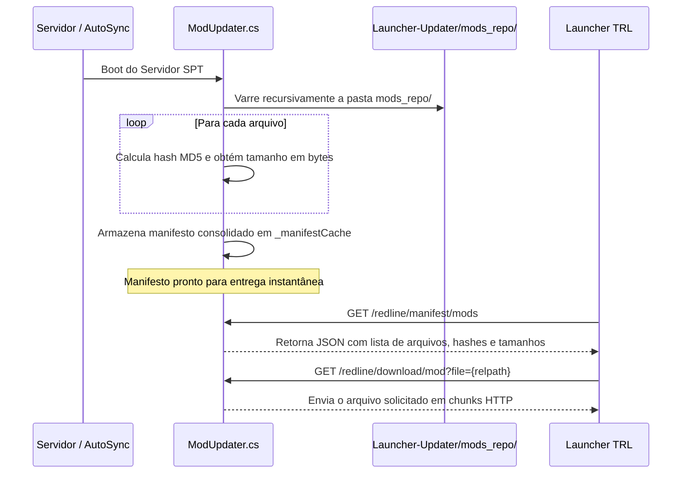

# Tarkov Red Line — Distribuição e Sincronização de Mods

O subsistema de distribuição de mods é responsável por catalogar, calcular impressões digitais (hashes) e servir os arquivos de mods, plugins BepInEx, bundles 3D e configurações para os clientes através do controller [ModUpdater.cs](../Server/TarkovRedLine.Server/Controllers/ModUpdater.cs).

---

## 1. Fluxo de Geração e Entrega de Manifesto

O servidor não mantém um arquivo estático de manifesto em disco; ele gera o catálogo diretamente em memória na inicialização e o mantém em cache:



---

## 2. Estrutura do Manifesto de Mods

O endpoint `GET /redline/manifest/mods` entrega a estrutura completa para o Launcher:

```json
{
  "version": "1.5.7",
  "files": [
    {
      "path": "BepInEx/plugins/SAIN.dll",
      "hash": "d41d8cd98f00b204e9800998ecf8427e",
      "size": 1048576,
      "optionalGroup": null
    },
    {
      "path": "user/cache/bundles/custom_armor.bundle",
      "hash": "79054025255fb1a26e4bc422aef54eb4",
      "size": 15728640,
      "optionalGroup": null
    }
  ],
  "managedPaths": [
    "BepInEx/plugins",
    "user/cache"
  ],
  "deleteFiles": [
    "SPT.Launcher.exe",
    "SPT.Server.exe",
    "Register.bat"
  ]
}
```

---

## 3. Endpoints REST do ModUpdater

| Endpoint | Método | Descrição |
|---|---|---|
| `/redline/manifest/mods` | `GET` | Devolve o manifesto completo de arquivos de mods e bundles |
| `/redline/download/mod` | `GET` | Faz o streaming do arquivo binário solicitado via query string `?file=` |
| `/launcher/mods/refresh` | `GET` | Força a invalidação do cache em memória e a revarredura imediata de `mods_repo/` |
| `/redline/manifest/version` | `GET` | Endpoint ultraleve que retorna apenas a versão e o hash global do manifesto |

---

## 4. Política de Confinamento e Segurança de Arquivos

Para impedir que arquivos fora da prateleira de distribuição sejam acessados via vulnerabilidade de *Path Traversal*:
- O [ModUpdater.cs](../Server/TarkovRedLine.Server/Controllers/ModUpdater.cs) normaliza todos os caminhos com `Path.GetFullPath`.
- Rejeita qualquer requisição que contenha `..` ou resolva para fora do diretório raiz `mods_repo/`.
