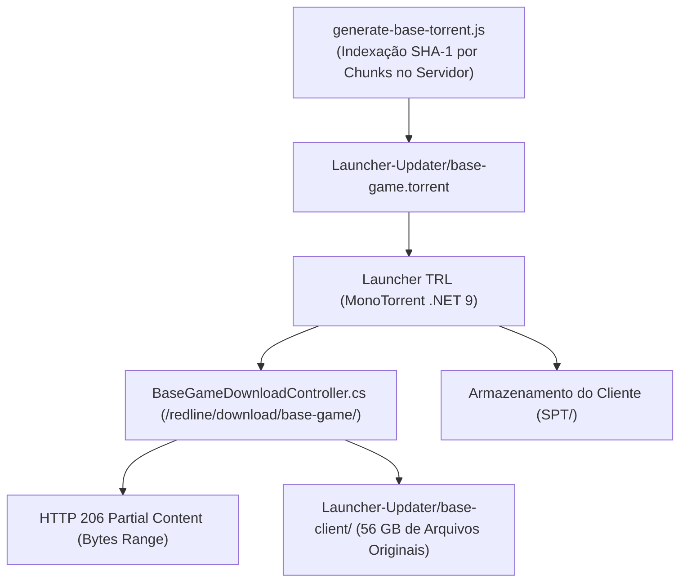

# Tarkov Red Line — Download do Jogo Base e WebSeeds HTTP

Este documento detalha o subsistema de distribuição de alta performance do cliente base do jogo (~56 GB), operado conjuntamente pelo [BaseGameDownloadController.cs](../Server/TarkovRedLine.Server/Controllers/BaseGameDownloadController.cs) e pelo script de indexação [generate-base-torrent.js](../Server/scripts/generate-base-torrent.js).

---

## 1. Arquitetura de Distribuição Híbrida (WebSeed HTTP)

O cliente base é distribuído através de um arquivo `.torrent` que mapeia a estrutura completa do jogo, combinado com servidores WebSeed HTTP capazes de fornecer download direto a velocidades de 10 MB/s a 100+ MB/s:



---

## 2. Implementação do BaseGameDownloadController

O controller atende requisições de pedaços (*chunks*) arbitrários enviados pelos clientes MonoTorrent:

### Suporte a HTTP Range Requests (RFC 7233)
Quando o cliente solicita partes específicas de um arquivo de múltiplos gigabytes (ex: `Range: bytes=1048576-2097151`):
1. O controller valida o caminho do arquivo solicitado dentro de `Launcher-Updater/base-client/`.
2. Suporta tanto caminhos relativos tradicionais quanto rotas prefixadas por `SPT/` ou `base-client/`.
3. Abre o arquivo em modo `FileShare.Read` com buffer assíncrono.
4. Responde com `HTTP 206 Partial Content` e o cabeçalho `Content-Range: bytes START-END/TOTAL`.

---

## 3. Gerador de Metadados do Torrent (`generate-base-torrent.js`)

O script Node.js indexa toda a pasta de arquivos do jogo base e gera o arquivo `base-game.torrent`:
- **Tamanho do Pedaço (Piece Length):** Configurado em `4 MB` (ou `2 MB`) para equilibrar o tamanho do arquivo `.torrent` com a eficiência de verificação SHA-1.
- **Injeção de WebSeeds (`url-list` / `httpseeds`):** Adiciona automaticamente os URLs HTTP de seed da máquina do servidor.
- **Nome do Pacote (`info.name`):** Definido como `"SPT"`, garantindo que os clientes descompactem os arquivos diretamente na subpasta confinada `SPT\`.

```bash
# Execução no servidor para reindexar arquivos novos adicionados ao base-client:
node scripts/generate-base-torrent.js
```
