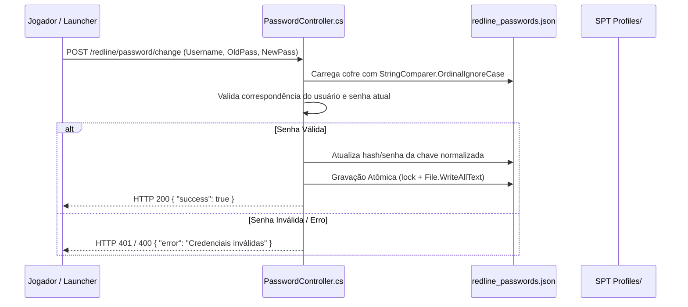

# Tarkov Red Line — Autenticação, Cofre de Senhas e Segurança

Este documento aborda os mecanismos de segurança implementados no servidor Tarkov Red Line, incluindo o cofre de credenciais case-insensitive ([PasswordController.cs](../Server/TarkovRedLine.Server/Controllers/PasswordController.cs)), a proteção por hardware ([HwidManager.cs](../Server/TarkovRedLine.Server/Controllers/HwidManager.cs)) e a distribuição segura de atualizações de executáveis ([LauncherUpdater.cs](../Server/TarkovRedLine.Server/Controllers/LauncherUpdater.cs)).

---

## 1. Cofre de Senhas Case-Insensitive (`PasswordController.cs`)

Diferente do SPT vanilla que não gerencia autenticação com hash seguro por padrão, o mod de servidor implementa um cofre dedicado em `redline_passwords.json`:

### Regras de Imutabilidade e Concorrência:
- **Resolução Case-Insensitive:** Dicionário com `StringComparer.OrdinalIgnoreCase`, prevenindo a criação de contas duplicadas (`Admin` vs `admin`).
- **Locks de Gravação:** Bloqueio síncrono com `lock (_vaultLock)` para evitar corrupção em requisições paralelas.

---

## 2. Gestão de Identidade de Hardware (`HwidManager.cs`)

O controller gerencia a vinculação do identificador único da máquina (HWID) do jogador para proteção da conta e prevenção de acessos cruzados não autorizados:
- **Rotas:** `/redline/hwid/register`, `/redline/hwid/validate`, `/redline/hwid/reset`.
- Permite que administradores gerenciem a lista de dispositivos confiáveis por perfil.

---

## 3. Distribuição Segura de Atualizações (`LauncherUpdater.cs`)

O subsistema de auto-atualização do Launcher é atendido por três rotas no servidor:

| Endpoint | Resposta | Finalidade |
|---|---|---|
| `GET /redline/launcher/version` | String (ex: `"2.10.2"`) | Consulta rápida de versão pelo Launcher no boot |
| `GET /redline/launcher/download` | Binário `TarkovRedLine.exe` | Download da versão mais recente do Launcher |
| `GET /redline/launcher/signature` | Binário `TarkovRedLine.exe.sig` | Assinatura digital RSA-2048 SHA-256 para validação anti-RCE |

> [!IMPORTANT]
> O Launcher rejeita e apaga imediatamente qualquer binário baixado cuja assinatura RSA não seja validada com sucesso contra a chave pública embutida.
