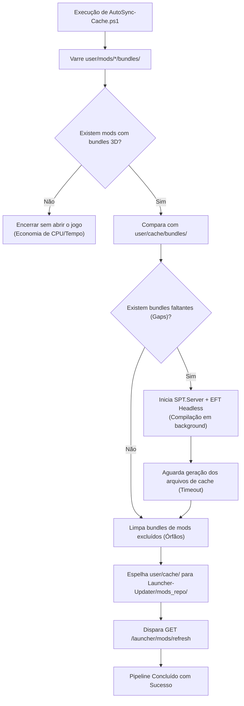

# Tarkov Red Line — Pipeline AutoSync e Aquecimento de Cache 3D

Este documento detalha o funcionamento do pipeline de automação [AutoSync-Cache.ps1](../AutoSync-Cache.ps1) (v2) responsável por pré-aquecer os modelos 3D (bundles) dos mods instalados no servidor e disponibilizá-los diretamente para distribuição via `mods_repo/`.

---

## 1. Problema e Motivação do AutoSync

No Escape From Tarkov / SPT, mods que adicionam itens novos (armas, roupas, miras, coletes) armazenam modelos e texturas em arquivos `*.bundle`. Quando um jogador entra no jogo sem o cache compilado desses modelos em `user/cache/bundles/`, o jogo precisa baixar e extrair esses recursos em tempo real, gerando *stuttering*, congelamentos ou falhas visuais.

O pipeline **AutoSync-Cache** roda no servidor e realiza a compilação prévia de todos os bundles de forma *headless*, empacotando-os no repositório de distribuição para que o Launcher entregue o cache 100% pronto antes do jogador abrir o jogo.

---

## 2. Fluxo Inteligente por Cobertura de Cache (v2)

Diferente de versões legadas que abriam o jogo sempre que a pasta de mods era alterada, a versão 2 adota **detecção por cobertura real de bundles**:



---

## 3. Estrutura do Estado (`autosync-state.json`)

O script persiste seu estado de auditoria na raiz do servidor no arquivo `autosync-state.json`:

```json
{
  "version": 2,
  "lastRunUtc": "2026-08-29T21:30:00Z",
  "sourceBundles": {
    "user/mods/CustomGuns/bundles/gun_01.bundle": "2457600|638598412340000000"
  },
  "knownMissing": []
}
```

- **`knownMissing` Anti-Loop:** Se um bundle de terceiros tiver defeito e não puder ser gerado pelo aquecimento headless, ele é registrado nesta lista para **não** forçar a abertura do jogo indefinidamente a cada execução.
