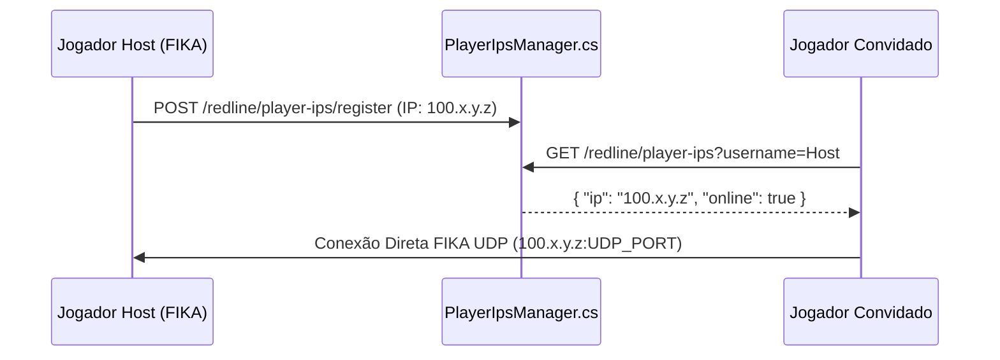

# Tarkov Red Line — Rede Tailscale, QoS e Suporte ao FIKA Coop

Este documento cobre a integração de rede privada do Tarkov Red Line, incluindo a descoberta de nós Tailscale via [PlayerIpsManager.cs](../Server/TarkovRedLine.Server/Controllers/PlayerIpsManager.cs), o controle adaptativo de banda via [ServerBandwidthController.cs](../Server/TarkovRedLine.Server/Controllers/ServerBandwidthController.cs) e a interoperabilidade com o FIKA Coop através de [FikaProfilePatch.cs](../Server/TarkovRedLine.Server/Patches/FikaProfilePatch.cs).

---

## 1. Descoberta de IPs da Malha Tailscale (`PlayerIpsManager.cs`)

Para que jogadores consigam se conectar diretamente em partidas cooperativas (P2P via FIKA) sem necessidade de portas públicas abertas ou configurações complexas de roteador:
1. O Launcher registra o IP Tailscale local do jogador ao iniciar a sessão através do endpoint `POST /redline/player-ips/register`.
2. Ao formar esquadrão no lobby do jogo, os clientes consultam `GET /redline/player-ips` para obter o mapeamento `Username ➔ Tailscale IP`.



---

## 2. Controle Dinâmico de Largura de Banda e QoS (`ServerBandwidthController.cs`)

Para evitar que downloads volumosos de novos jogadores (mods de 5 GB ou jogo base de 56 GB) saturem a conexão do servidor e causem *lag/desync* para jogadores que estão em raid:

```mermaid
stateDiagram-v2
    [*] --> Idle: Nenhum jogador em raid
    Idle --> InRaid: Jogadores iniciam raid
    InRaid --> Idle: Todas as raids encerradas

    state Idle {
        TaxaDownload: Banda Máxima Liberada (100 MB/s)
    }
    state InRaid {
        TaxaDownload: Throttling Ativo (ex: 5 MB/s por cliente)
        Prioridade: Tráfego de Pacotes UDP da Partida
    }
```

- Monitora os eventos de início/fim de raid no servidor.
- Informa aos controllers de download (`BaseGameDownloadController` e `ModUpdater`) a quota de taxa de transferência permitida por cliente.

---

## 3. Compatibilidade com FIKA Coop (`FikaProfilePatch.cs`)

O patch garante que os perfis com classes customizadas, multiplicadores e configurações especiais do Tarkov Red Line sejam serializados de forma 100% segura e compatível com as rotinas de sincronização de raid do FIKA.
