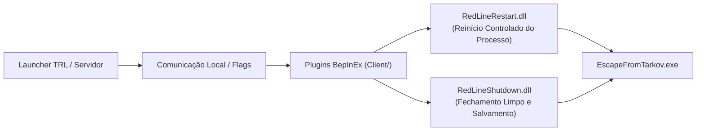

# Tarkov Red Line — Plugins Client BepInEx e Controle de Sessão

Este documento aborda os plugins BepInEx client-side que compõem o mod Tarkov Red Line localizados na pasta [Client/](../Client/): `RedLineRestart` e `RedLineShutdown`.

---

## 1. Visão Geral dos Plugins Cliente

Os plugins cliente são compilados em C# (.NET Framework 4.7.2 / BepInEx 5.x) e injetados diretamente no processo do jogo (`EscapeFromTarkov.exe`):

---

## 2. Descrição dos Componentes Client-Side

| Plugin | Diretório | Função e Comportamento |
|---|---|---|
| **RedLineRestart** | [Client/RedLineRestart/](../Client/RedLineRestart/) | Plugin BepInEx que escuta comandos de reinício forçado ou programado do cliente de jogo, garantindo que recursos e arquivos abertos sejam liberados antes de reiniciar |
| **RedLineShutdown** | [Client/RedLineShutdown/](../Client/RedLineShutdown/) | Plugin BepInEx responsável por interceptar o encerramento da aplicação, garantindo o envio correto do estado final do jogador e sincronização de perfil com o servidor SPT |

---

## 3. Diretrizes de Compilação dos Plugins Client

- Os plugins de cliente dependem das DLLs do Unity/EFT resolvidas automaticamente a partir do arquivo `.spt-path` ou referências do jogo base.
- Nenhuma DLL compilada de cliente deve ser copiada manualmente para a pasta de instalação do jogo; a distribuição ocorre exclusivamente através do pipeline de empacotamento do servidor (`mods_repo/`).
