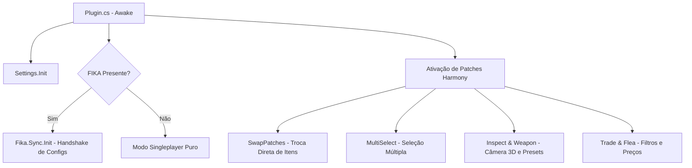

# UIFixes — Visão Geral e Arquitetura

O mod **UIFixes** (`Tyfon.UIFixes`) é uma biblioteca robusta de correções e melhorias ergonômicas para a interface do Escape From Tarkov / SPT. Ele atua tanto no cliente local quanto em sessões multiplayer através de sincronização de rede com o **FIKA**.

---

## 1. Estrutura Arquitetural

O ponto de entrada vive em [`Plugin.cs`](../original/src/Plugin.cs) (`BaseUnityPlugin`), responsável por:
1. Inicializar todas as configurações F12 via [`Settings.Init(Config)`](../original/src/Settings/Settings.cs).
2. Carregar recursos gráficos e componentes via `R.Init()`.
3. Detectar a presença do **FIKA** e inicializar a camada de sincronização de rede via [`Fika.Sync.Init()`](../original/src/Fika/Sync.cs).
4. Ativar mais de 40 patches estáticos e dinâmicos do Harmony cobrindo janelas, inventário, trading, flea market e inspeção de armas.

---

## 2. Integração com o FIKA (`Fika.Sync`)

Para garantir integridade em partidas multiplayer cooperativas, certas configurações do UIFixes que afetam regras de transação e inventário são **sincronizadas e impostas pelo Host**:
- Localização: [`Fika/Sync.cs`](../original/src/Fika/Sync.cs).
- Pacote de Rede: `ConfigPacket` transmitido no início da conexão contendo a versão (`PluginInfo.PLUGIN_VERSION`) e as opções que exigem paridade entre clientes.
- Se houver divergência de versão entre o cliente e o Host, uma notificação de aviso é exibida em tela e o log registra:
  `UIFixes version mismatch: your client has X, host has Y`.

---

## 3. Catálogo de Configurações

O mod expõe 19 categorias temáticas no menu F12 (ConfigurationManager), detalhadas no documento [`../PROPRIEDADES.md`](../PROPRIEDADES.md).
