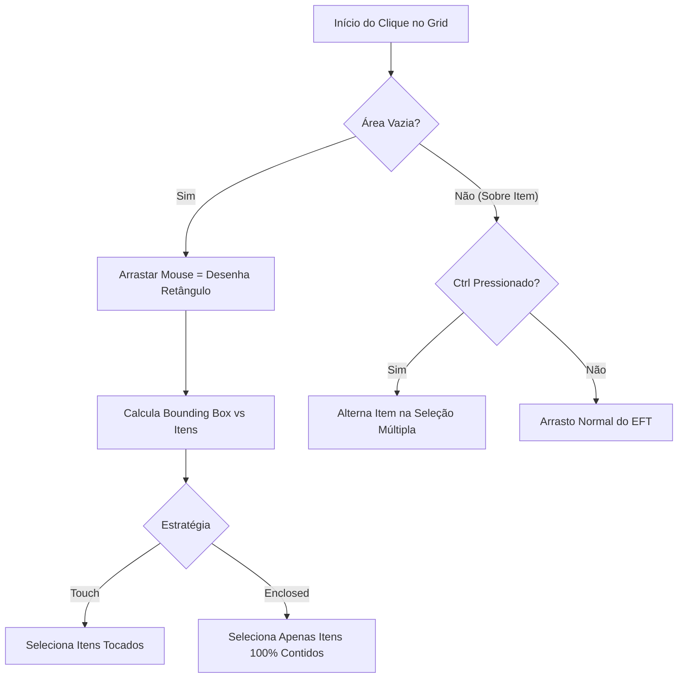

# UIFixes — Sistema de Multiseleção e Stash

Uma das funcionalidades mais avançadas do UIFixes é a capacidade de selecionar, arrastar, transferir e vender múltiplos itens simultaneamente no inventário e no Stash do jogador.

---

## 1. Funcionamento da Seleção Múltipla

O subsistema reside no namespace `UIFixes.Multiselect` (arquivos [`MultiSelect.cs`](../original/src/Multiselect/MultiSelect.cs) e [`MultiSelectInterop.cs`](../original/src/Multiselect/MultiSelectInterop.cs)).

### Mecânicas de Seleção:
1. **Caixa de Seleção (Marquee Selection):** O jogador clica em uma área vazia do grid e arrasta para desenhar um retângulo.
2. **Estratégias de Interseção (`MultiSelectStrategy`):**
   - `Touch`: Qualquer item que tenha contato parcial com a caixa é selecionado.
   - `Enclosed`: Apenas itens cujos limites físicos estejam 100% contidos na caixa são selecionados.
3. **Seleção Aditiva (Multi-Click):** Segurando `Ctrl` e clicando em itens individuais para adicioná-los ou removê-los do grupo de seleção.
4. **Seleção por Tipo:** Atalho dedicado para selecionar todos os itens do mesmo tipo no contêiner atual.

---

## 2. Movimentação em Bloco e Batching

Quando um grupo de itens selecionados é arrastado:
- O UIFixes calcula o deslocamento relativo (*delta*) de cada item em relação ao ponto de ancoragem do cursor.
- O sistema valida previamente se todos os slots de destino suportam a matriz de itens.
- As operações são submetidas de forma sequencial ou agrupada via fila de transações (`OperationQueueTime`).

---

## 3. Segurança em Raid

Por padrão, a opção **Multiselect em Raid** (`EnableMultiSelectInRaid`) permanece **desativada**. Essa decisão arquitetural previne que falhas de rede ou desyncs em operações em lote de múltiplos itens travem o cliente durante o combate.
