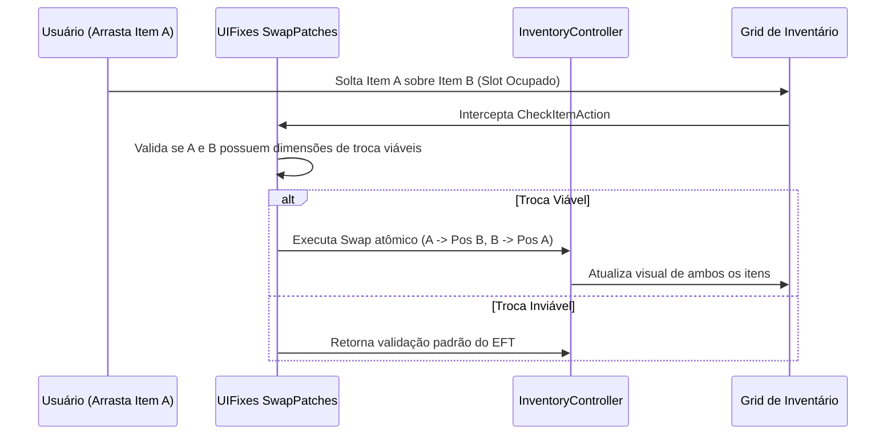

# UIFixes — Sistemas de Inventário: Troca e Empilhamento

A manipulação de inventário no EFT é frequentemente travada pela impossibilidade de trocar de posição dois itens que ocupam o mesmo espaço ou pela separação rígida de pilhas de itens.

---

## 1. Troca Direta de Itens (Item Swapping)

Implementado em [`SwapPatches.cs`](../original/src/Patches/SwapPatches.cs):
- No EFT original, se você arrastar um item A de 2x1 sobre um item B de 2x1 num slot ou contêiner cheio, o jogo simplesmente bloqueia a ação com erro de espaço insuficiente.
- Com o **Item Swapping** ativo, o UIFixes detecta se os dois itens possuem dimensões idênticas ou compatíveis e executa uma **operação de permuta atômica**:
  1. O item B é temporariamente descolocado.
  2. O item A ocupa a posição de B.
  3. O item B é alocado na posição deixada por A.

---

## 2. Empilhamento Inteligente (Item Stacking)

Implementado em [`StackFirItemsPatches.cs`](../original/src/Patches/StackFirItemsPatches.cs):
- Permite mesclar pilhas de munição, dinheiro e recursos médicos de forma rápida.
- Possui salvaguardas para proteger o status **Found in Raid (FiR)**: impede que o jogador mescle acidentalmente itens FiR com itens comprados no mercado caso isso cause a perda do status necessário para missões.

---

## 3. Gestão de Contêineres e Abertura Rápida

- Suporte ao atalho `O` para abrir mochilas e contêineres diretamente sob o cursor.
- Atalho `T` (*Top Up*) para completar carregadores ou caixas de munição sem precisar abrir menus de contexto.
