# Plano de Implementação — Refatoração de Performance & Sistema "Wake on Hit" (Visceral Combat)

Este plano estabelece a arquitetura e as etapas de implementação para resolver todos os gargalos de desempenho e falhas técnicas identificadas na auditoria do **Visceral Combat** ([`mods/VisceralCombat/modded/`](file:///d:/Projetos/GITHUB%20TARKOV/tarkov-spt-4.0/mods/VisceralCombat/modded/)), preservando integralmente a experiência estética: **animações de agonia reativas**, **desmembramento visceral**, **estética de sangue escuro/coagulado**, **proteção contra cancelamento precoce de agonia por rajadas** e uma mecânica inteligente de **Repouso Físico (*Sleep*) com Despertar sob Impacto (*Wake on Hit*)**.

---

## 🎯 Metas Principais

1. **Preservar a Agonia Ativa & Active Ragdolls:** Manter a transição suave de agonia para ragdoll mole sob gravidade.
2. **Buffer de Proteção da Agonia contra Rajadas (Anti-Burst Early Cancel):**
   - Evitar que o 2º ou 3º tiro de uma rajada automática cancele a agonia recém-iniciada antes de 1.2s a 1.5s.
   - Permitir que tiros de misericórdia disparados intencionalmente após esse intervalo interrompam a agonia e colapsem o corpo no chão.
3. **Implementar "Wake on Hit" (Despertar sob Impacto):**
   - O corpo morto assenta no chão e entra em repouso físico (`isKinematic = true`, 0% de CPU).
   - Ao receber novo tiro ou explosão de granada, **o corpo acorda instantaneamente por 2 a 3 segundos**, leva o tranco/empurrão físico do projétil, solta sangue, sofre desmembramento pós-morte e assenta de volta no sono.
4. **Eliminar o FPS Thief em Tiroteios:** Unificar as 3 corrotinas `WatchShot` paralelas por bala em um único processador centralizado e leve.
5. **Corrigir Patches Quebrados no EFT 0.16.9 / SPT 4.0.13:**
   - `ShootOffHelmetPatch` (método `Player.ReceiveDamage` inexistente $\rightarrow$ `Player.ApplyDamageInfo`).
   - `CreateBSGRagdollPatch` (NRE fatal em `GetComponent<Player>()` $\rightarrow$ `GetComponentInChildren<PlayerBody>()`).
   - Eliminar `KillClientPatch` e duplicações em `GameStartedPatch`.
6. **Limpar Varreduras Cegas & Pressão de GC:**
   - Remover varreduras `FindObjectsOfType` na cena.
   - Corrigir bitmask de granadas (`1 << LayerMask.NameToLayer("Default")`).
   - Reduzir `DismemberedLimbScaler` a apenas `LateUpdate()`.
   - Conectar o `GoreObjectPool` ativo aos spawns de sangue e partículas.

---

## 🏗️ Arquitetura Técnica Proposta

```mermaid
flowchart TD
    subgraph Ciclo_de_Morte_e_Agonia [Ciclo de Morte & Proteção de Agonia]
        Death[Tiro Fatal / Morte] --> AgonyStart[Início da Agonia: Registra Timestamp]
        AgonyStart --> AgonyActive[Fase 1: Agonia Ativa 2-5s]
        
        AgonyActive -- Tiro durante Grace Period < 1.5s --> IgnoreCancel[Aplica Sangue/Física mas MANTÉM Agonia]
        AgonyActive -- Tiro após Grace Period >= 1.5s --> MercyKill[Tiro de Misericórdia: Interrompe Agonia]
        AgonyActive -- Tempo Esgotado --> LimpFall[Fase 2: Colapso em Ragdoll Mole]
        MercyKill --> LimpFall
        
        LimpFall --> SleepState[Fase 3: Repouso Físico - isKinematic = true]
        
        SleepState -- Novo Tiro / Granada --> WakeHit[Wake on Hit: Acorda por 2.5s]
        WakeHit --> Impulse[Aplica Força da Bala + Desmembramento]
        Impulse --> SleepState
    end

    subgraph Pipeline_de_Tiro_Unificado [Pipeline de Balística Unificado]
        BulletFired[Projétil no Ar] --> SingleWatcher[VisceralShotProcessor: 1 Corrotina Unificada]
        SingleWatcher --> ImpactCheck{Atingiu Alvo?}
        ImpactCheck -- Sim --> Dispatch[Despacha: Impulso + Sangue + Desmembramento + Wake on Hit]
    end
```

---

## 📋 Detalhamento dos Componentes e Mudanças

### 1. Sistema de Ragdoll, Agonia & "Wake on Hit" (`VisceralCombat.Ragdolls`)

#### [MODIFY] [`RagdollHelperClass.cs`](file:///d:/Projetos/GITHUB%20TARKOV/tarkov-spt-4.0/mods/VisceralCombat/modded/VisceralCombat/VisceralCombat.Ragdolls.Classes/RagdollHelperClass.cs)
- **Buffer de Proteção contra Rajadas (Grace Period):**
  - Adicionar dicionário `_agonyStartTime` (mapeando `Player -> float`) ou timestamp de início de agonia.
  - No método `PlayDeathAnimation(player, pm, eBodyPart)`, registrar `_agonyStartTime[player] = Time.time;`.
  - No método `InterruptAgony(player, pm, bool forceInstant = false)`:
    - Verificar se `Time.time < _agonyStartTime[player] + 1.2f` (1.2 segundos de proteção).
    - Se estiver dentro da janela de carência e `forceInstant` for `false`, **ignorar o cancelamento da animação** (permitindo que rajadas automáticas não cortem a agonia prematuramente).
    - Se estiver fora da janela (tiro de misericórdia após 1.2s), executar a interrupção normalmente.
- **Sistema Wake on Hit:**
  - Adicionar o método `WakeCorpseTemporarily(Player player, float duration = 2.5f)`:
    - Localiza os rigidbodies do cadáver e define `isKinematic = false` / acorda o physics solver.
    - Inicia uma corrotina temporizada que, após `duration` segundos (e se o corpo estiver parado), redefine `isKinematic = true` e desregistra do suporte.
- **Otimização de Scaler:**
  - Em `DismemberedLimbScaler`, remover `Update()` e `OnAnimatorMove()`, mantendo apenas `LateUpdate()`.

#### [MODIFY] [`RagdollClassPatch.cs`](file:///d:/Projetos/GITHUB%20TARKOV/tarkov-spt-4.0/mods/VisceralCombat/modded/VisceralCombat/VisceralCombat.Ragdolls.Patches/RagdollClassPatch.cs)
- Reescrever a corrotina de sleep substituindo a classe stub ILSpy (`_003CRagdollSleepHandler_003Ed__2`) por um método C# limpo.
- Restaurar a chamada nativa de `method_1` (`UnsupportRigidbody`, `isKinematic = true`, `CollisionDetectionMode.Discrete`) e limpeza de spawners quando o corpo estabilizar no chão.
- Cachear o `_supportRigidbodyMethod` sem alocações `new object[]` em loop.

#### [MODIFY] [`BodiesImpulsePatch.cs`](file:///d:/Projetos/GITHUB%20TARKOV/tarkov-spt-4.0/mods/VisceralCombat/modded/VisceralCombat/VisceralCombat.Ragdolls.Patches/BodiesImpulsePatch.cs)
- Remover a corrotina `WatchShot` redundante.
- No método `ProcessImpulse(shot)`:
  - Se o Rigidbody atingido pertencer a um cadáver dormente (`isKinematic == true`), acionar `RagdollHelperClass.WakeCorpseTemporarily(targetPlayer, 2.5f)` antes de `rb.AddForceAtPosition()`.

---

### 2. Unificação do Pipeline de Tiros (`VisceralShotProcessor`)

#### [NEW] [`VisceralShotProcessor.cs`](file:///d:/Projetos/GITHUB%20TARKOV/tarkov-spt-4.0/mods/VisceralCombat/modded/VisceralCombat/VisceralCombat.Combined.Classes/VisceralShotProcessor.cs)
- Criar gerenciador centralizado para monitoramento de projéteis.
- Uma única corrotina por disparo ativo que aguarda `shot.IsShotFinished`.
- Ao terminar o disparo e confirmar colisão válida, executa em sequência única:
  1. `BodiesImpulsePatch.ProcessImpulse(shot)` (com Wake on Hit).
  2. `LimbKillPatch.ProcessLimbKill(shot)` (desmembramento pós-morte, living leg e mercy kill respeitando o grace period).
  3. `BleedPatch.ProcessWatchShot(shot)` (partículas e decais de sangue).

#### [MODIFY] [`LimbKillPatch.cs`](file:///d:/Projetos/GITHUB%20TARKOV/tarkov-spt-4.0/mods/VisceralCombat/modded/VisceralCombat/VisceralCombat.Ragdolls.Patches/LimbKillPatch.cs)
- Remover `WatchShot(shot)` do `Postfix` de `BallisticsCalculator.Shoot`.
- Conectar o ponto de entrada ao `VisceralShotProcessor`.
- Na chamada de `RagdollHelperClass.InterruptAgony(player, pm)`, respeitar a janela de carência para rajadas.

#### [MODIFY] [`BleedPatch.cs`](file:///d:/Projetos/GITHUB%20TARKOV/tarkov-spt-4.0/mods/VisceralCombat/modded/VisceralCombat/VisceralCombat.Dismemberment.Patches/BleedPatch.cs)
- Remover `WatchShot(__result)` do `Postfix` de `BallisticsCalculator.CreateShot`.
- Substituir o `Traverse.Create` em `_preAllocatedRenderersList` por cache de `FieldInfo` estático.

---

### 3. Correções Críticas de Assinaturas & NREs

#### [MODIFY] [`ShootOffHelmetPatch.cs`](file:///d:/Projetos/GITHUB%20TARKOV/tarkov-spt-4.0/mods/VisceralCombat/modded/VisceralCombat/VisceralCombat.Ragdolls.Patches/ShootOffHelmetPatch.cs)
- Alterar o alvo de `Player.ReceiveDamage` (inexistente no EFT 0.16.9) para `Player.ApplyDamageInfo`.
- Validar se o impacto atingiu a cabeça/capacete e acionar a ejeção física do capacete.

#### [MODIFY] [`CreateBSGRagdollPatch.cs`](file:///d:/Projetos/GITHUB%20TARKOV/tarkov-spt-4.0/mods/VisceralCombat/modded/VisceralCombat/VisceralCombat.Ragdolls.Patches/CreateBSGRagdollPatch.cs)
- Substituir `GetComponent<Player>().PlayerBody` por `__instance.GetComponentInChildren<PlayerBody>()`.
- Cachear estaticamente os `FieldInfo` de `rigidbodySpawner_0`, `characterJointSpawner_0`, `list_0` e `vector3_1`.

#### [DELETE] [`KillClientPatch.cs`](file:///d:/Projetos/GITHUB%20TARKOV/tarkov-spt-4.0/mods/VisceralCombat/modded/VisceralCombat/VisceralCombat.Combined.Patches/KillClientPatch.cs)
- Remover a classe redundante para evitar dupla execução de `KillPatch.Postfix`.

#### [DELETE] [`PlayerDetonationPatch.cs`](file:///d:/Projetos/GITHUB%20TARKOV/tarkov-spt-4.0/mods/VisceralCombat/modded/VisceralCombat/VisceralCombat.Dismemberment.Patches/PlayerDetonationPatch.cs)
- Remover o arquivo órfão que continha código destrutivo (`Object.Destroy(player)`).

---

### 4. Limpeza de Carga no Carregamento, GC e Granadas

#### [MODIFY] [`GameStartedPatch.cs (Ragdolls)`](file:///d:/Projetos/GITHUB%20TARKOV/tarkov-spt-4.0/mods/VisceralCombat/modded/VisceralCombat/VisceralCombat.Ragdolls.Patches/GameStartedPatch.cs)
- Excluir linhas 28 a 34 (`FindObjectsOfType<GameObject>()` para Grass/Foliage e `TerrainsAI`).
- Manter apenas as configurações essenciais de matriz de colisão e limpeza de coleções entre raids (incluindo limpeza do `_agonyStartTime`).

#### [MODIFY] [`GameStartedPatch.cs (Dismemberment)`](file:///d:/Projetos/GITHUB%20TARKOV/tarkov-spt-4.0/mods/VisceralCombat/modded/VisceralCombat/VisceralCombat.Dismemberment.Patches/GameStartedPatch.cs)
- Remover as chamadas redundantes `((ModulePatch)new KillPatch()).Enable();` e `KillClientPatch`.
- Cachear os `FieldInfo` de `TextureDecalsPainter` estaticamente.

#### [MODIFY] [`GrenadeItemsPatch.cs`](file:///d:/Projetos/GITHUB%20TARKOV/tarkov-spt-4.0/mods/VisceralCombat/modded/VisceralCombat/VisceralCombat.Ragdolls.Patches/GrenadeItemsPatch.cs) & [`GrenadeDeadBodiesPatch.cs`](file:///d:/Projetos/GITHUB%20TARKOV/tarkov-spt-4.0/mods/VisceralCombat/modded/VisceralCombat/VisceralCombat.Ragdolls.Patches/GrenadeDeadBodiesPatch.cs)
- Corrigir a bitmask de `LayerMask.NameToLayer("Default")` para `1 << LayerMask.NameToLayer("Default")`.
- Migrar para `Physics.OverlapSphereNonAlloc` com buffer estático pré-alocado (`RaycastHit[64]`).
- Quando uma granada explodir perto de um cadáver dormente, acionar `RagdollHelperClass.WakeCorpseTemporarily(corpsePlayer, 3.0f)` para que o corpo voe com a explosão e depois volte a dormir.

#### [MODIFY] [`ShellCasingPatch.cs`](file:///d:/Projetos/GITHUB%20TARKOV/tarkov-spt-4.0/mods/VisceralCombat/modded/VisceralCombat/VisceralCombat.Combat.Patches/ShellCasingPatch.cs) & [`VisceralEntry.cs`](file:///d:/Projetos/GITHUB%20TARKOV/tarkov-spt-4.0/mods/VisceralCombat/modded/VisceralCombat/VisceralCombat/VisceralEntry.cs)
- Vincular `NeverDeleteShells` via `Config.Bind()` no `VisceralEntry.Awake()`.
- Substituir a `Queue` com busca linear O(N) por `HashSet<AmmoPoolObject>` O(1).
- Adicionar limpeza da coleção em `GameStartedPatch`.

#### [MODIFY] [`LivingDismembermentController.cs`](file:///d:/Projetos/GITHUB%20TARKOV/tarkov-spt-4.0/mods/VisceralCombat/modded/VisceralCombat/VisceralCombat.Dismemberment.Classes/LivingDismembermentController.cs)
- Cadenciar `ForceProneLock()` para executar a cada `0.5s` em vez de rodar a cada frame em `Update()`.

---

## 🧪 Plano de Verificação

### 1. Verificação Estática e Compilação
- Compilar o mod via `dotnet build` em `mods/VisceralCombat/modded/VisceralCombat/VisceralCombat.csproj`.
- Validar ausência de erros de compilação, warnings de tipagem e integridade dos símbolos EFT / FIKA.

### 2. Verificação Dinâmica / Funcional (In-Raid)
- **Agonia & Rajada Automática:** Disparar uma rajada de fuzil em um bot $\rightarrow$ verificar se o primeiro tiro inicia a agonia e os tiros seguintes da mesma rajada (dentro de 1.2s) **não cancelam prematuramente** a animação de dor.
- **Tiro de Misericórdia:** Esperar 1.5s de agonia e disparar um tiro único $\rightarrow$ verificar se a agonia é interrompida imediatamente e o corpo desaba no chão.
- **Repouso Físico (Sleep):** Confirmar que, após parar no chão, o cadáver entra em repouso (`isKinematic = true`) e não consome CPU.
- **Wake on Hit:** Atirar com rifle ou escopeta em um cadáver que já estava dormente no chão $\rightarrow$ verificar se o membro/corpo leva o tranco do tiro instantaneamente, desmembra (se aplicável), espirra sangue e volta a dormir após 2.5s.
- **Granada em Cadáver:** Jogar uma granada perto de um cadáver dormente $\rightarrow$ verificar se o corpo voa com a onda de choque e assenta novamente.
- **Capacetes:** Atirar na cabeça de um bot usando capacete $\rightarrow$ verificar se o capacete é arremessado com base na chance configurada.
- **Desmembramento de Perna em Bots Vivos:** Atirar na perna de um bot com arma pesada $\rightarrow$ verificar se a perna decepa, ele cai em prone forçado, agoniza e deixa rastro de sangue até sangrar até a morte.
- **Transição de Raids:** Jogar 2 raids consecutivas e verificar ausência de vazamentos de memória ou NREs no log.
