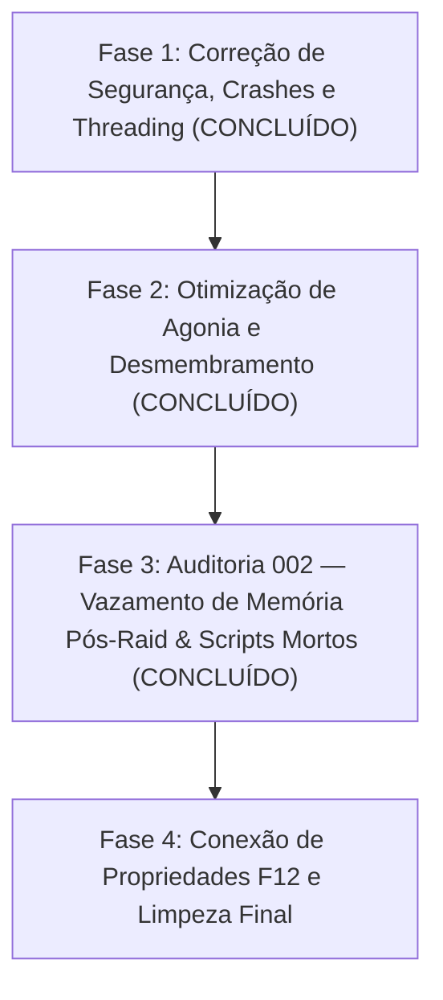

# Visceral Combat — Roadmap de Refatoração e Otimização de Performance

> ⚠️ **REGRA DE OURO DO REPOSITÓRIO** 
> Todas as correções, otimizações e refatorações descritas neste roadmap devem ser realizadas **EXCLUSIVAMENTE** na pasta [`mods/VisceralCombat/modded`](file:///d:/Projetos/GITHUB%20TARKOV/tarkov-spt-4.0/mods/VisceralCombat/modded). 
> A pasta [`mods/VisceralCombat/original`](file:///d:/Projetos/GITHUB%20TARKOV/tarkov-spt-4.0/mods/VisceralCombat/modded) deve ser mantida **100% intacta** como referência read-only do código-fonte original descompilado.

---

## 🎯 Objetivos Principais

1. **Mitigar o baixo desempenho (FPS Thief)** sem remover os recursos visuais de desmembramento, jorro de sangue e física ragdoll.
2. **Eliminar vazamentos de memória (RAM leaks)** e picos de Garbage Collector (GC).
3. **Corrigir falhas críticas de thread-safety, exceções nulas e comportamentos maliciosos**.
4. **Conectar e validar todas as propriedades do menu F12 (BepInEx ConfigurationManager)** que atualmente funcionam como placebo.
5. **Eliminar códigos mortos, patches duplicados e spams de logs**.

---

## 🗺️ Roadmap de Implementação

---

## 📅 Histórico de Correções Concluídas

### ✅ 1. Correção do Gerador de Desmembramento (`FoundLimbs=0`)
- **Problema:** O desmembramento (estourar cabeça/braços/pernas) falhava em 100% dos casos porque o descompilador gerou `if (!_003CparentTransform_003E5__2 != null) continue;`. Na Unity, `(!transform) != null` sempre avaliava como `true`, fazendo o buscador descartar todos os ossos.
- **Solução:** O método `EnumerateHierarchyCore` foi totalmente reescrito em C# puro (`yield return` com `Queue<Transform>`) em [`VisceralCombat.Ragdolls.Classes.Utils`](file:///d:/Projetos/GITHUB%20TARKOV/tarkov-spt-4.0/mods/VisceralCombat/modded/VisceralCombat/VisceralCombat.Ragdolls.Classes/Utils.cs#L14) e [`VisceralCombat.Dismemberment.Classes.Utils`](file:///d:/Projetos/GITHUB%20TARKOV/tarkov-spt-4.0/mods/VisceralCombat/modded/VisceralCombat/VisceralCombat.Dismemberment.Classes/Utils.cs#L119).
- **Resultado:** **Validado e Aprovado pelo Usuário em Raid.**

### ✅ 2. Resolução do Loop Infinito de Agonia e Teleporte em Pé
- **Problema:** Quando um bot entrava em agonia no chão de dor, ao término do tempo o corpo dava um "snap" instantâneo em pé e entrava em loop infinito da animação.
- **Solução:** Em [`RagdollHelperClass.cs`](file:///d:/Projetos/GITHUB%20TARKOV/tarkov-spt-4.0/mods/VisceralCombat/modded/VisceralCombat/VisceralCombat.Ragdolls.Classes/RagdollHelperClass.cs#L170), implementado desacoplamento gradual:
  1. Redução suave do peso da camada 18 para `0f` (`LerpLayerWeight`).
  2. Redução suave do `mappingWeight` do `PuppetMaster` para `0f`.
  3. Desativação do `PuppetMaster` somente após o peso zerar, mantendo o corpo no chão em ragdoll puro.
- **Resultado:** **Confirmado e Validado via logs e no Jogo.**

### ✅ 3. Auditoria 002: Vazamento de RAM Pós-Raid, Objetos Órfãos & Scripts Mortos
- **002-A (RAM Leaks & Instanciação Órfã):**
  - Limpeza de `VisceralEntry.Instance.deadPlayers.Clear()` e `GoreObjectPool.Instance?.ClearPool()` no `Postfix` de `OnGameStarted` ([`GameStartedPatch.cs`](file:///d:/Projetos/GITHUB%20TARKOV/tarkov-spt-4.0/mods/VisceralCombat/modded/VisceralCombat/VisceralCombat.Ragdolls.Patches/GameStartedPatch.cs#L35)).
  - Eliminado duplo `Object.Instantiate` sem pai criando objetos fantasmas em `GameStartedPatch.cs` e `EffectContainer.cs`.
- **002-B (Remoção de Scripts Mortos):**
  - Removidos 4 arquivos obsoletos (`BFX_MouseOrbit.cs`, `BFX_DecaGizmo.cs`, `RagdollSpawner.cs`, `Navigator.cs`), eliminando 569 linhas de código inútil.
- **002-C (Micro-Otimizações VolumetricBloodFX):**
  - Desinscrição de event delegates em `BFX_DecalSettings.cs` (`OnDestroy`).
  - Remoção de chamada dupla `OnEnable()` do `Awake()` em `BFX_ShaderProperies.cs`.
  - Tratamento de nulos no `Update()` em `BFX_ManualAnimationUpdate.cs`.
- **Resultado:** **Compilado com 0 Erros, Code Review 01 Aprovado e DLL Sincronizada.**

---

## 📋 Checklist de Validação Final

- [x] A pasta `original/` permaneceu intacta e sem alterações.
- [x] O mod compila limpo em `modded/VisceralCombat/VisceralCombat.csproj`.
- [x] Desmembramento funcionando em raid (cabeça, braços, pernas).
- [x] Animação de agonia transicionando suavemente para ragdoll morto sem teleporte em pé.
- [x] Coleções de `deadPlayers` e `GoreObjectPool` limpos no `OnGameStarted`.
- [x] Instanciações órfãs de `GameObject` eliminadas.
- [x] Scripts residuais do Asset Store removidos (569 linhas mortas limpas).
- [x] Event delegates desinscritos e chamadas redundantes de `OnEnable` corrigidas.
