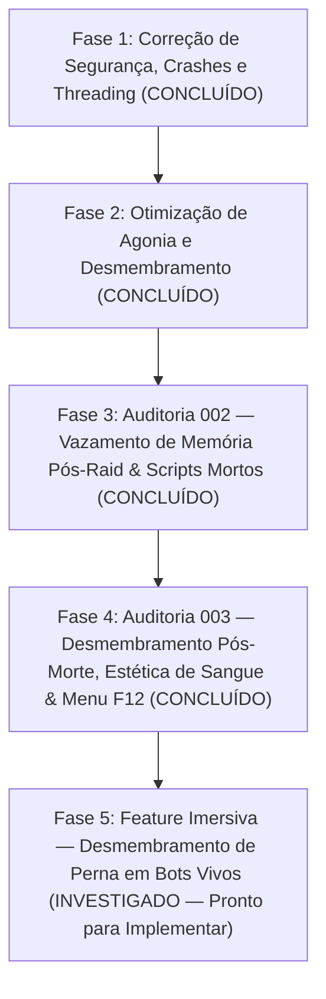

# Visceral Combat — Roadmap de Refatoração e Otimização de Performance

> ⚠️ **REGRA DE OURO DO REPOSITÓRIO** 
> Todas as correções, otimizações e refatorações descritas neste roadmap devem ser realizadas **EXCLUSIVAMENTE** na pasta [`mods/VisceralCombat/modded`](file:///d:/Projetos/GITHUB%20TARKOV/tarkov-spt-4.0/mods/VisceralCombat/modded). 
> A pasta [`mods/VisceralCombat/original`](file:///d:/Projetos/GITHUB%20TARKOV/tarkov-spt-4.0/mods/VisceralCombat/original) deve ser mantida **100% intacta** como referência read-only do código-fonte original descompilado.

---

## 🎯 Objetivos Principais

1. **Mitigar o baixo desempenho (FPS Thief)** sem remover os recursos visuais de desmembramento, jorro de sangue e física ragdoll.
2. **Eliminar vazamentos de memória (RAM leaks)** e picos de Garbage Collector (GC).
3. **Corrigir falhas críticas de thread-safety, exceções nulas e comportamentos maliciosos**.
4. **Conectar e validar todas as propriedades do menu F12 (BepInEx ConfigurationManager)** que atualmente funcionam como placebo.
5. **Implementar mecânicas imersivas avançadas** (desmembramento de perna em bots vivos com prone, rastro de sangue e exsanguição).

---

## 🗺️ Roadmap de Implementação

---

## 📅 Histórico de Correções & Próximas Fases

### 🔵 5. Fase 5: Feature Imersiva — Desmembramento de Perna em Bots Vivos (Item `001`) — INVESTIGADO ✅

**Status: Investigação Concluída — Pronto para implementar quando autorizado.**

| Aspecto | Resultado | Evidência |
| :--- | :--- | :--- |
| **Prone forçado no bot** | ✅ API nativa existe | `botOwner.BotLay.IsLay = true` — `BotLay.cs:L34-72` |
| **Bloqueio de GetUp** | ✅ Viável | Re-assegurar `BotLay.IsLay = true` e `NextPosibleGetUp = Time.time + 99999f` no `Update()` |
| **Sangramento (exsanguição)** | ✅ API nativa | `player.ActiveHealthController.ApplyDamage(leg, dmg, GClass3051.HeavyBleedingDamage)` — `GClass3051.cs:L40` |
| **FIKA: detecção de mod** | ✅ **Implementado** | `VisceralHandshakePacket` + `AllPlayersHaveVisceralCombat` — handshake in-raid |
| **Mod de Servidor SPT** | ✅ Não necessário | Handshake C# puro; zero dependência de config extra |

**Componentes implementados / a criar:**
- ✅ `VisceralHandshakePacket.cs` — packet bidirecional host↔cliente para verificar presença do mod em raid FIKA.
- ✅ `VisceralEntry.AllPlayersHaveVisceralCombat` — flag global gating da feature; solo SPT = sempre `true`.
- ✅ `GameStartedPatch` chama `StartVisceralHandshake()` no início de cada raid (host/solo only).
- 🔲 `LivingDismembermentController.cs` — `MonoBehaviour` com prone lock, bleed trail e exsanguição (próxima etapa).
- 🔲 Ponto de entrada em `LimbKillPatch.cs` para detectar bot vivo + perna + `AllPlayersHaveVisceralCombat`.

**✅ Garantia FIKA implementada (handshake nativo):**
- **Solo SPT:** flag `true` imediatamente — sem overhead.
- **FIKA host:** broadcast `VisceralHandshakePacket (IsRequest=true)` para todos ao iniciar raid.
- **FIKA client com mod:** responde ACK automaticamente com seu `NetId`.
- **Após 5 s:** host compara ACKs vs `CoopHandler.AmountOfHumans - 1`. Se `ACKs == esperado` → feature ON; senão → feature OFF para toda a sessão.
- **Cliente sem mod:** não registra o packet → não responde → contagem falha → **feature bloqueada** para todos, sem crash.

**Backlog:** [`backlog/001-alive-leg-dismemberment/001-alive-leg-dismemberment-01-spec.md`](../backlog/001-alive-leg-dismemberment/001-alive-leg-dismemberment-01-spec.md)

---

### ✅ 4. Fase 4: Auditoria 003 — Desmembramento Pós-Morte, Estética de Sangue & Menu F12 (v3.8.0 / v3.8.1)
- **Desmembramento Pós-Morte em Cadáveres (braços, pernas e cabeça):** Estratégia dupla em `LimbKillPatch.cs` para bots vivos (`BodyPartColliderType`) e mortos (matching de nome de osso físico).
- **Estilização de Sangue Escuro & Zero Glow:** `ApplyDarkCoagulatedBloodFx` em `RagdollHelperClass.cs` com tratamento bifurcado por shader (`VD 3D Blood Shader V14` vs `Legacy Alpha Blended Premultiply`).
- **Remoção do FPS Thief (Corrotinas `WatchShot`):** Removidos loops de polling por frame em `BodiesImpulsePatch.cs`, `LimbKillPatch.cs` e `BleedPatch.cs`.
- **Calibres de Pistola/PDW bloqueados:** `9x19PARA`, `9x18PM`, `.45 ACP`, `4.6mm`, `5.7mm` com `0.0` de chance de desmembramento.
- **Conexão Real F12:** Multiplicadores anatômicos conectados à física.

### ✅ 3. Fase 3: Auditoria 002 — Vazamento de RAM Pós-Raid & Scripts Mortos
- Limpeza de `deadPlayers`/`dismemberedPlayers` e `GoreObjectPool` no `OnGameStarted`.
- Removidos 4 arquivos obsoletos (569 linhas de código morto).

### ✅ 2. Fase 2: Resolução do Loop Infinito de Agonia e Teleporte em Pé
- Desacoplamento suave do `PuppetMaster` com redução gradual de `mappingWeight` → ragdoll puro sem teleporte.

### ✅ 1. Fase 1: Correção do Gerador de Desmembramento (`FoundLimbs=0`)
- `EnumerateHierarchyCore` reescrito em C# puro (`yield return` com `Queue<Transform>`).
