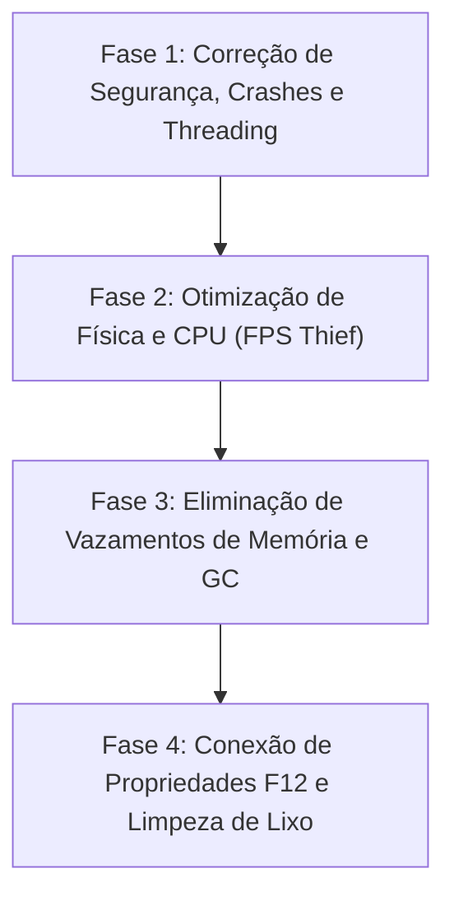

# Visceral Combat — Roadmap de Refatoração e Otimização de Performance

> ⚠️ **REGRA DE OURO DO REPOSITÓRIO** 
> Todas as correções, otimizações e refatorações descritas neste roadmap devem ser realizadas **EXCLUSIVAMENTE** na pasta [`mods/VisceralCombat/modded`](file:///d:/Projetos/GITHUB%20TARKOV/tarkov-spt-4.0/mods/VisceralCombat/modded). 
> A pasta [`mods/VisceralCombat/original`](file:///d:/Projetos/GITHUB%20TARKOV/tarkov-spt-4.0/mods/VisceralCombat/original) deve ser mantida **100% intacta** como referência read-only do código-fonte original descompilado.

---

## 🎯 Objetivos Principais

1. **Mitigar o baixo desempenho (FPS Thief)** sem remover os recursos visuais de desmembramento, jorro de sangue e física ragdoll.
2. **Eliminar vazamentos de memória (RAM leaks)** e picos de Garbage Collector (GC).
3. **Corrigir falhas críticas de thread-safety, exceções nulas e comportamentos maliciosos**.
4. **Conectar e validar todas as propriedades do menu F12 (BepInEx ConfigurationManager)** que atualmente funcionam como placebo.
5. **Eliminar códigos mortos, patches duplicados e spams de logs**.

---

## 🗺️ Roadmap de Implementação

---

### 🚨 Fase 1: Correções Críticas de Segurança, Threading e Crashes

**Foco:** Garantir estabilidade do mod e prevenir crashes do jogo e exceções não tratadas.

#### 1.1 Remoção do Rickroll e Auto-Quit no Startup
- **Arquivo:** [`VisceralEntry.cs`](file:///d:/Projetos/GITHUB%20TARKOV/tarkov-spt-4.0/mods/VisceralCombat/modded/VisceralCombat/VisceralCombat/VisceralEntry.cs#L293-L302)
- **Instrução de Correção:**
  - Remover a chamada `Application.OpenURL("https://www.youtube.com/watch?v=FTv14Bib2z4"); Application.Quit();` no `Start()`.
  - Substituir por um aviso legível em log (`QuickLogger.Log(ELogType.Warn, ...)`) e criação do arquivo JSON com valores padrão caso ele não exista na pasta `BepInEx/plugins/ssh/`.

#### 1.2 Correção de Thread-Safety no Async Postfix
- **Arquivo:** [`PlayerInitPatch.cs`](file:///d:/Projetos/GITHUB%20TARKOV/tarkov-spt-4.0/mods/VisceralCombat/modded/VisceralCombat/VisceralCombat.Ragdolls.Patches/PlayerInitPatch.cs#L17-L28)
- **Instrução de Correção:**
  - O método `Postfix` atual utiliza `async void` com `await __result`, fazendo com que a continuação seja executada em thread secundária do ThreadPool e invocando métodos não-thread-safe da Unity (`Utils.SetupPuppetMaster`).
  - Remover a assinatura `async void`. Utilizar `Task.ContinueWith` garantindo agendamento no `TaskScheduler.FromCurrentSynchronizationContext()` (Main Thread da Unity) ou registrar o setup no ciclo de atualização da Main Thread.

#### 1.3 Correção de Array Nulo no FIKA (`limbNames`)
- **Arquivo:** [`KillPatch.cs`](file:///d:/Projetos/GITHUB%20TARKOV/tarkov-spt-4.0/mods/VisceralCombat/modded/VisceralCombat/VisceralCombat.Combined.Patches/KillPatch.cs#L61)
- **Instrução de Correção:**
  - Inicializar a propriedade `public static string[] limbNames { get; set; } = Array.Empty<string>();`.
  - Substituir o uso incorreto de `CollectionExtensions.AddItem` por um `List<string>` estático ou HashSet para evitar exceções e realocações desnecessárias.

#### 1.4 Correção da Condição no Bundle Loader
- **Arquivo:** [`BundleLoaderPlugin.cs`](file:///d:/Projetos/GITHUB%20TARKOV/tarkov-spt-4.0/mods/VisceralCombat/modded/bundleloader/Nexus.BundleLoader/BundleLoaderPlugin.cs#L64)
- **Instrução de Correção:**
  - Corrigir a lógica no método `GetAssetBundleAsync` trocando `!cancellationToken.CanBeCanceled` por `!cancellationToken.IsCancellationRequested`.

---

### ⚡ Fase 2: Otimização de Física e CPU (Mitigação do Baixo Desempenho)

**Foco:** Eliminar os maiores gargalos de FPS da física de ragdolls, itens e tiros.

#### 2.1 Implementação do Ciclo de Vida do Ragdoll (Active Ragdoll Sleep / Freeze System)
- **Arquivos:**
  - [`CreateBSGRagdollPatch.cs`](file:///d:/Projetos/GITHUB%20TARKOV/tarkov-spt-4.0/mods/VisceralCombat/modded/VisceralCombat/VisceralCombat.Ragdolls.Patches/CreateBSGRagdollPatch.cs#L27)
  - [`KillPatch.cs`](file:///d:/Projetos/GITHUB%20TARKOV/tarkov-spt-4.0/mods/VisceralCombat/modded/VisceralCombat/VisceralCombat.Combined.Patches/KillPatch.cs#L477-L582)
  - [`PuppetMaster.cs`](file:///d:/Projetos/GITHUB%20TARKOV/tarkov-spt-4.0/mods/VisceralCombat/modded/VisceralCombat/VisceralCombat.Ragdolls.Classes.RootMotion.Dynamics/PuppetMaster.cs)
- **Instrução de Correção:**
  - Atualmente os corpos permanecem com `keepRigidbody = true` e o componente `PuppetMaster` ativo indefinidamente recalculando juntas e forças.
  - Implementar um timer configurável (`RagdollDisableTime` / `RagdollSleepTime`). Após o término da animação de morte (~3 a 5 segundos), desativar o componente `PuppetMaster`, congelar as físicas dos `Rigidbodies` (`rigidbody.Sleep()`) e permitir que o jogo limpe as juntas ativas.

#### 2.2 Substituição do Monitoramento de Tiros por Eventos Direct-Hit
- **Arquivos:**
  - [`BodiesImpulsePatch.cs`](file:///d:/Projetos/GITHUB%20TARKOV/tarkov-spt-4.0/mods/VisceralCombat/modded/VisceralCombat/VisceralCombat.Ragdolls.Patches/BodiesImpulsePatch.cs#L201-L214)
  - [`BleedPatch.cs`](file:///d:/Projetos/GITHUB%20TARKOV/tarkov-spt-4.0/mods/VisceralCombat/modded/VisceralCombat/VisceralCombat.Dismemberment.Patches/BleedPatch.cs#L246-L260)
- **Instrução de Correção:**
  - Ambos os patches adicionam um Postfix no `BallisticsCalculator.Shoot` / `CreateShot` iniciando corrotinas em `StaticManager.Instance` para **cada** tiro disparado no jogo.
  - **Remover as corrotinas `WatchShot`**. Aplicar o cálculo de impulso e efeitos de sangramento diretamente nos eventos de colisão/dano do jogador (`ApplyDamageInfo` ou `OnHit`), eliminando o overhead de centenas de corrotinas simultâneas durante tiroteios.

#### 2.3 Reciclagem Correta de Cápsulas de Balas
- **Arquivo:** [`ShellCasingPatch.cs`](file:///d:/Projetos/GITHUB%20TARKOV/tarkov-spt-4.0/mods/VisceralCombat/modded/VisceralCombat/VisceralCombat.Combat.Patches/ShellCasingPatch.cs#L15-L18)
- **Instrução de Correção:**
  - Em vez de bloquear o `Update()` de `AmmoPoolObject` (o que faz as cápsulas ficarem no cenário para sempre), implementar uma fila limite com tamanho máximo (ex: máximo de 50 cápsulas visíveis no chão), descartando as mais antigas de volta ao pool do jogo.

#### 2.4 Permitir Repouso Físico de Itens Dropados
- **Arquivo:** [`PhysicalItemsPatch.cs`](file:///d:/Projetos/GITHUB%20TARKOV/tarkov-spt-4.0/mods/VisceralCombat/modded/VisceralCombat/VisceralCombat.Ragdolls.Patches/PhysicalItemsPatch.cs#L19-L25)
- **Instrução de Correção:**
  - Remover a trava que força `LootItem.IsRigidbodyDone` a retornar `false` continuamente. Permitir que itens soltos entrem no estado *sleeping* da Unity Physics após pararem de se mover.

---

### 🧠 Fase 3: Eliminação de Vazamentos de Memória (RAM Leaks) e GC Pressure

**Foco:** Evitar acúmulo de uso de memória e quedas pontuais de quadros por coleta de lixo.

#### 3.1 Object Pooling para Tampões e Efeitos de Sangue
- **Arquivos:**
  - [`KillPatch.cs`](file:///d:/Projetos/GITHUB%20TARKOV/tarkov-spt-4.0/mods/VisceralCombat/modded/VisceralCombat/VisceralCombat.Combined.Patches/KillPatch.cs#L313-L345)
  - [`BleedPatch.cs`](file:///d:/Projetos/GITHUB%20TARKOV/tarkov-spt-4.0/mods/VisceralCombat/modded/VisceralCombat/VisceralCombat.Dismemberment.Patches/BleedPatch.cs#L298-L321)
- **Instrução de Correção:**
  - Substituir o uso direto de `Object.Instantiate` sem descarte por um gerenciador de pool (`GoreObjectPool`).
  - Reutilizar instâncias de *Gore Caps*, borrifos de sangue e efeitos sonoros.
  - Remover o `GameObject.CreatePrimitive(PrimitiveType.Sphere)` criado em headshots no jogador principal ou adicionar remoção automática imediata após o término do efeito.

#### 3.2 Otimização do Componente ParticleFloorPainter
- **Arquivo:** [`ParticleFloorPainter.cs`](file:///d:/Projetos/GITHUB%20TARKOV/tarkov-spt-4.0/mods/VisceralCombat/modded/VisceralCombat/VisceralCombat.Dismemberment.Classes/ParticleFloorPainter.cs#L19-L35)
- **Instrução de Correção:**
  - Cachear os IDs das Layers (`LayerMask.NameToLayer`) em variáveis estáticas na inicialização em vez de chamá-los a cada colisão de partícula.
  - Reutilizar um buffer/lista estático de `ParticleCollisionEvent` para `GetCollisionEvents`, eliminando a alocação de `new List<ParticleCollisionEvent>()` a cada colisão de partícula.

#### 3.3 Gerenciamento de Ciclo de Vida do AnimatorOverrideController
- **Arquivo:** [`KillPatch.cs`](file:///d:/Projetos/GITHUB%20TARKOV/tarkov-spt-4.0/mods/VisceralCombat/modded/VisceralCombat/VisceralCombat.Combined.Patches/KillPatch.cs#L546)
- **Instrução de Correção:**
  - Destruir explicitamente instâncias antigas de `AnimatorOverrideController` utilizando `UnityEngine.Object.Destroy` antes de associar uma nova instância ao `BodyAnimatorCommon`.

---

### 👻 Fase 4: Conexão das Propriedades F12 (BepInEx Config) e Limpeza de Lixo

**Foco:** Fazer com que todas as opções da interface do F12 funcionem e remover código descartável.

#### 4.1 Conexão das Propriedades Fantasma
- **Arquivo:** [`VisceralEntry.cs`](file:///d:/Projetos/GITHUB%20TARKOV/tarkov-spt-4.0/mods/VisceralCombat/modded/VisceralCombat/VisceralCombat/VisceralEntry.cs#L87-L156)
- **Instrução de Correção:**
  - Conectar as seguintes configurações às suas respectivas lógicas no código:
    - `EnableBloodEffects.Value`: Checar no `BleedPatch`.
    - `ArterySpray.Value`: Checar no `SpawnArterialSprays`.
    - `DisableRagdollsAfterTime.Value`, `RagdollDisableTime.Value` e `RagdollSleepTime.Value`: Integrar no sistema de sleep de ragdolls (Fase 2.1).
    - `MappingWeightDuration.Value`: Substituir o valor hardcoded `0.8f` em `KillPatch.cs:573`.
    - `headForceIntensity.Value`, `TorsoForceIntensity.Value`, `ArmsForceIntensity.Value`, `LegsForceIntensity.Value`: Aplicar os multiplicadores no `BodiesImpulsePatch.cs`.
  - Remover configurações de teste abandonadas (`timer`, `x`, `y`, `z`).

#### 4.2 Limpeza de Código Morto e Logs Excessivos
- **Arquivos:**
  - [`OldBleedPatch.cs`](file:///d:/Projetos/GITHUB%20TARKOV/tarkov-spt-4.0/mods/VisceralCombat/modded/VisceralCombat/VisceralCombat.Dismemberment.Patches/OldBleedPatch.cs) *(Remover arquivo duplicado do projeto)*
  - [`KillPatch.cs`](file:///d:/Projetos/GITHUB%20TARKOV/tarkov-spt-4.0/mods/VisceralCombat/modded/VisceralCombat/VisceralCombat.Combined.Patches/KillPatch.cs#L499-L581) *(Remover sequências de `ConsoleScreen.Log("START 0" ... "END 27")`)*
  - Remoção de campos não utilizados em `VisceralEntry.cs` (`SoundsList`, `BloodFXList`, `lerpTest`, `deadPlayers`, `deadBodyTimer`, etc.).

---

## 📋 Checklist de Validação Final

- [ ] A pasta `original/` permaneceu intacta e sem alterações.
- [ ] O mod compila limpo em `modded/VisceralCombat/VisceralCombat.csproj`.
- [ ] Nenhum crash ou Rickroll ocorre caso arquivos de configuração estejam ausentes.
- [ ] O FPS se mantém estável mesmo após 20+ eliminações em raids densas (ex: Streets of Tarkov).
- [ ] O uso de RAM permanece controlado sem vazamentos progressivos de GameObjects ou contadores de corrotina.
- [ ] As opções alteradas no menu F12 refletem em tempo real ou na raid seguinte.
