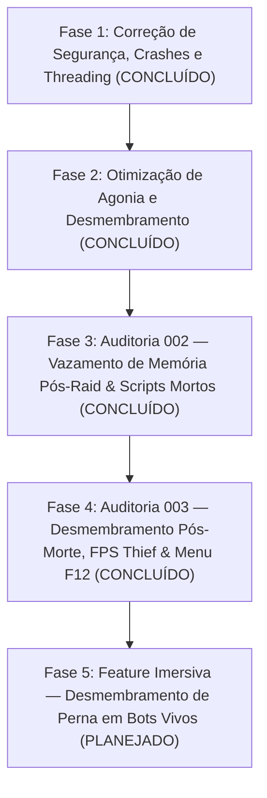

# Visceral Combat — Roadmap de Refatoração e Otimização de Performance

> ⚠️ **REGRA DE OURO DO REPOSITÓRIO** 
> Todas as correções, otimizações e refatorações descritas neste roadmap devem ser realizadas **EXCLUSIVAMENTE** na pasta [`mods/VisceralCombat/modded`](file:///d:/Projetos/GITHUB%20TARKOV/tarkov-spt-4.0/mods/VisceralCombat/modded). 
> A pasta [`mods/VisceralCombat/original`](file:///d:/Projetos/GITHUB%20TARKOV/tarkov-spt-4.0/mods/VisceralCombat/modded) deve ser mantida **100% intacta** como referência read-only do código-fonte original descompilado.

---

## 🎯 Objetivos Principais

1. **Mitigar o baixo desempenho (FPS Thief)** sem remover os recursos visuais de desmembramento, jorro de sangue e física ragdoll.
2. **Eliminar vazamentos de memória (RAM leaks)** e picos de Garbage Collector (GC).
3. **Corrigir falhas críticas de thread-safety, exceções nulas e comportamentos maliciosos**.
4. **Conectar e validar todas as propriedades do menu F12 (BepInEx ConfigurationManager)** que atualmente funcionam como placebo.
5. **Implementar mecânicas imersivas avançadas** (desmembramento de perna em bots vivos com rastejamento e rastro de sangue).

---

## 🗺️ Roadmap de Implementação

---

## 📅 Histórico de Correções & Próximas Fases

### 🟡 5. Fase 5: Feature Imersiva — Desmembramento de Perna em Bots Vivos (Item `001`)
- **Objetivo:** Permitir amputação de pernas por tiros de alto impacto em bots que sobrevivam ao tiro inicial.
- **Mecânicas:**
  - Queda forçada e instantânea para *Prone* com execução de agonia.
  - Bloqueio permanente de postura em *Prone* (bot impossibilitado de se levantar).
  - Emissão contínua de sangramento arterial e rastro de poças de sangue no chão durante o rastejamento.
  - Exsanguição progressiva até o decesso do bot.
- **Backlog:** Documentado na spec [`backlog/001-alive-leg-dismemberment/001-alive-leg-dismemberment-01-spec.md`](../backlog/001-alive-leg-dismemberment/001-alive-leg-dismemberment-01-spec.md).

### ✅ 4. Auditoria 003: Desmembramento Pós-Morte, Otimização de CPU & Menu F12 (v3.8.0 / v3.8.1)
- **Desmembramento Pós-Morte em Cadáveres:** Habilitado `DismemberLimb` em projéteis que colidem com cadáveres no chão para braços, pernas e cabeça sem reiniciar agonia.
- **Estilização de Sangue Escuro & Zero Glow:** Criado o manipulador `ApplyDarkCoagulatedBloodFx` em C# que desativa emissão/brilho branco e aplica vermelho escuro coagulado.
- **Remoção do FPS Thief (Corrotinas `WatchShot`):** Removidos loops de polling por frame em `BodiesImpulsePatch.cs`, `LimbKillPatch.cs` e `BleedPatch.cs`.
- **Conexão Real F12:** Conectados multiplicadores anatômicos (`headForceIntensity`, `TorsoForceIntensity`, `ArmsForceIntensity`, `LegsForceIntensity`) e `MappingWeightDuration`.

### ✅ 3. Auditoria 002: Vazamento de RAM Pós-Raid, Objetos Órfãos & Scripts Mortos
- **002-A (RAM Leaks & Instanciação Órfã):** Limpeza de `deadPlayers` e `dismemberedPlayers` no início/fim de raid.
- **002-B (Remoção de Scripts Mortos):** Removidos 4 arquivos obsoletos (569 linhas limpas).

### ✅ 2. Resolução do Loop Infinito de Agonia e Teleporte em Pé
- Desacoplamento suave do `PuppetMaster` e transição direta em ragdoll sem teleporte em pé.

### ✅ 1. Correção do Gerador de Desmembramento (`FoundLimbs=0`)
- Método `EnumerateHierarchyCore` reescrito em C# puro.
