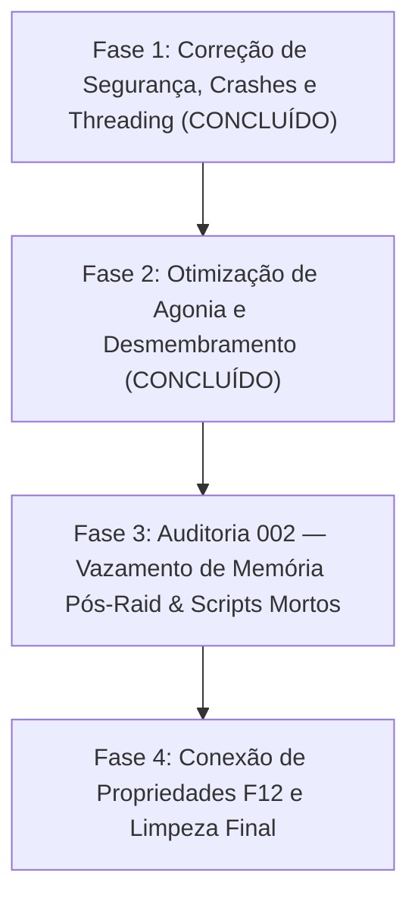

# Visceral Combat — Roadmap de Refatoração e Otimização de Performance

> ⚠️ **REGRA DE OURO DO REPOSITÓRIO** 
> Todas as correções, otimizações e refatorações descritas neste roadmap devem ser realizadas **EXCLUSIVAMENTE** na pasta [`mods/VisceralCombat/modded`](file:///d:/Projetos/GITHUB%20TARKOV/tarkov-spt-4.0/mods/VisceralCombat/modded). 
> A pasta [`mods/VisceralCombat/original`](file:///d:/Projetos/GITHUB%20TARKOV/tarkov-spt-4.0/mods/VisceralCombat/modded) deve ser mantida **100% intacta** como referência read-only do código-fonte original descompilado.

---

## 🎯 Objetivos Principais

1. **Mitigar o baixo desempenho (FPS Thief)** sem remover os recursos visuais de desmembramento, jorro de sangue e física ragdoll.
2. **Eliminar vazamentos de memória (RAM leaks)** e picos de Garbage Collector (GC).
3. **Corrigir falhas críticas de thread-safety, exceções nulas e comportamentos maliciosos**.
4. **Conectar e validar todas as propriedades do menu F12 (BepInEx ConfigurationManager)** que atualmente funcionam como placebo.
5. **Eliminar códigos mortos, patches duplicados e spams de logs**.

---

## 🗺️ Roadmap de Implementação

---

## 📅 Histórico de Correções Concluídas

### ✅ 1. Correção do Gerador de Desmembramento (`FoundLimbs=0`)
- **Problema:** O desmembramento (estourar cabeça/braços/pernas) falhava em 100% dos casos porque o descompilador gerou `if (!_003CparentTransform_003E5__2 != null) continue;`. Na Unity, `(!transform) != null` sempre avaliava como `true`, fazendo o buscador descartar todos os ossos.
- **Solução:** O método `EnumerateHierarchyCore` foi totalmente reescrito em C# puro (`yield return` com `Queue<Transform>`) em [`VisceralCombat.Ragdolls.Classes.Utils`](file:///d:/Projetos/GITHUB%20TARKOV/tarkov-spt-4.0/mods/VisceralCombat/modded/VisceralCombat/VisceralCombat.Ragdolls.Classes/Utils.cs#L14) e [`VisceralCombat.Dismemberment.Classes.Utils`](file:///d:/Projetos/GITHUB%20TARKOV/tarkov-spt-4.0/mods/VisceralCombat/modded/VisceralCombat/VisceralCombat.Dismemberment.Classes/Utils.cs#L119).
- **Resultado:** **Validado e Aprovado pelo Usuário em Raid.**

### ✅ 2. Resolução do Loop Infinito de Agonia e Teleporte em Pé
- **Problema:** Quando um bot entrava em agonia no chão de dor, ao término do tempo o corpo dava um "snap" instantâneo em pé e entrava em loop infinito da animação.
- **Causa Raiz:** A camada 18 do `BodyAnimatorCommon` continuava em peso `1.0f` com uma animação em loop. Ao desativar o `PuppetMaster`, a Unity resetava o esqueleto para a pose inicial em pé.
- **Solução:** Em [`RagdollHelperClass.cs`](file:///d:/Projetos/GITHUB%20TARKOV/tarkov-spt-4.0/mods/VisceralCombat/modded/VisceralCombat/VisceralCombat.Ragdolls.Classes/RagdollHelperClass.cs#L170), implementado desacoplamento gradual:
  1. Redução suave do peso da camada 18 para `0f` (`LerpLayerWeight`).
  2. Redução suave do `mappingWeight` do `PuppetMaster` para `0f`.
  3. Desativação do `PuppetMaster` somente após o peso zerar, mantendo o corpo no chão em ragdoll puro.
- **Resultado:** **Confirmado e Validado via logs `[SPY-AGONY]` e no Jogo.**

---

## 🚨 Fases de Atuação Atuais (`002-refactor`)

### 🔴 002-A: Vazamentos de Memória Pós-Raid (Em Andamento)
- **VisceralEntry.cs:** `deadPlayers` e `dismemberedPlayers` são mantidos entre raids sem `Clear()`. Retêm instâncias destruídas de `Player` na RAM.
- **Ragdolls/GameStartedPatch.cs:** Linhas 40-42 contêm duplo `Object.Instantiate` de `active_ragdoll_base` sem atribuição (cria objetos fantasma na cena).
- **EffectContainer.cs:** Linhas 78-79 instanciam `val2` na raiz da cena e criam um objeto órfão na memória.
- **GoreObjectPool.cs:** O pool de sangue não é limpo ao mudar de raid (`ClearPool()`).

### 🟡 002-B: Scripts Mortos e Residuais do Asset Store
- **BFX_MouseOrbit.cs:** Script de teste de câmera do Asset Store rodando `LateUpdate()` e tentando alterar o ponteiro do mouse (`Cursor.visible`).
- **RagdollSpawner.cs & Navigator.cs:** Classes residuais de teste e NavMesh sem chamadas no mod.
- **BFX_DecaGizmo.cs:** Desenho de editor Gizmo inutilizável em runtime.

---

## 📋 Checklist de Validação Final

- [x] Desmembramento funcionando em raid (cabeça, braços, pernas).
- [x] Animação de agonia transicionando suavemente para ragdoll morto sem teleporte em pé.
- [ ] Coleções de `deadPlayers` e `GoreObjectPool` limpos no `OnGameStarted`.
- [ ] Instanciações órfãs de `GameObject` eliminadas.
- [ ] Scripts residuais do Asset Store removidos.
