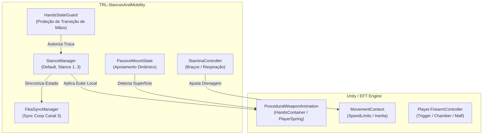

# TRL-StancesAndMobility — Visão Geral e Arquitetura

O **TRL-StancesAndMobility** (anteriormente denominado *CameraRotationMod* / *RealisticMobility*) é um mod client BepInEx para SPT 4.0 / EFT 0.16.9 focado em expandir o realismo procedural, controle de posturas de armas, mobilidade, miras dinâmicas e sistemas de apoiamento tático.

---

## 1. Arquitetura do Mod e Ciclo de Vida

O mod atua interceptando a cadeia procedural de animação de armas do EFT ([`ProceduralWeaponAnimation`](../../../references/eft-decompiled/Assembly-CSharp/EFT/Animations/ProceduralWeaponAnimation.cs)), os controladores de movimentação ([`MovementContext`](../../../references/eft-decompiled/Assembly-CSharp/EFT/MovementContext.cs)) e os controladores de armas ([`FirearmController`](../../../references/eft-decompiled/Assembly-CSharp/EFT/Player.cs#L12140)).



---

## 2. Convenção Crítica de Eixos da Arma (Local Space)

> [!WARNING]
> **EIXOS LOCAIS DA ARMA ≠ EIXOS DO UNITY**
> No EFT, a rotação procedural da arma é aplicada como `weapRotation * Quaternion.Euler(euler)` no espaço local do modelo da arma:
> - **Eixo X:** Lateral (Pitch — levantar/abaixar o cano)
> - **Eixo Y:** Longitudinal / Ao longo do cano (Roll — tombar/inclinar lateralmente a arma)
> - **Eixo Z:** Vertical (Yaw — apontar a arma para esquerda/direita)
> 
> A convenção do Unity é `(Pitch, Yaw, Roll)`. No mod, a montagem é obrigatoriamente `new Vector3(Pitch, Roll, Yaw)`.

---

## 3. Modelo de Estados de Postura (`Stance`)

O mod suporta 4 estados de postura controlados pelo [`StanceManager`](../modded-testchannel/StanceManager.cs):

| Postura | Nome Canônico | Descrição | Configuração Padrão |
| :--- | :--- | :--- | :--- |
| **`Stance.Default`** | Stance 0 (Vanilla) | Postura padrão do jogo, cano centrado e pronto para disparo. | Offset (0, 0, 0) |
| **`Stance.Stance1`** | Stance 1 (High Ready) | Arma levantada na altura do peitoral/ombro, reduzindo fadiga. | Pitch -15° |
| **`Stance.Stance2`** | Stance 2 (Low Ready) | Arma abaixada apontando para o solo em 45°. | Pitch +30° |
| **`Stance.Stance3`** | Stance 3 (Custom / Off-Axis) | Posição customizada lateralizada / canted. | Yaw -30° |

---

## 4. Estrutura de Pastas e Módulos

```text
mods/stancesAndCameraPositionSPT4.0.11/modded-testchannel/
├── Plugin.cs                  # Ponto de entrada BepInEx, binds F12 e bootstrapping
├── StanceManager.cs           # Máquina de estados de postura e transições
├── HandsStateGuard.cs         # Trava de segurança para estados de mãos ocupadas
├── StaminaController.cs       # Sistema de drenagem e recuperação de stamina
├── SpringMath.cs              # Interpolação de molas amortecidas (SpringDamp)
├── Networking/                # Sincronização multiplayer FIKA
│   ├── FikaSyncManager.cs     # Envio/recebimento de pacotes (Canal 3)
│   ├── ObservedStanceAnimator.cs # Animação de outros jogadores
│   └── StanceSyncPacket.cs    # Estrutura do pacote de rede
├── Patches/                   # Patches Harmony para EFT e FIKA
│   ├── ActionStancePatches.cs # Reação a reload, check ammo e examine
│   ├── ManualChamberingPatches.cs # Mecânica de câmara manual
│   ├── ApplyComplexRotationPatch.cs # Aplicação de rotação procedural
│   └── PassiveMountDetectPatch.cs # Detecção de superfícies para apoiamento
└── UI/                        # Overlays visuais de Oxygen e Debug
```
