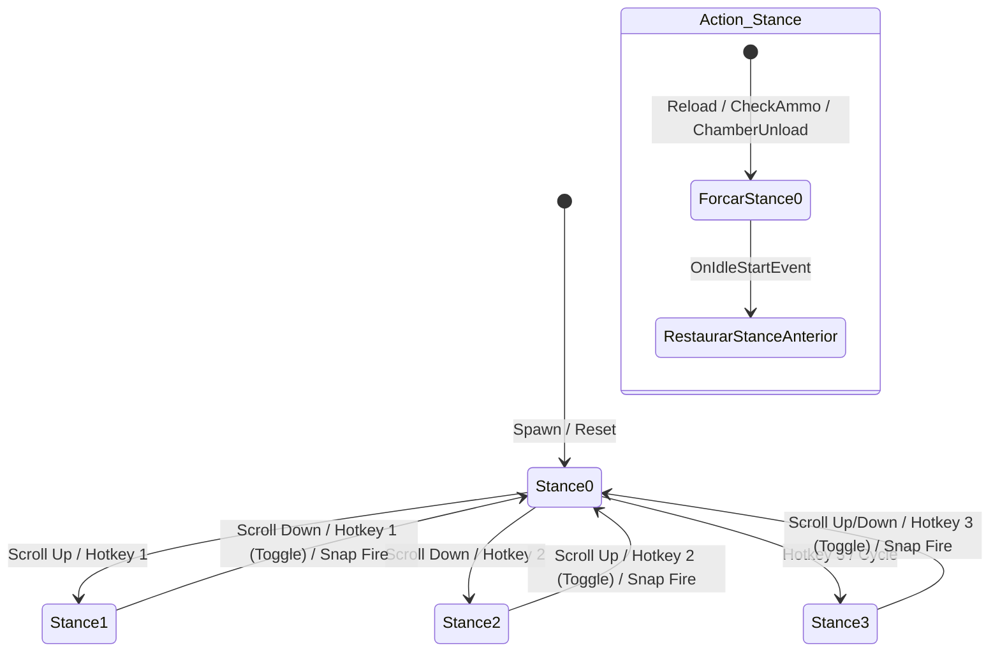

# TRL-StancesAndMobility — Sistema de Posturas e Transições

Este subsistema controla a transição suave entre diferentes posições da arma, garantindo que o jogador possa alternar dinamicamente entre posições de prontidão, corrida, recarga e disparo rápido.

---

## 1. Modos de Troca e Controle

O [`StanceManager`](../modded-testchannel/StanceManager.cs) gerencia três métodos primários de alternância de postura:

1. **Roda do Mouse (Linear ou Circular):**
   - **Modo Linear:** Eixo vertical fixo: `Stance 1 (High Ready)` ↔ `Stance 0 (Default)` ↔ `Stance 2 (Low Ready)`. Scroll para cima sobe no eixo; scroll para baixo desce. `Stance 3` atua como postura off-axis.
   - **Modo Circular (Cycle):** Alterna sequencialmente entre as posturas habilitadas na ordem `0 → 1 → 2 → 3 → 0`.
2. **Hotkeys Dedicadas:** Teclas diretas configuradas via menu F12 para cada stance. Ao pressionar a tecla da postura atualmente ativa, o sistema faz toggle retornando para a `Stance 0`.
3. **Tecla de Toggle Universal:** Tecla única de ciclo (padrão configurável).

---

## 2. Action Stances (Transição Automática em Ações de Arma)

Implementado em [`ActionStancePatches.cs`](../modded-testchannel/Patches/ActionStancePatches.cs), o recurso força a arma temporariamente para a posição `Default (Stance 0)` sempre que uma ação técnica for realizada:

- **Recarga de Arma (`ReloadWeaponClass` / `GClass2015`):** Retorna para o centro para encaixar o carregador.
- **Esvaziamento de Carregador (`GClass2050`):** Retorna para o centro ao desengatar o magazine.
- **Checagem de Munição / Câmara (`CheckAmmo` / `CheckChamber` / `ExamineWeapon`):** A arma é posicionada no centro.
- **Término da Ação:** Ao receber o evento de Idle da arma ([`ActionStanceOnIdlePatch`](../modded-testchannel/Patches/ActionStancePatches.cs#L125)), o mod restaura a postura que estava ativa antes do início da ação (`_preActionStance`).

---

## 3. Snap to Stance 0 on Fire (Disparo Imediato com Interceptação e Ressurreição)

Implementado em [`SnapFireTriggerPatch.cs`](../modded-testchannel/Patches/SnapFireTriggerPatch.cs):
- Se o jogador puxar o gatilho (`SetTriggerPressed(true)`) enquanto estiver em uma postura diferente da `Default` (Stance 1, 2 ou 3):
  1. O disparo inicial é **interceptado e bloqueado** no primeiro instante (`Prefix` retorna `false`).
  2. A postura é imediatamente forçada para `Stance 0`.
  3. No frame seguinte (Frame N+1), um gatilho sintético é disparado para que o tiro ocorra de forma responsiva.
  4. No Frame N+2, se a arma estiver em modo automático e o jogador já tiver solto o botão, o gatilho sintético envia `false` para impedir disparos descontrolados (*runaway burst*).

---

## 4. Interpolação e Física de Molas (`SpringMath.SpringDamp`)

A suavidade das transições é regida por equações de amortecimento de mola crítica implementadas em [`SpringMath.cs`](../modded-testchannel/SpringMath.cs), evitando movimentos mecânicos rígidos ou saltos visuais:

$$x(t) = \text{SpringDamp}(current, target, \text{ref } velocity, damping, dt)$$

Parâmetros configuráveis no F12 permitem ajustar a velocidade de transição (`Stance Transition Speed`) e o nível de amortecimento (`Stance Damping`).
