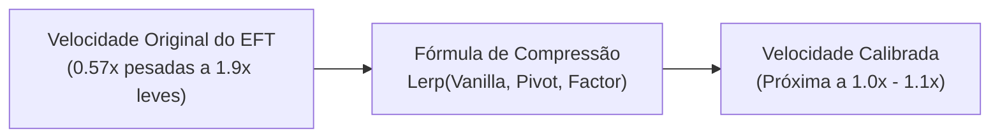

# TRL-StancesAndMobility — Sistemas de Mira (ADS) e Movimentação

Este subsistema calibra a resposta ergonômica de miras (ADS Speed Compression), limites de velocidade por postura e o impacto de inércia e fadiga nos braços.

---

## 1. Compressão de Velocidade de Mira (ADS Speed Compression)

Implementado em [`AdsSpeedCompressionPatch.cs`](../modded-testchannel/Patches/AdsSpeedCompressionPatch.cs), o recurso visa reduzir a discrepância excessiva entre miras de pistolas ultraleves e fuzis pesados, trazendo uma curva mais homogênea e tática.

- **Pivô de Compressão:** Valor central em torno de `1.0` a `1.1`.
- **Fator de Compressão:** Controla a força com que valores extremos são puxados para o pivô central.
- **ADS Waypoint ([`AdsWaypoint.cs`](../modded-testchannel/AdsWaypoint.cs)):** Permite adicionar pequenos atrasos ou transições no alinhamento da luneta com o olho do operador.

---

## 2. Limites de Velocidade e Mobilidade

O patch [`MovementContextSpeedPatch.cs`](../modded-testchannel/Patches/MovementContextSpeedPatch.cs) e a lógica em [`StanceManager.cs`](../modded-testchannel/StanceManager.cs) ajustam os limites de velocidade máxima de caminhada (`SpeedLimits` no EFT):

| Postura / Estado | Fator de Velocidade | Efeito Prático |
| :--- | :--- | :--- |
| **Stance 0 (Vanilla)** | `Walk Speed Multiplier` (~0.85 a 0.90) | Redução leve configurada para marcha de combate tática. |
| **Stance 1 (High Ready)** | Multiplicador configurável | Permite caminhada rápida sem necessidade de abaixar a arma. |
| **Stance 2 (Low Ready)** | Multiplicador configurável | Mobilidade aprimorada com o cano apontado para baixo. |
| **Tac Sprint** | Velocidade de corrida normal | Transição automática durante o sprint sem quebrar a postura. |

---

## 3. Controle de Stamina e Fadiga de Braço

Implementado em [`StaminaController.cs`](../modded-testchannel/StaminaController.cs) e [`StanceStaminaRecoveryPatch.cs`](../modded-testchannel/Patches/StanceStaminaRecoveryPatch.cs):
- **Stance 1 (High Ready) e Stance 2 (Low Ready):** Reduzem drasticamente ou neutralizam a drenagem de stamina de braço em comparação com manter a arma apontada na altura dos olhos (`Stance 0`).
- **Recuperação Ativa:** Posturas de descanso aceleram a recuperação de stamina dos membros superiores.
