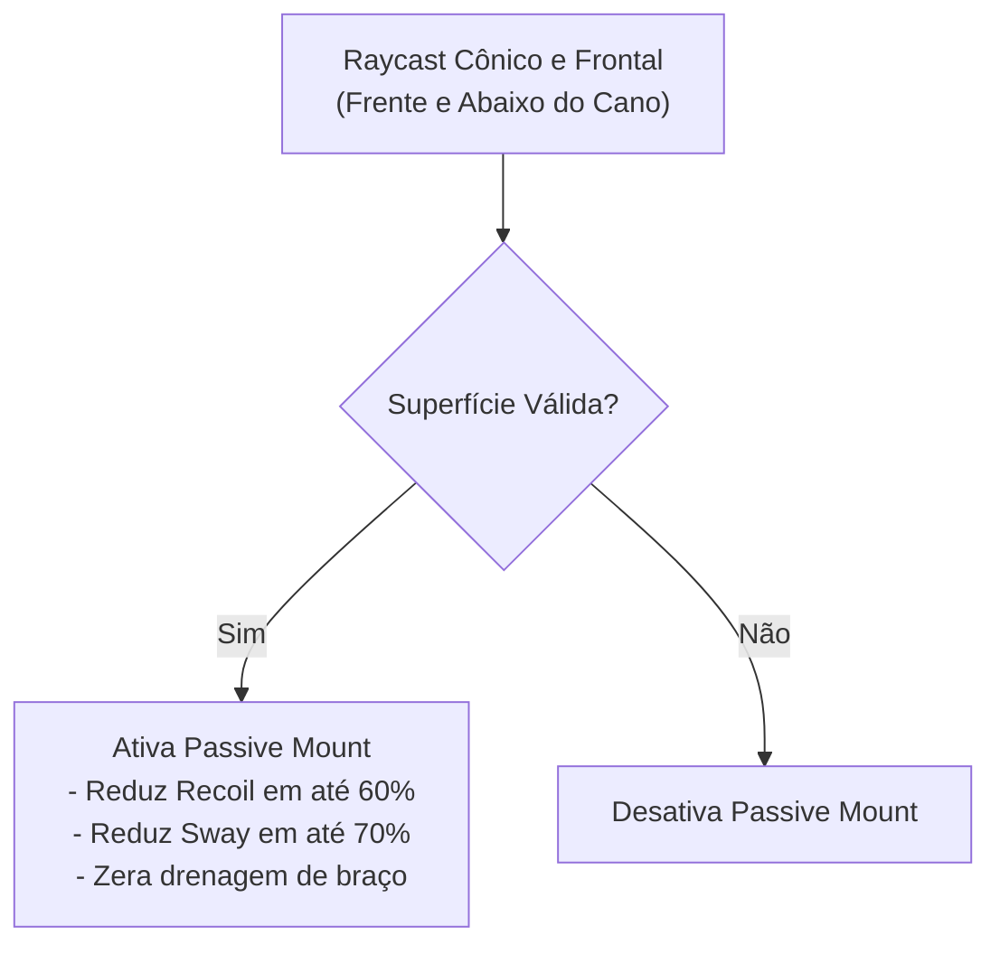

# TRL-StancesAndMobility — Sistemas de Apoiamento e Respiração

Este documento detalha o sistema de **Apoiamento Passivo (*Passive Mount*)**, a mecânica aprimorada de **Segurar a Respiração (*Hold Breath*)** e o overlay de **Oxigênio/Estamina**.

---

## 1. Apoiamento Passivo (Passive Mount)

Diferente do sistema nativo do EFT que exige o acionamento manual de um botão de mount, o **Passive Mount** ([`PassiveMountDetectPatch.cs`](../modded-testchannel/Patches/PassiveMountDetectPatch.cs) e [`PassiveMountState.cs`](../modded-testchannel/PassiveMountState.cs)) detecta automaticamente quando a arma está próxima a superfícies rígidas (parapeitos, cantos de parede, sacos de areia, capôs de carro):

- **Buffs de Estabilização:**
  - Redução de Recoil horizontal e vertical ([`PassiveMountBuffPatches.cs`](../modded-testchannel/Patches/PassiveMountBuffPatches.cs)).
  - Minimização do balanço natural da arma (*Weapon Sway*).
  - Indicador visual opcional na UI ([`PassiveMountUI.cs`](../modded-testchannel/PassiveMountUI.cs)).

---

## 2. Bloqueio de Mount Ativo em Posturas (`BlockActiveMountPatch`)

O patch [`BlockActiveMountPatch.cs`](../modded-testchannel/Patches/BlockActiveMountPatch.cs) previne conflitos entre o mount nativo do EFT e as posturas customizadas:
- Se o jogador estiver em `Stance 1`, `Stance 2` ou `Stance 3`, a tentativa de mount ativo vanilla é bloqueada para evitar distorções de malha e braço.
- O mount nativo é liberado normalmente na `Stance 0` (Default), em mira (ADS) e em postura deitada (Prone).

---

## 3. Hold Breath e Retenção de Ar

Implementado em [`HoldBreathPatch.cs`](../modded-testchannel/Patches/HoldBreathPatch.cs):
- Efeitos sonoros dedicados de inspiração e expiração (`breath_in.ogg` e `breath_out.ogg`).
- Batimentos cardíacos dinâmicos (`heartbeat.ogg`) ao atingir níveis críticos de falta de ar.
- Interface gráfica de Oxigênio ([`UI/OxygenUI.cs`](../modded-testchannel/UI/OxygenUI.cs)) indicando visualmente o tempo restante de retenção de mira estável.
