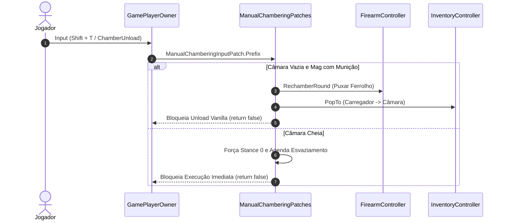

# TRL-StancesAndMobility — Manual Chambering e Mecânicas de Armas

Este documento descreve a implementação do **Manual Chambering (Alimentação Manual de Câmara)**, a lógica de checagem de câmara e suas interações com o inventário do EFT e FIKA.

---

## 1. Conceito do Manual Chambering

No EFT vanilla, ao equipar uma arma ou inserir um carregador novo, o jogo pode alimentar automaticamente a primeira bala na câmara. O **Manual Chambering** ([`ManualChamberingPatches.cs`](../modded-testchannel/Patches/ManualChamberingPatches.cs)) visa dar ao jogador controle manual total sobre puxar o ferrolho para alimentar a primeira munição:

---

## 2. Patches Principais do Subsistema

| Patch | Alvo no EFT | Objetivo |
| :--- | :--- | :--- |
| **`StartEquipWeapPatch`** | `ChamberWeaponClass.Start` | Bloqueia o carregamento automático de bala na câmara ao puxar/equipar a arma no início da raid ou após troca. |
| **`StartReloadResetPatch`** | `ReloadWeaponClass.Start` | Reseta as flags `CanLoadChamber` ao iniciar recarga convencional. |
| **`SetAmmoCompatiblePatch`** | `FirearmsAnimator.SetAmmoCompatible` | Intercepta o sinal de compatibilidade no animador para sincronizar a animação de recarga. |
| **`PreChamberLoadPatch`** | `Player.FirearmController.method_18` | Intercepta o método interno de carregamento de câmara pós-recarga. |
| **`ManualChamberingInputPatch`** | `GamePlayerOwner.TranslateCommand` | Intercepta os comandos de teclado de `ECommand.ChamberUnload` e `ECommand.UnloadMagazine`. |
| **`ChamberCheckAmmoPatch`** | [`ChamberCheckAmmoPatch.cs`](../modded-testchannel/Patches/ChamberCheckAmmoPatch.cs) | Renderiza no HUD (Battle UI) o tipo de munição presente na câmara durante a inspeção. |

---

## 3. Riscos de Sincronização de Inventário em Coop (FIKA)

> [!CAUTION]
> **Atenção ao uso de `PopTo` direto no cliente:**
> A chamada `mag.Cartridges.PopTo(player.InventoryController, address)` manipula itens locais sem abrir uma transação de rede (`ProceedRequestPacket` / `FikaClient`). No modo multiplayer FIKA, isso pode gerar dessincronia no `TraderControllerClass.CheckAction`, resultando no erro `GClass1561` (*"Default Inventory is currently being modified"*).
