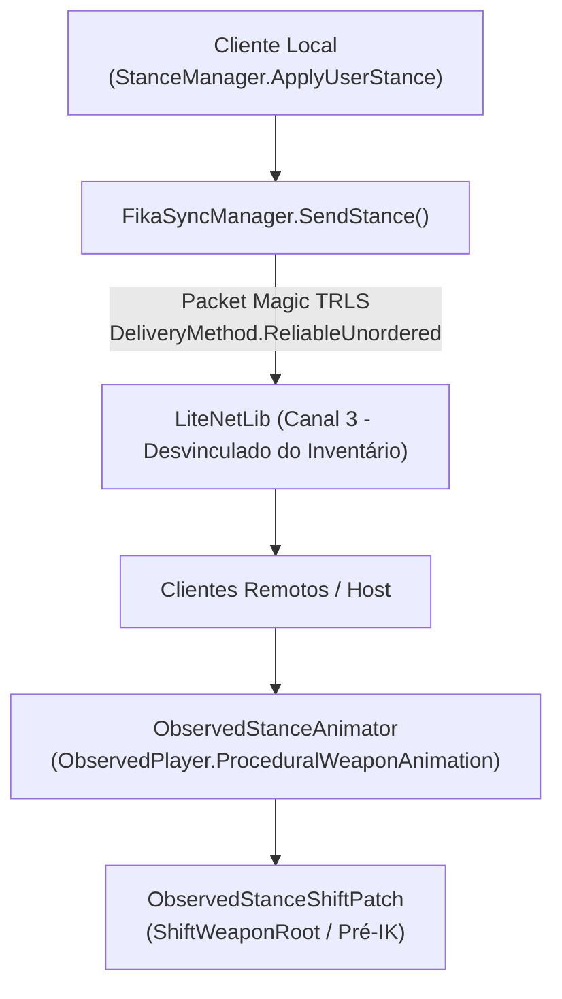

# TRL-StancesAndMobility — Integração FIKA Coop e Rede

Este documento descreve a infraestrutura de rede para o **FIKA Multiplayer**, responsável por transmitir e replicar as posturas entre o host, servidores dedicados e clientes remotos.

---

## 1. Arquitetura de Sincronização em Rede (Canal 3 Isolado)

Implementado em [`Networking/FikaSyncManager.cs`](../modded-testchannel/Networking/FikaSyncManager.cs):

---

## 2. Estrutura do Pacote de Rede (`StanceSyncPacket`)

Definido em [`Networking/StanceSyncPacket.cs`](../modded-testchannel/Networking/StanceSyncPacket.cs):

- **Magic Header:** `0x534C5254` (`TRLS`) para validação de pacote.
- **Player NetId:** Identificador de rede do jogador que alterou a postura.
- **Stance Index:** `0` (Default), `1` (High Ready), `2` (Low Ready) ou `3` (Custom).
- **Euler Offset:** Vetor3 com o ângulo de rotação local da arma para renderização precisa.
- **Position Offset:** Vetor3 com o deslocamento de translação da arma.

---

## 3. Replicação Visual em Jogadores Observados (`ObservedPlayer`)

- **Janela Pré-IK:** O patch [`ObservedStanceShiftPatch.cs`](../modded-testchannel/Patches/ObservedStanceShiftPatch.cs) atua em um `Postfix` de `PlayerBones.ShiftWeaponRoot`.
- **Sincronia Anatômica:** Ao aplicar os offsets antes do passo de cinemática inversa (IK), **os braços e as mãos do personagem acompanham a arma**, evitando que a arma se mova no ar enquanto as mãos ficam estáticas.
